# 1. Introdução

## 1.1 Contextulização

A rotatividade de clientes (churn) é definida como a propensão dos clientes a deixarem de fazer negócios com uma empresa em um determinado período de tempo (XIE et al., 2009). Isso pode acontecer por diversos motivos, como a insatisfação do cliente com a serviço da empresa. A ciência de dados pode ajudar as empresas na previsão do churn.

Extraído do site [Kaggle](https://www.kaggle.com/datasets/abhinav89/telecom-customer) , este conjunto de dados apresenta 100 variáveis e aproximadamente 100 mil registros. Ele contém diversas variáveis que detalham os atributos da indústria de telecomunicações, além de fatores cruciais ao lidar com os clientes desse setor. A variável central é a rotatividade, indicando se o cliente está propenso a abandonar o serviço.

## 1.2 Objetivo

Este conjunto de dados será usado para prever se os clientes abandonarão ou não esta de empresa de Telecomunicações.

## 1.3 Metodologia (...)


Os passos utilizados neste projeto são os seguintes:

1.Introdução

2.Coleta dos dados

3.Descrição dos dados

4.Transformação dos dados

5.Limpeza dos dados

6.Análise descritiva

7.Modelagem

7.1 Dividir o dataset em treino.teste e validação

7.2 Padronizar

7.3 Treinar os modelos

-   Serão escolhidos os modelos : regressão logística , Random forest, XGboost e lightGM. Em seguida, será avaliado qual o melhor modelo para a análise.

7.4 Cross-Validation, teste

7.5 Avaliação das métricas

-   Verificar a acuraria, precisão, AUC, curva ROC

7.6 Otimização de hiper-parâmetros

7.7 Obter o modelo final e marcar os dados

8.Gerar o reporte

## 1.4 Seleção dos Preditores

Escolher as variáveis explicativas certas é fundamental para a construção de um bom modelo.A análise descritiva ajudará nesse quesito. Além disso, foi realizado uma pesquisa na literatura para verificar quais variáveis estão associadas ao churn. A tabela a seguir é uma adapatação do trabalho de (KERAMATI et al., 2014).

|     | Literatura                                | Churn Determinístico na literatura                                             | Código no dataset | Descrição do código no dataset                                                                                                                                                                                                                                        |
|-----|-------------------------------------------|--------------------------------------------------------------------------------|-------------------|-----------------------------------------------------------------------------------------------------------------------------------------------------------------------------------------------------------------------------------------------------------------------|
| 1   | (GOPAL; MEHER, 2008) e (LEE et al., 2011) | Número de meses em serviço                                                     | **months**        | Número total de meses de serviço                                                                                                                                                                                                                                      |
| 2   | (GOPAL; MEHER, 2008)                      | Qualidade de serviço ruim                                                      | **truck**         | Indicador de caminhão. Um um indicador de caminhão é um dispositivo usado para medir a qualidade do sinal de uma rede de telefonia celular. O indicador é instalado em um caminhão e mede o sinal em várias áreas, incluindo áreas rurais, urbanas e suburbanas.      |
| 3   | (GOPAL; MEHER, 2008)                      | Qualidade de serviço ruim                                                      | **rv**            | Indicador de RV. É um indicador usado para medir a qualidade do sinal de uma rede de telefonia celular em áreas rurais. O indicador é instalado em uma caravana ou trailer e mede o sinal em várias áreas, incluindo estradas rurais, fazendas e comunidades remotas. |
| 4   | (GOPAL; MEHER, 2008) e (KIM; YOON, 2004)  | Falhas                                                                         | **drop_vce_Mean** | Número médio de chamadas de voz perdidas (com falha)                                                                                                                                                                                                                  |
| 5   | (GOPAL; MEHER, 2008) e (KIM; YOON, 2004)  | Falhas                                                                         | **drop_dat_Mean** | Número médio de chamadas de dados perdidas (com falha). Ou seja, é uma falha na qual uma conexão de dados é interrompida antes que a transferência de dados seja concluída. Ex: Falha ao baixar um arquivo da internet.                                               |
| 6   | (GOPAL; MEHER, 2008) e (KIM; YOON, 2004)  | Falhas                                                                         | **blck_vce_Mean** | Número médio de chamadas de voz bloqueadas (com falha)                                                                                                                                                                                                                |
| 7   | (GOPAL; MEHER, 2008) e (KIM; YOON, 2004)  | Falhas                                                                         | **blck_dat_Mean** | Número médio de chamadas de dados bloqueadas (com falha)                                                                                                                                                                                                              |
| 8   | (ZHANG et al., 2012)                      | Preços                                                                         | **hnd_price**     | Preço atual do aparelho                                                                                                                                                                                                                                               |
| 9   | (ZHANG et al., 2012) e (LEE et al., 2011) | Contagem de chamadas mensais                                                   | **avgqty**        | Número médio mensal de chamadas ao longo da vida do cliente                                                                                                                                                                                                           |
| 10  | (ZHANG et al., 2012)                      | conjunto de cobrança                                                           | **rev_Mean**      | Receita média mensal (valor da cobrança)                                                                                                                                                                                                                              |
| 11  | (ZHANG et al., 2012)                      | conjunto de cobrança                                                           | **totmrc_Mean**   | Média de cobrança recorrente mensal total                                                                                                                                                                                                                             |
| 12  | (LEE et al., 2011)                        | Número de dias de equipamento                                                  | **eqpdays**       | Número de dias (idade) do equipamento atual                                                                                                                                                                                                                           |
| 13  | (LEE et al., 2011)                        | Intervalo de minutos excedentes de uso                                         | **ovrmou_Mean**   | Média de minutos excedentes de uso                                                                                                                                                                                                                                    |
| 16  | (LEE et al., 2011)                        | Média de minutos não arredondados de uso de chamadas de voz concluídas         | **mou_cvce_Mean** | Média de minutos não arredondados de uso de chamadas de voz concluídas                                                                                                                                                                                                |
| 15  | (LEE et al., 2011)                        | Limite de gastos da conta                                                      | **asl_flag**      | Limite de gastos da conta                                                                                                                                                                                                                                             |
| 17  | (LEE et al., 2011)                        | Total de minutos ajustados ao faturamento ao longo da vida do cliente          | **totmou**        | Total de minutos de uso ao longo da vida do cliente                                                                                                                                                                                                                   |
| 18  | (LEE et al., 2011)                        | Média do número de minutos de uso                                              | **avgmou**        | Média mensal de minutos de uso ao longo da vida do cliente                                                                                                                                                                                                            |
| 19  | (LEE et al., 2011)                        | Faixa de receita de excedente de **voz**                                       | **vceovr_Mean**   | Receita média de excedente de voz                                                                                                                                                                                                                                     |
| 20  | (LEE et al., 2011)                        | Faixa de receita de excedente                                                  | **ovrrev_Mean**   |                                                                                                                                                                                                                                                                       |
| 21  | (LEE et al., 2011)                        | Variação percentual em minutos mensais de uso vs. média dos 3 meses anteriores | **change_mou**    | Alteração percentual nos minutos mensais de uso em relação à média dos três meses anteriores                                                                                                                                                                          |
| 22  | (LEE et al., 2011)e (KIM; JUN; LEE, 2014) | Telefone atual (recondicionado ou novo)                                        | **refurb_new**    | Aparelho: recondicionado ou novo                                                                                                                                                                                                                                      |
| 23  | (TSAI; CHEN, 2010) e (KIM; YOON, 2004)    | A velocidade de upload e download de dados                                     | **hnd_webcap**    | Capacidade web do aparelho                                                                                                                                                                                                                                            |
| 24  | (HUNG; YEN; WANG, 2006)                   |  Customer Demographic                                                          | **area**          | Área geográfica                                                                                                                                                                                                                                                       |
| 25  | (HUNG; YEN; WANG, 2006)                   | Faixas de classe social                                                        | **income**        | Renda estimada                                                                                                                                                                                                                                                        |
| 26  | (Huang ; Kechadi, 2013)                   | Tipos de chamadas (por exemplo, chamadas internacionais ou locais)             | **roam_Mean**     | Número médio de chamadas em roaming (quando o cliente de uma operadora sai da área de cobertura da qual foi cadastrado)                                                                                                                                               |
| 27  | (Huang ; Kechadi, 2013)                   | Tipos de chamadas (por exemplo, chamadas internacionais ou locais)             | **roam_Mean**     | Número médio de chamadas em roaming (quando o cliente de uma operadora sai da área de cobertura da qual foi cadastrado)                                                                                                                                               |
| 28  | (LU et al., 2014)                         |  Informações de entrada/saída de atendimento ao cliente                        | **cc_mou_Mean**   | Média de minutos não arredondados de uso de chamadas de atendimento ao cliente .                                                                                                                                                                                      |

### 

### 1.4.1 Critério para seleção das preditoras

O critério de seleção para as variáveis preditoras será primeiro a análise do gráfico e da literatura. Caso a diferença no gráfico seja sutil, será realizado um teste de hipótese, somente nas variáveis numéricas.

-   Se a diferença no gráfico for grande, então a variável será incluída como preditora.

-   Se a diferença no gráfico for sutil mas a variável estiver na literatura, a tendência é inclui-la na lista de preditoras.

-   Se a diferença for sutil e a variável numérica, não estiver na literatura, será feito um teste de hipótese. E, em caso de rejeitar a Ho, a variável será incluída como preditora.

-   Se a diferença for sutil e a variável não for numérica, será avaliada individualmente.

Com base no conjunto de todas as informações descritas, as variáveis serão escolhidas


------------------------------------------------------------------------


#### 

------------------------------------------------------------------------


## 1.5 Modelo Logístico

A regressão logística é um modelo linear para classificação no qual a variável dependente é binária e categórica.

Ele é resultado de uma transformação da regressão linear. Após a transformação logarítmica temos um modelo que encontra a probabilidade de algo acontecer.

Com a regressão logística é possível, por exemplo, encontrar a probabilidade de um cliente deixar uma empresa (churn). Essa informação pode ajudar os gestores a direcionar seus esforços para clientes com maiores chances de churn.

## 1.6 Random forest

## 1.7 XGBoost

## 1.8 LightGBM

# 2. Coleta dos dados

#### 2.1 Carregar os pacotes


```r
library(dplyr)
library(data.table)
library(tidyr)
library(ggplot2)
library(tidyverse)
library(psych) # função describe
library(ggcorrplot) # grafico de correlação
library(pastecs)
library(dummy) #Criar dummy: linhas passam a ser colunas binárias 
library(caret) #padronizar dados
library(randomForest) #Usar no algoritmo Random Forest
library(boot)#Fazer CrossValidation
library(glmnet)#Fazer regularização de LASSO
library(caret) #Fazer avaliação dos modelos
library(fastDummies) 
library(stats) #Métrica KS
#install.packages("ROCR")
library(ROCR)#para fazer a curva ROC
library(pROC)
```


```r
#Boruta
#("ParamHelpers")
library(ParamHelpers)

#install.packages("mlr")
library(mlr)
```

```
## Warning message: 'mlr' is in 'maintenance-only' mode since July 2019.
## Future development will only happen in 'mlr3'
## (<https://mlr3.mlr-org.com>). Due to the focus on 'mlr3' there might be
## uncaught bugs meanwhile in {mlr} - please consider switching.
```

```
## 
## Attaching package: 'mlr'
```

```
## The following object is masked from 'package:ROCR':
## 
##     performance
```

```
## The following object is masked from 'package:caret':
## 
##     train
```

```r
#install.packages("Boruta")
library(Boruta)
```

#### 2.2 Carregar a base de dados


```r
dados <- read.csv("C:/0.Projetos/2.Telecom_customer_(Churn)/Dataset/Telecom_customer_churn.csv")
```


```r
#head(dados)
```

# 3. Descrever os dados

#### Descrição das colunas


#### Número de linhas e colunas


```r
#Numero de linhas e colunas
n_linhas <- nrow(dados)

n_colunas <- ncol(dados)

cat("O conjunto de dados tem", n_linhas,"linhas e", n_colunas,"colunas.")
```

```
## O conjunto de dados tem 100000 linhas e 100 colunas.
```

#### Tipo de dados


```r
#Verificando o formato das colunas
data.frame(sapply(dados, class))
```

```
##                  sapply.dados..class.
## rev_Mean                      numeric
## mou_Mean                      numeric
## totmrc_Mean                   numeric
## da_Mean                       numeric
## ovrmou_Mean                   numeric
## ovrrev_Mean                   numeric
## vceovr_Mean                   numeric
## datovr_Mean                   numeric
## roam_Mean                     numeric
## change_mou                    numeric
## change_rev                    numeric
## drop_vce_Mean                 numeric
## drop_dat_Mean                 numeric
## blck_vce_Mean                 numeric
## blck_dat_Mean                 numeric
## unan_vce_Mean                 numeric
## unan_dat_Mean                 numeric
## plcd_vce_Mean                 numeric
## plcd_dat_Mean                 numeric
## recv_vce_Mean                 numeric
## recv_sms_Mean                 numeric
## comp_vce_Mean                 numeric
## comp_dat_Mean                 numeric
## custcare_Mean                 numeric
## ccrndmou_Mean                 numeric
## cc_mou_Mean                   numeric
## inonemin_Mean                 numeric
## threeway_Mean                 numeric
## mou_cvce_Mean                 numeric
## mou_cdat_Mean                 numeric
## mou_rvce_Mean                 numeric
## owylis_vce_Mean               numeric
## mouowylisv_Mean               numeric
## iwylis_vce_Mean               numeric
## mouiwylisv_Mean               numeric
## peak_vce_Mean                 numeric
## peak_dat_Mean                 numeric
## mou_peav_Mean                 numeric
## mou_pead_Mean                 numeric
## opk_vce_Mean                  numeric
## opk_dat_Mean                  numeric
## mou_opkv_Mean                 numeric
## mou_opkd_Mean                 numeric
## drop_blk_Mean                 numeric
## attempt_Mean                  numeric
## complete_Mean                 numeric
## callfwdv_Mean                 numeric
## callwait_Mean                 numeric
## churn                         integer
## months                        integer
## uniqsubs                      integer
## actvsubs                      integer
## new_cell                    character
## crclscod                    character
## asl_flag                    character
## totcalls                      integer
## totmou                        numeric
## totrev                        numeric
## adjrev                        numeric
## adjmou                        numeric
## adjqty                        integer
## avgrev                        numeric
## avgmou                        numeric
## avgqty                        numeric
## avg3mou                       integer
## avg3qty                       integer
## avg3rev                       integer
## avg6mou                       integer
## avg6qty                       integer
## avg6rev                       integer
## prizm_social_one            character
## area                        character
## dualband                    character
## refurb_new                  character
## hnd_price                     numeric
## phones                        integer
## models                        integer
## hnd_webcap                  character
## truck                         integer
## rv                            integer
## ownrent                     character
## lor                           integer
## dwlltype                    character
## marital                     character
## adults                        integer
## infobase                    character
## income                        integer
## numbcars                      integer
## HHstatin                    character
## dwllsize                    character
## forgntvl                      integer
## ethnic                      character
## kid0_2                      character
## kid3_5                      character
## kid6_10                     character
## kid11_15                    character
## kid16_17                    character
## creditcd                    character
## eqpdays                       integer
## Customer_ID                   integer
```


```r
# Encontrar colunas com caracteres (Strings)
colunas_caracteres <- names(dados)[sapply(dados, is.character)]
colunas_caracteres
```

```
##  [1] "new_cell"         "crclscod"         "asl_flag"         "prizm_social_one"
##  [5] "area"             "dualband"         "refurb_new"       "hnd_webcap"      
##  [9] "ownrent"          "dwlltype"         "marital"          "infobase"        
## [13] "HHstatin"         "dwllsize"         "ethnic"           "kid0_2"          
## [17] "kid3_5"           "kid6_10"          "kid11_15"         "kid16_17"        
## [21] "creditcd"
```


```r
#Quantidade de colunas com caracteres (Strings)
length(colunas_caracteres)
```

```
## [1] 21
```


```r
# Encontrar colunas com dados numericos 
colunas_numeric <- names(dados)[sapply(dados, is.numeric)]
colunas_numeric
```

```
##  [1] "rev_Mean"        "mou_Mean"        "totmrc_Mean"     "da_Mean"        
##  [5] "ovrmou_Mean"     "ovrrev_Mean"     "vceovr_Mean"     "datovr_Mean"    
##  [9] "roam_Mean"       "change_mou"      "change_rev"      "drop_vce_Mean"  
## [13] "drop_dat_Mean"   "blck_vce_Mean"   "blck_dat_Mean"   "unan_vce_Mean"  
## [17] "unan_dat_Mean"   "plcd_vce_Mean"   "plcd_dat_Mean"   "recv_vce_Mean"  
## [21] "recv_sms_Mean"   "comp_vce_Mean"   "comp_dat_Mean"   "custcare_Mean"  
## [25] "ccrndmou_Mean"   "cc_mou_Mean"     "inonemin_Mean"   "threeway_Mean"  
## [29] "mou_cvce_Mean"   "mou_cdat_Mean"   "mou_rvce_Mean"   "owylis_vce_Mean"
## [33] "mouowylisv_Mean" "iwylis_vce_Mean" "mouiwylisv_Mean" "peak_vce_Mean"  
## [37] "peak_dat_Mean"   "mou_peav_Mean"   "mou_pead_Mean"   "opk_vce_Mean"   
## [41] "opk_dat_Mean"    "mou_opkv_Mean"   "mou_opkd_Mean"   "drop_blk_Mean"  
## [45] "attempt_Mean"    "complete_Mean"   "callfwdv_Mean"   "callwait_Mean"  
## [49] "churn"           "months"          "uniqsubs"        "actvsubs"       
## [53] "totcalls"        "totmou"          "totrev"          "adjrev"         
## [57] "adjmou"          "adjqty"          "avgrev"          "avgmou"         
## [61] "avgqty"          "avg3mou"         "avg3qty"         "avg3rev"        
## [65] "avg6mou"         "avg6qty"         "avg6rev"         "hnd_price"      
## [69] "phones"          "models"          "truck"           "rv"             
## [73] "lor"             "adults"          "income"          "numbcars"       
## [77] "forgntvl"        "eqpdays"         "Customer_ID"
```


```r
#Quantidade de colunas com dados numericos
length(colunas_numeric)
```

```
## [1] 79
```

#### Conclusão

Existem 100 colunas divididas em dois tipos de dados: 21 variaveis do tipo *character* e 79 variáveis do tipo *numeric.*

-   Variáveis do tipo character: `churn`, `new_cell`, `crclscod`, `asl_flag`, `prizm_social_one`, `area`, `dualband`, `refurb_new`, `hnd_webcap`, `ownrent`, `dwlltype`, `marital`, `infobase`, `HHstatin`, `dwllsize`, `ethnic` , `kid0_2`, `kid3_5`, `kid6_10` , `kid11_15`, `kid16_17`, `creditcd`

-   Variáveis numéricas:  `months` , `uniqsubs`, `actvsubs`, `totcalls`, `adjqty`, `avg3mou` , \`avg3qty\`, \`avg3rev\`, \`rev_Mean\`, \`mou_Mean\`, \`totmrc_Mean\`, \`da_Mean\`, \`ovrmou_Mean\`, \`ovrrev_Mean\`, \`vceovr_Mean\`, \`datovr_Mean\`, \`roam_Mean\`, \`change_mou\`, \`change_rev\`, \`drop_vce_Mean\`, \`drop_dat_Mean\`, \`blck_vce_Mean\`, \`blck_dat_Mean\`, \`unan_vce_Mean\`, \`unan_dat_Mean\`, \`plcd_vce_Mean\`, \`plcd_dat_Mean\`, \`recv_vce_Mean\`, \`recv_sms_Mean\`, \`comp_vce_Mean\`, \`comp_dat_Mean\`, \`custcare_Mean\`, \`ccrndmou_Mean\`, \`cc_mou_Mean\`, \`inonemin_Mean\`, \`threeway_Mean\`, \`mou_cvce_Mean\`, \`mou_cdat_Mean\`, \`mou_rvce_Mean\`, \`owylis_vce_Mean\`, \`mouowylisv_Mean\`, \`iwylis_vce_Mean\`, \`mouiwylisv_Mean\`, \`peak_vce_Mean\`, \`peak_dat_Mean\`, \`mou_peav_Mean\`, \`mou_pead_Mean\`, \`opk_vce_Mean\`, \`opk_dat_Mean\`, \`mou_opkv_Mean\`, \`mou_opkd_Mean\`, \`drop_blk_Mean\`, \`attempt_Mean\`, \`complete_Mean\`, \`callfwdv_Mean\`, \`callwait_Mean\`, \`totmou\`, \`totrev\`, \`adjrev\`, \`adjmou\`, \`avgrev\`, \`avgmou\`, \`avgqty\`, \`avg6mou\`, \`avg6qty\`, \`avg6rev\`, \`hnd_price\`, \`phones\`, \`models\`, \`truck\`, \`rv\`, \`lor\`, \`adults\`, \`income\`, \`numbcars\`, \`forgntvl\`, \`eqpdays\`

#### Porcentagem de dados nulos


```r
#Porcentagem Dados Nulos
porcentagem_nulos <- colSums(is.na(dados))/nrow(dados)*100
data.frame(porcentagem_nulos)
```

```
##                  porcentagem_nulos
## rev_Mean                     0.357
## mou_Mean                     0.357
## totmrc_Mean                  0.357
## da_Mean                      0.357
## ovrmou_Mean                  0.357
## ovrrev_Mean                  0.357
## vceovr_Mean                  0.357
## datovr_Mean                  0.357
## roam_Mean                    0.357
## change_mou                   0.891
## change_rev                   0.891
## drop_vce_Mean                0.000
## drop_dat_Mean                0.000
## blck_vce_Mean                0.000
## blck_dat_Mean                0.000
## unan_vce_Mean                0.000
## unan_dat_Mean                0.000
## plcd_vce_Mean                0.000
## plcd_dat_Mean                0.000
## recv_vce_Mean                0.000
## recv_sms_Mean                0.000
## comp_vce_Mean                0.000
## comp_dat_Mean                0.000
## custcare_Mean                0.000
## ccrndmou_Mean                0.000
## cc_mou_Mean                  0.000
## inonemin_Mean                0.000
## threeway_Mean                0.000
## mou_cvce_Mean                0.000
## mou_cdat_Mean                0.000
## mou_rvce_Mean                0.000
## owylis_vce_Mean              0.000
## mouowylisv_Mean              0.000
## iwylis_vce_Mean              0.000
## mouiwylisv_Mean              0.000
## peak_vce_Mean                0.000
## peak_dat_Mean                0.000
## mou_peav_Mean                0.000
## mou_pead_Mean                0.000
## opk_vce_Mean                 0.000
## opk_dat_Mean                 0.000
## mou_opkv_Mean                0.000
## mou_opkd_Mean                0.000
## drop_blk_Mean                0.000
## attempt_Mean                 0.000
## complete_Mean                0.000
## callfwdv_Mean                0.000
## callwait_Mean                0.000
## churn                        0.000
## months                       0.000
## uniqsubs                     0.000
## actvsubs                     0.000
## new_cell                     0.000
## crclscod                     0.000
## asl_flag                     0.000
## totcalls                     0.000
## totmou                       0.000
## totrev                       0.000
## adjrev                       0.000
## adjmou                       0.000
## adjqty                       0.000
## avgrev                       0.000
## avgmou                       0.000
## avgqty                       0.000
## avg3mou                      0.000
## avg3qty                      0.000
## avg3rev                      0.000
## avg6mou                      2.839
## avg6qty                      2.839
## avg6rev                      2.839
## prizm_social_one             0.000
## area                         0.000
## dualband                     0.000
## refurb_new                   0.000
## hnd_price                    0.847
## phones                       0.001
## models                       0.001
## hnd_webcap                  10.188
## truck                        1.732
## rv                           1.732
## ownrent                      0.000
## lor                         30.190
## dwlltype                     0.000
## marital                      0.000
## adults                      23.019
## infobase                     0.000
## income                      25.436
## numbcars                    49.366
## HHstatin                     0.000
## dwllsize                     0.000
## forgntvl                     1.732
## ethnic                       0.000
## kid0_2                       0.000
## kid3_5                       0.000
## kid6_10                      0.000
## kid11_15                     0.000
## kid16_17                     0.000
## creditcd                     0.000
## eqpdays                      0.001
## Customer_ID                  0.000
```


```r
#Colocando a porcentagem de dados nulos em ordem descrescente
nulos <- sort(porcentagem_nulos, decreasing = TRUE)
nulos2 <- data.frame(nulos)

#print(nulos2)
```

Algumas colunas tem números significativos de dados nulos , como numbcars (49.4%) , lor (30.2%) , income (25.4%) , adults (23%) e hnd_webcap (10.2%) .

Para descobrir o que fazer, deve-se analisar cada uma.

##### Coluna numbcars


```r
#Checar dados nulos
unique(dados$numbcars)
```

```
## [1]  3  1  2 NA
```

A coluna numbcars representa a quantidade de carros do cliente. Na base de dados, não tem nenhum valor representando zero carros. Logo, é poss´´ivel concluir que NA significa clientes com zero carros. Então, o ideal será trocar NA por 0.

##### Coluna lor

Representa o tempo de residência do cliente. Esta informação não é relevante para Churn. Logo, pode-se eliminá-la.

##### Coluna income

Representa a renda estimada. Esta é uma informação relevante, logo não é ideal retirar a coluna. Uma solução é eliminar as linhas com NA.

##### Coluna adults

Representa o número de adultos na residência. Esta também não é informação não é relevante para Churn. Logo, pode-se eliminá-la.

##### Coluna hnd_webcap

Representa a capacidade web do aparelho. Segundo (TSAI; CHEN, 2010) e (KIM; YOON, 2004) esta informação pode ser relevante para Churn. Uma solução é eliminar as linhas com NA.

##### Em resumo:

-   numbcars: trocar NA por zero

-   lor: retirar a coluna, pois não é relevante para Churn

-   income: eliminar as linhas com NA

-   adults: retirar esta coluna

-   hnd_webcap: eliminar as linhas com NA

# 4. Limpeza dos dados

#### 1ª Passo: Trocar NA por zero na coluna numbcars


```r
#Criar uma nova base 
dados2 <- dados
```


```r
# 1º Trocar NA por zero na coluna numbcars
dados2$numbcars[is.na(dados2$numbcars)] <- 0
```

#### 2º Passo: Tirar as colunas lor e adults


```r
# 2º Tirar as colunas
dados2 <- subset(dados2, select = -c(lor, adults))
```


```r
#Verificar o resultado
dim(dados2)
```

```
## [1] 100000     98
```

#### 3º Passo: Eliminar as NA´s


```r
# 3º Eliminar as NAs
dados2 <- na.omit(dados2)

anyNA(dados2)
```

```
## [1] FALSE
```

#### 4º Checar novamente a quantidade de dados nulos


```r
#Transformar dados3 num data.frame
dados2 <- data.frame(dados2)
```


```r
#Porcentagem Dados Nulos
porcentagem_nulos2 <- colSums(is.na(dados2))/nrow(dados2)*100
#data.frame(porcentagem_nulos2)
```


```r
#Colocando a porcentagem de dados nulos em ordem descrescente
nulos3 <- sort(porcentagem_nulos2, decreasing = TRUE)
nulos4 <- data.frame(nulos3)

anyNA(nulos4)
```

```
## [1] FALSE
```


```r
#Visão Geral da base dados3
#head(dados2)
```

#### Salvar os dados limpos em csv


```r
#Alterar o caminho do diretório para a pasta com os datasets
#setwd("C:/0.Projetos/2.Telecom_customer_(Churn)/Dataset")
#dir()
```


```r
#Salvar a base de dados
#write.csv(dados2,"dados_limpos.csv", row.names=FALSE)
```


```r
#Retornar para o diretório com os scripts
#setwd("C:/0.Projetos/2.Telecom_customer_(Churn)/Scripts")
#dir()
```

# 5. Transformação dos dados

O que será feito nesta etapa:

-   Retirada de algumas colunas

-   Agrupamento da coluna kids

## 5.1 Retirada de variáveis

Algumas colunas serão irrelevantes para a análise.

-   A coluna `prizm_social_one` , `iwylis_vce_Mean` e `infobase` não estão bem específicadas na documentação.

-   A coluna `ccrndmou_Mean` apresenta os números arredondados, porém há outra variável que apresenta os mesmos números sem arredondar.


```r
#Retirando 4 colunas
dados3 <- dados2 %>% select(-prizm_social_one, -iwylis_vce_Mean,-infobase , -ccrndmou_Mean)
```


```r
#Verificando o número de colunas de uma tabela
ncol(dados2)
```

```
## [1] 98
```

```r
ncol(dados3)
```

```
## [1] 94
```

## 5.2 Transformação de variáveis

O dataset apresenta 4 categorias para o caso do cliente ter filhos. Transformaremos essas 4 colunas em uma só, criando uma variável binária em que 0 significa não ter filho e 1 significa ter filhos.


```r
#kid=1 significa ter filhos
#kid=0 significa não ter filhos
# Converta as colunas relacionadas à presença de filhos para tipo lógico (logical)
dados3 <- dados3 %>%
  mutate(kid = ifelse(kid0_2 =="Y" | kid3_5 =="Y" | kid6_10 =="Y" | kid11_15 =="Y" | kid16_17 =="Y", 1, 0))

#OBS: mutate(across(starts_with("kid"), as.logical)) Significa converter as colunas que começam com"kid" para dados do tipo lógico.
```


```r
#Verificar se está tudo certo com a variavel"kid"
unique(dados3$kid)
```

```
## [1] 0 1
```


```r
#retirar as colunas:'kid0_2' , 'kid3_5', 'kid6_10' , 'kid11_15' , 'kid16_17'
dados3 <- dados3 %>% select(-kid0_2, -kid3_5,-kid6_10 , -kid11_15, -kid16_17)
```


```r
#Verificar se as colunas foram retiradas
ncol(dados3)
```

```
## [1] 90
```

### Salvar os dados


```r
#Alterar o caminho do diretório para a pasta com os datasets
#setwd("C:/0.Projetos/2.Telecom_customer_(Churn)/Dataset")
#dir()
```


```r
#Salvar a base de dados
#write.csv(dados3,"dados_transformados.csv", row.names=FALSE)
```

# 6. Análise Descritiva

O objetivo aqui é encontrar variáveis que serão úteis na modelagem. Para isso é necessário identificar padrões e associações, portanto, será feita:

-   A correlação entre as variáveis

-   A criação de gráficos das váriaveis com `churn`

## **6.1 Encontrar associções das variáveis com churn** {.tabset .tabset-pills}

### **Correlação da coluna Churn**

Para realizar uma correlação de Churn com as outras variáveis. É necessário descobrir quais estão em formato numeric. Pois a correlação só é feita com váriaveis númericas.


```r
# Verificar quais colunas são numericas
col_numeric <- sapply(dados3, is.numeric)

# Exibir apenas as colunas que são numericas
col_numeric <- dados3[, col_numeric]

# Transformar num data.frame
col_numeric <- data.frame(col_numeric)
```


```r
ncol(col_numeric)
```

```
## [1] 76
```

A tabela tem 76 colunas, é necessário dividi-lá em tabelas menores para visualizar melhor o gráfico de correlação.


```r
# Dividir o data frame em partes, garantindo a presença da coluna"churn"
partes <- split.default(col_numeric[, -ncol(col_numeric)], 1:7)

# Adicionar a coluna"churn" a cada parte
partes <- lapply(partes, function(parte) {
  cbind(parte, churn = col_numeric$churn)
})

# Salvar cada parte em uma variável separada
for (i in 1:7) {
  assign(paste0("parte", i), partes[[i]])
}
```

Após dividir a base em tabelas menores. Será criado uma uma função para automatizar a construção dos gráficos de correlação.

**Função para criar gráficos de correlação**


```r
# Função que automatiza a criação de gráficos de correlação
graf_cor <- function(x){
  ggcorrplot(
    cor(x), 
    hc.order = TRUE,
    type="upper",
    lab=TRUE,
    lab_size = 2.5,
    p.mat=cor_pmat(x), #matriz de p-valores para correlação
    insig="blank"
  )+
    theme(axis.text.x = element_text(angle = 80, hjust = 1))  # Rotacionar rótulos do eixo x
}

#hc.order = TRUE : Ordenamento dasa variveis por agrupamento hierárquico
#type="lower" : esconder espelhamento
#lab=TRUE : adiciona o valor da correlação
#lab_size = 2.5 : ajusta o tamanho da fonte dos rótulos da correlação
#p.mat=cor_pmat() : vai apagar os valores da matriz de correlação que não são significativas.
```

### **Gráfico de correlação 1**


```r
graf_pt1 <- graf_cor(parte1)
graf_pt1
```

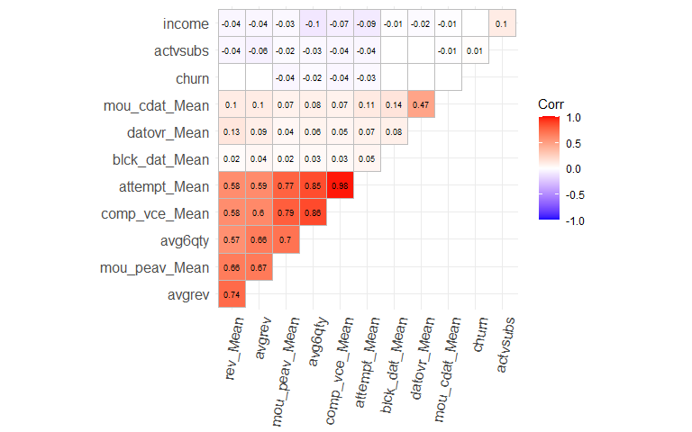<!-- -->

### **Gráfico de correlação 2**


```r
graf_pt2 <- graf_cor(parte2)
graf_pt2
```

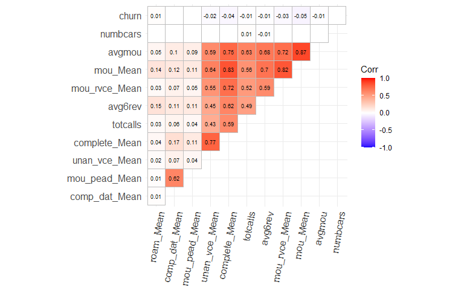<!-- -->

### **Gráfico de correlação 3**


```r
graf_pt3 <- graf_cor(parte3)
graf_pt3
```

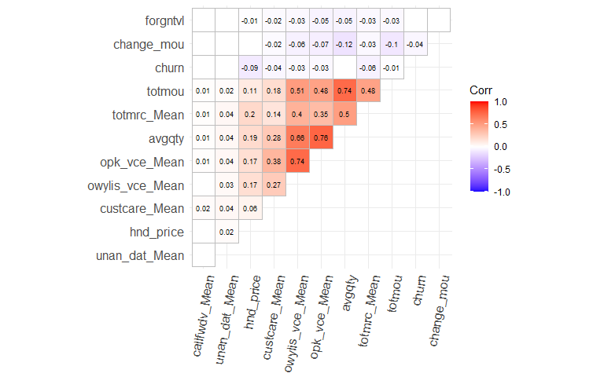<!-- -->

### **Gráfico de correlação 4**


```r
graf_pt4 <- graf_cor(parte4)
graf_pt4
```

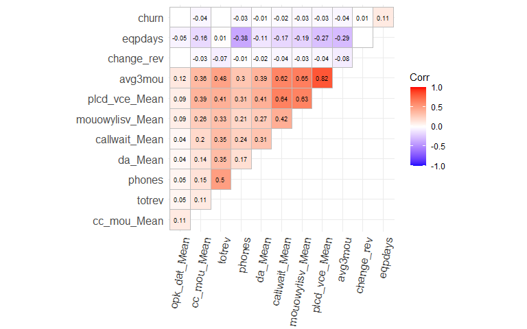<!-- -->

### **Gráfico de correlação 5**


```r
graf_pt5 <- graf_cor(parte5)
graf_pt5
```

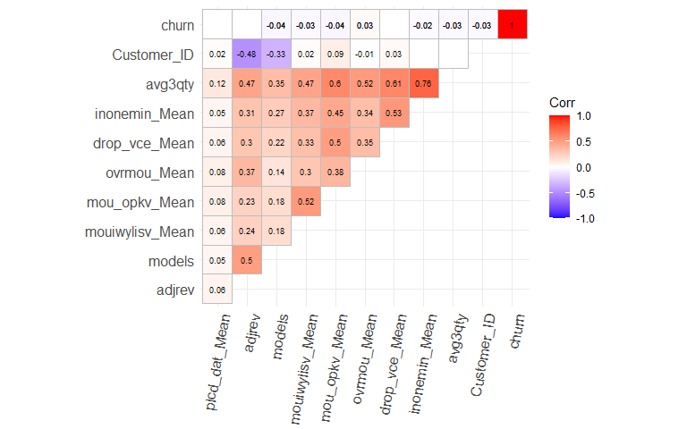<!-- -->

### **Gráfico de correlação 6**


```r
graf_pt6 <- graf_cor(parte6)
graf_pt6
```

<!-- -->

### **Gráfico de correlação 7**


```r
graf_pt7 <- graf_cor(parte7)
graf_pt7
```

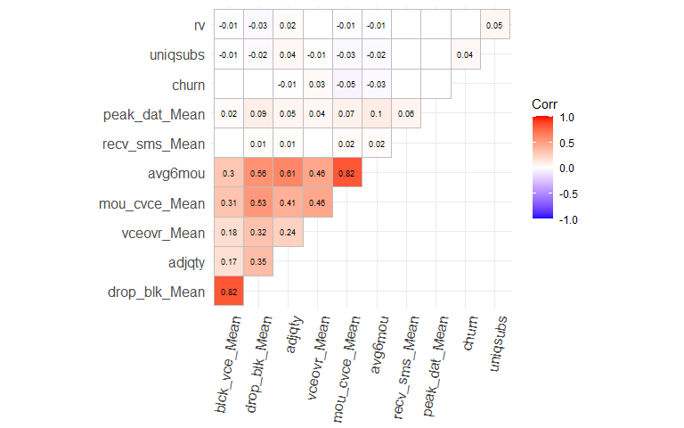<!-- -->

### **Conclusão**

Foram encontradas 42 correlações altas. A tabela a seguir mostra essas associações:

### Tabela com as variáveis altamente correlacionadas

|     | Variável 1      | Variável 2      | Correlação entre 1 e 2 |
|-----|-----------------|-----------------|------------------------|
| 1   | attempt_Mean    | comp_vce_Mean   | 0.98                   |
| 2   | avgmou          | mou_Mean        | 0.87                   |
| 3   | comp_vce_Mean   | avg6qty         | 0.86                   |
| 4   | attempt_Mean    | avg6qty         | 0.85                   |
| 5   | avg6mou         | mou_cvce_Mean   | 0.83                   |
| 6   | complete_Mean   | mou_Mean        | 0.83                   |
| 7   | avg3mou         | plcd_vc_Mean    | 0.83                   |
| 8   | mou_rvce_Mean   | mou_Mean        | 0.82                   |
| 9   | drop_blck_Mean  | blck_vce_Mean   | 0.82                   |
| 10  | comp_vce_Mean   | mou_peav_Mean   | 0.8                    |
| 11  | peak_vce_Mean   | recv_vce_Mean   | 0.l8                   |
| 12  | attempt_Mean    | mou_peav_Mean   | 0.77                   |
| 13  | complete_Mean   | unan_vce_Mean   | 0.77                   |
| 14  | avg3ty          | inonemin_Mean   | 0.77                   |
| 15  | avgmou          | complete_Mean   | 0.76                   |
| 16  | avgrev          | rev_Mean        | 0.75                   |
| 17  | avg3rev         | ovrrev_Mean     | 0.75                   |
| 18  | avgqty          | opk_vc_Mean     | 0.76                   |
| 19  | owylis_vce_Mean | opk_vc_Mean     | 0.74                   |
| 20  | totmou          | avgqty          | 0.74                   |
| 21  | avgmou          | mou_rvce_Mean   | 0.73                   |
| 22  | complete_Mean   | mou_rvce_Mean   | 0.73                   |
| 23  | avg6ty          | mou_peav_Mean   | 0.71                   |
| 24  | mou_Mean        | avg6rev         | 0.7                    |
| 25  | avgmou          | avg6rev         | 0.68                   |
| 26  | rev_Mean        | mou_peav_Mean   | 0.67                   |
| 27  | avgrev          | mou_peav_Mean   | 0.67                   |
| 28  | owylis_vce_Mean | avgqty          | 0.66                   |
| 29  | avg3mou         | mouowylisv_Mean | 0.65                   |
| 30  | peak_vce_Mean   | adjmou          | 0.65                   |
| 31  | peak_vce_Mean   | avg3rev         | 0.64                   |
| 32  | plcd_vce_Mean   | callwait_Mean   | 0.64                   |
| 33  | mou_Mean        | unan_vce_Mean   | 0.64                   |
| 34  | plcd_vce_Mean   | mouowylisv_Mean | 0.63                   |
| 35  | avgmou          | totcalls        | 0.63                   |
| 36  | mou_pead_Mean   | comp_dat_Mean   | 0.62                   |
| 37  | avgmou          | callwait_Mean   | 0.62                   |
| 38  | av3qty          | drop_vce_Mean   | 0.61                   |
| 39  | avg3qty         | mou_opkv_Mean   | 0.6                    |
| 40  | attempt_Mean    | avgrev          | 0.6                    |
| 41  | comp_vce_Mean   | avgrev          | 0.6                    |
| 42  | mou_rvce_Mean   | avg6rev         | 0.6                    |

Analisando a tabela acima , é possível notar que 7 variáveis aparecem com frequência. São elas:

| Variável      | Descrição                                                  | Quantidade de vezes que aparece |
|---------------|------------------------------------------------------------|---------------------------------|
| avgmou        | Média mensal de minutos de uso ao longo da vida do cliente | 5                               |
| attempt_Mean  | Número médio de tentativas de chamadas                     | 4                               |
| avg3mou       | Média mensal de minutos de uso nos três meses anteriores   | 3                               |
| avg3qty       | Número médio mensal de chamadas nos três meses anteriores  | 3                               |
| comp_vce_Mean | Número médio de chamadas de voz concluídas                 | 3                               |
| complete_Mean | Número médio de chamadas concluídas                        | 3                               |
| peak_vce_Mean | Número médio de chamadas de voz de entrada e saída de pico | 3                               |

A variável `avgmou` também aparece na literaturta como determística de Churn. Isso é um indica ser uma boa ideia deixá-la no dataset final e eliminar as variáveis que são altamente correlacionadas com ela.

## **6.2 Análise Exploratória das variáveis correlacionadas com churn**

### Funções {.tabset .tabset-pills}

Será feita uma analise exploratória das variáveis da tabela acima

#### Função 1 para automatizar a análise de dados númericos


```r
#Função que retorna com o summary e com o gráfico de dados numéricos
func_n1 <- function(col) {
  # Calcula o resumo
  resumo <- summary(dados3[[col]])
  describe <-describe(dados3[[col]])
  total <- sum(dados3[[col]], na.rm= TRUE)
  classe <- class(dados3[[col]])

  # Cria o gráfico
  p <- ggplot(dados3, aes_string(x = col, fill = factor(dados3$churn))) +
    geom_histogram(position ="stack", bins = 30, color ="white", alpha = 0.7) +
    labs(
      title = paste('Distribuição de', col, 'Agrupada por Churn'),
      subtitle = paste("Total:", total),
      x = col,
      y = 'Count',
      fill = 'Churn'
    ) +
    theme_minimal() +
    theme(plot.title = element_text(hjust = 0.5)) +
    scale_fill_manual(values = c("blue","red"), name ="Churn", labels = c("0","1")) +
    guides(fill = guide_legend(title ="Churn"))

  print(classe)
  print(resumo)
  print(describe)
  print(p)
  
}
```

#### Função 2 para automatizar a análise de dados númericos


```r
#Função que retorna com o summary e com o gráfico de dados numéricos
func_n2 <- function(col){
  # Calcula o resumo
  resumo <- summary(dados3[[col]])
  describe <-describe(dados3[[col]])
  total <- sum(dados3[[col]], na.rm= TRUE)
  classe <- paste("A variável" , col,"é do tipo", class(dados3[[col]]))

  # Cria o gráfico
  p <- ggplot(dados3, aes_string(x = col, fill = factor(dados3$churn))) +
    geom_histogram(position ="dodge", bins = 30, color ="white", alpha = 0.7) +
    labs(
      title = paste('Distribuição de', col, 'Agrupada por Churn'),
      subtitle = paste("Total:", total),
      x = col,
      y = 'Count',
      fill = 'Churn'
    ) +
    theme_minimal() +
    theme(plot.title = element_text(hjust = 0.5)) +
    scale_fill_manual(values = c("blue","red"), name ="Churn", labels = c("0","1")) +
    guides(fill = guide_legend(title ="Churn"))

  cat(classe)
  print(resumo)
  print(describe)
  print(p)
  
}

#OBS: a Função paste serve para concatenar os elementos da mensagem, e cat para imprimir o resultado
```

#### Função 1 para automatizar a análise de dados categóricos


```r
func_c1 <- function(col) {
  # Verifica se a coluna é do tipo character
  if (!is.character(dados3[[col]])) {
    stop("A coluna não é do tipo character.")
  }
  
  # Calcula o resumo
  resumo <- table(dados3[[col]])
  
  # Cria o gráfico de barras para variáveis categóricas
  p <- ggplot(dados3, aes_string(x = col, fill = factor(dados3$churn))) +
    geom_bar(position ="stack", color ="white", alpha = 0.7) +
    labs(
      title = paste('Distribuição de', col, 'Agrupada por Churn'),
      x = col,
      y = 'Count',
      fill = 'Churn'
    ) +
    theme_minimal() +
    theme(plot.title = element_text(hjust = 0.5)) +
    scale_fill_manual(values = c("blue","red"), name ="Churn", labels = c("0","1")) +
    guides(fill = guide_legend(title ="Churn"))
  
  print(resumo)
  print(p)
}
```

#### Função 2 para automatizar a análise de dados categóricos


```r
func_c2 <- function(col) {
  # Verifica se a coluna é do tipo character
  if (!is.character(dados3[[col]])) {
    stop("A coluna não é do tipo character.")
  }
  
  # Calcula o resumo
  resumo <- table(dados3[[col]])
  
  # Cria o gráfico de barras para variáveis categóricas
  p <- ggplot(dados3, aes_string(x = col, fill = factor(dados3$churn))) +
    geom_bar(position ="dodge", color ="white", alpha = 0.7) +
    labs(
      title = paste('Distribuição de', col, 'Agrupada por Churn'),
      x = col,
      y = 'Count',
      fill = 'Churn'
    ) +
    theme_minimal() +
    theme(axis.text.x = element_text(angle = 45, hjust = 1))+
    scale_fill_manual(values = c("blue","red"), name ="Churn", labels = c("0","1")) +
    guides(fill = guide_legend(title ="Churn"))
  
  print(resumo)
  print(p)
}
```

#### Testar numa amostra se o gráfico acima está certo


```r
#Função que retorna com o summary e com o gráfico
func_amostra <- function(col) {
  # Calcula o resumo
  resumo <- summary(amostra[[col]])
  describe <-describe(amostra[[col]])
  total <- sum(amostra[[col]], na.rm= TRUE)

  # Cria o gráfico
  p <- ggplot(amostra, aes_string(x = col, fill = factor(amostra$churn))) +
    geom_histogram(position ="stack", bins = 30, color ="white", alpha = 0.7) +
    labs(
      title = paste('Distribuição de', col, 'Agrupada por Churn'),
      subtitle = paste("Total:", total),
      x = col,
      y = 'Count',
      fill = 'Churn'
    ) +
    theme_minimal() +
    theme(plot.title = element_text(hjust = 0.5)) +
    scale_fill_manual(values = c("blue","red"), name ="Churn", labels = c("0","1")) +
    guides(fill = guide_legend(title ="Churn"))

  print(resumo)
  print(describe)
  print(p)
  
}
```


```r
#Criar uma amostra para conferir se o gráfico foi feito corretamente
amostra<- dados3[sample(nrow(dados3), 50),]
```


```r
amostra <- amostra %>% select(drop_vce_Mean, churn)
```


```r
#amostra
```


```r
func_amostra("drop_vce_Mean")
```

```
## Warning: `aes_string()` was deprecated in ggplot2 3.0.0.
## ℹ Please use tidy evaluation idioms with `aes()`.
## ℹ See also `vignette("ggplot2-in-packages")` for more information.
## This warning is displayed once every 8 hours.
## Call `lifecycle::last_lifecycle_warnings()` to see where this warning was
## generated.
```

```
##    Min. 1st Qu.  Median    Mean 3rd Qu.    Max. 
##   0.000   1.333   4.333   6.160   7.917  35.333 
##    vars  n mean   sd median trimmed  mad min   max range skew kurtosis   se
## X1    1 50 6.16 7.01   4.33    4.84 4.94   0 35.33 35.33 1.99     4.63 0.99
```

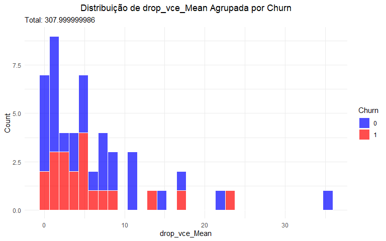<!-- -->

### Teste de Hipótese

Para realizar o gráfico será criada duas tabelas , uma com amostra dos dados quando churn for igual a 0 e outra tabela quando churn for igual a 1. E em seguida, será feito o teste comparando a distribuição dessas duas tabelas.

#### Amostragem aleatória


```r
#Definir a semente

set.seed(123)  # Define uma semente para reproducibilidade

# Criar um dataframe com os dados quando churn =0

df_churn_0 <- dados3[dados3$churn == 0, ]

## Criar um dataframe com os dados quando churn =0

df_churn_1 <- dados3[dados3$churn == 1, ]

# Tamanho da amostra para churn=0 (mesmo tamanho que churn=1)

tamanho_amostra <- min(nrow(df_churn_0), nrow(df_churn_1))

#OBS: tamanho_amostra é o tamanho da amostra desejado, que é o menor entre o tamanho de amostra_churn_0 e amostra_churn_1.

# Amostragem aleatória

amostra_churn_0 <- df_churn_0[sample(nrow(df_churn_0), tamanho_amostra, replace = TRUE), ]

amostra_churn_1 <- df_churn_1[sample(nrow(df_churn_1), tamanho_amostra, replace = TRUE), ]

#OBS:replace = TRUE

# - Amostragem com substituição.

# - Isso significa que a mesma observação pode ser escolhida mais de uma vez durante o processo de amostragem. Cada vez que uma observação é escolhida, ela é devolvida à população antes da próxima escolha.
```

#### Teste de Hipótese - Kolmogorov-Smirnov

É um teste não paramétrico que compara as funções de distribuição de duas amostras

$H_0: As \ distribuições \ são \ iguais$

$H_1: As\ distribuições \ são \ diferentes$

O nível de significância será de 0.05 e critério de avaliação será pelo p-valor. Se o p-valor for maior que 0.05, rejeita-se $H_0$, logo as amostras tem a mesma distribuição. Isso será um indicativo de que a variável testada não é uma boa preditora.

Agora, se o p-valor for menor que 0.05, então rejeita-se $H_0$, logo as amostras tem distribuições diferentes, portanto, a variável análisada é uma boa preditora de churn.

O objetivo do teste é ajudar a encontrar boas preditoras de churn.


```r
teste_ks <- function(x){
  t <- ks.test(amostra_churn_0[[x]], amostra_churn_1[[x]])
  print(t)
}
```

### \*\*\*6.2.1 months


```r
class(dados3$months)
```

```
## [1] "integer"
```


```r
func_n2("months")
```

```
## A variável months é do tipo integer   Min. 1st Qu.  Median    Mean 3rd Qu.    Max. 
##     7.0    12.0    17.0    18.9    24.0    61.0 
##    vars     n mean   sd median trimmed mad min max range skew kurtosis   se
## X1    1 63377 18.9 9.28     17    17.8 8.9   7  61    54 1.09     1.01 0.04
```

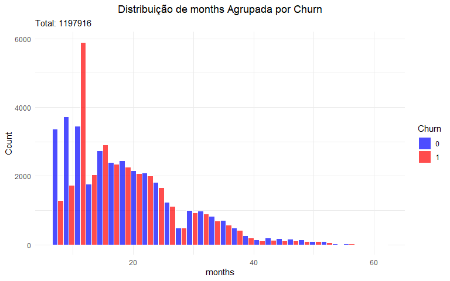<!-- -->


```r
teste_ks("months")
```

```
## Warning in ks.test.default(amostra_churn_0[[x]], amostra_churn_1[[x]]): p-value
## will be approximate in the presence of ties
```

```
## 
## 	Asymptotic two-sample Kolmogorov-Smirnov test
## 
## data:  amostra_churn_0[[x]] and amostra_churn_1[[x]]
## D = 0.11689, p-value < 2.2e-16
## alternative hypothesis: two-sided
```

### 6.2.2 truck


```r
class(dados3$truck)
```

```
## [1] "integer"
```


```r
unique(dados3$truck)
```

```
## [1] 0 1
```


```r
func_n2("truck")
```

```
## A variável truck é do tipo integer   Min. 1st Qu.  Median    Mean 3rd Qu.    Max. 
##  0.0000  0.0000  0.0000  0.2458  0.0000  1.0000 
##    vars     n mean   sd median trimmed mad min max range skew kurtosis se
## X1    1 63377 0.25 0.43      0    0.18   0   0   1     1 1.18    -0.61  0
```

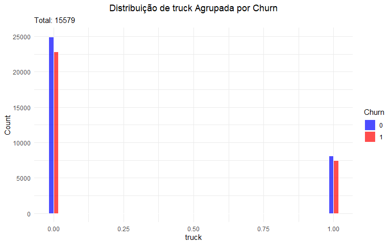<!-- -->

A análise gráfica mostra que não uma grande diferença entre as distribuições. Logo, esta não é uma boa preditora.

### 6.2.3 rv


```r
func_n2("rv")
```

```
## A variável rv é do tipo integer   Min. 1st Qu.  Median    Mean 3rd Qu.    Max. 
##  0.0000  0.0000  0.0000  0.1087  0.0000  1.0000 
##    vars     n mean   sd median trimmed mad min max range skew kurtosis se
## X1    1 63377 0.11 0.31      0    0.01   0   0   1     1 2.51     4.32  0
```

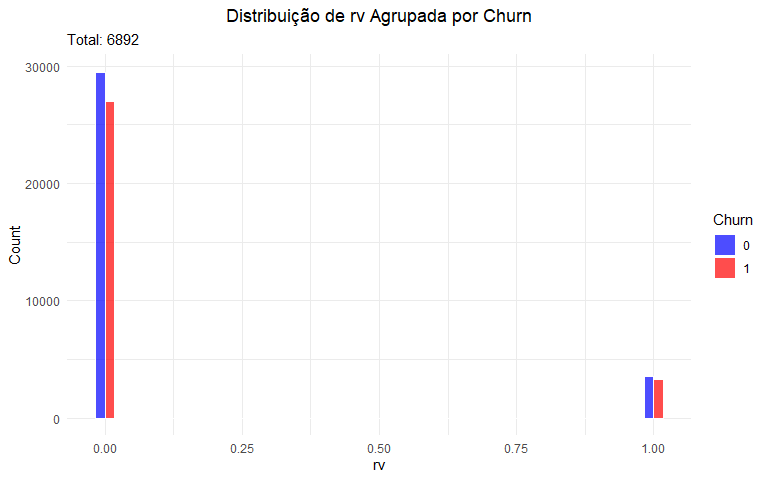<!-- -->

### \*\*\*6.2.4 drop_vce_Mean


```r
class(dados3$drop_vce_Mean)
```

```
## [1] "numeric"
```


```r
func_n2("drop_vce_Mean")
```

```
## A variável drop_vce_Mean é do tipo numeric    Min.  1st Qu.   Median     Mean  3rd Qu.     Max. 
##   0.0000   0.6667   3.0000   5.7904   7.3333 232.6667 
##    vars     n mean   sd median trimmed  mad min    max  range skew kurtosis
## X1    1 63377 5.79 8.66      3    4.04 3.95   0 232.67 232.67 4.44    39.78
##      se
## X1 0.03
```

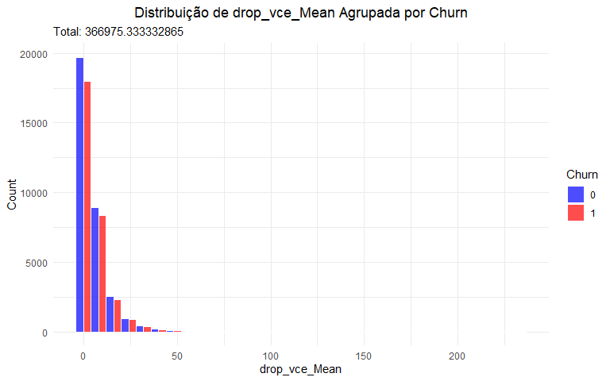<!-- -->


```r
teste_ks("drop_vce_Mean")
```

```
## Warning in ks.test.default(amostra_churn_0[[x]], amostra_churn_1[[x]]): p-value
## will be approximate in the presence of ties
```

```
## 
## 	Asymptotic two-sample Kolmogorov-Smirnov test
## 
## data:  amostra_churn_0[[x]] and amostra_churn_1[[x]]
## D = 0.016953, p-value = 0.0003286
## alternative hypothesis: two-sided
```

### \*6.2.5 drop_dat_Mean


```r
func_n2("drop_dat_Mean")
```

```
## A variável drop_dat_Mean é do tipo numeric     Min.   1st Qu.    Median      Mean   3rd Qu.      Max. 
##   0.00000   0.00000   0.00000   0.04105   0.00000 207.33333 
##    vars     n mean   sd median trimmed mad min    max  range   skew kurtosis se
## X1    1 63377 0.04 0.96      0       0   0   0 207.33 207.33 162.71 34077.54  0
```

<!-- -->

### \*6.2.5 blck_vce_Mean


```r
func_n2("blck_vce_Mean")
```

```
## A variável blck_vce_Mean é do tipo numeric   Min. 1st Qu.  Median    Mean 3rd Qu.    Max. 
##   0.000   0.000   1.000   3.883   3.333 385.333 
##    vars     n mean    sd median trimmed  mad min    max  range  skew kurtosis
## X1    1 63377 3.88 10.52      1    1.84 1.48   0 385.33 385.33 10.68   202.83
##      se
## X1 0.04
```

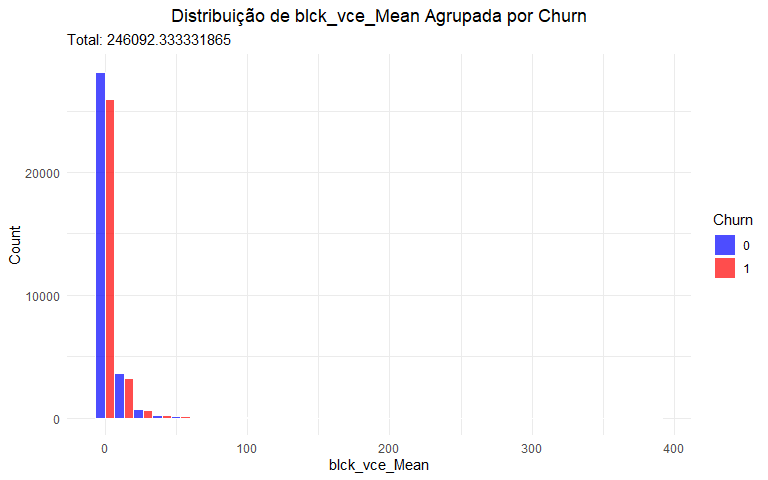<!-- -->


```r
teste_ks("blck_vce_Mean")
```

```
## Warning in ks.test.default(amostra_churn_0[[x]], amostra_churn_1[[x]]): p-value
## will be approximate in the presence of ties
```

```
## 
## 	Asymptotic two-sample Kolmogorov-Smirnov test
## 
## data:  amostra_churn_0[[x]] and amostra_churn_1[[x]]
## D = 0.024935, p-value = 1.301e-08
## alternative hypothesis: two-sided
```

### \*6.2.6 blck_dat_Mean


```r
unique(dados3$blck_dat_Mean)
```

```
##  [1]   0.0000000   0.3333333   2.0000000   0.6666667   1.3333333   3.0000000
##  [7]   1.0000000  11.0000000   4.3333333   1.6666667   2.3333333   2.6666667
## [13]   3.6666667  72.3333333   5.3333333   4.6666667 122.3333333   7.3333333
## [19]   3.3333333  14.3333333   6.0000000   4.0000000  11.3333333  11.6666667
## [25]  15.3333333   8.0000000   7.0000000   8.3333333  10.6666667   7.6666667
## [31]  17.3333333  10.3333333   6.6666667  16.3333333   5.0000000  70.0000000
## [37]  66.6666667  12.6666667  16.0000000  13.3333333   9.6666667  64.0000000
## [43]   5.6666667  32.3333333  13.6666667  17.0000000
```


```r
func_n2("blck_dat_Mean")
```

```
## A variável blck_dat_Mean é do tipo numeric     Min.   1st Qu.    Median      Mean   3rd Qu.      Max. 
##   0.00000   0.00000   0.00000   0.02225   0.00000 122.33333 
##    vars     n mean   sd median trimmed mad min    max  range  skew kurtosis se
## X1    1 63377 0.02 0.79      0       0   0   0 122.33 122.33 100.9  12455.1  0
```

<!-- -->


```r
teste_ks("blck_vce_Mean")
```

```
## Warning in ks.test.default(amostra_churn_0[[x]], amostra_churn_1[[x]]): p-value
## will be approximate in the presence of ties
```

```
## 
## 	Asymptotic two-sample Kolmogorov-Smirnov test
## 
## data:  amostra_churn_0[[x]] and amostra_churn_1[[x]]
## D = 0.024935, p-value = 1.301e-08
## alternative hypothesis: two-sided
```

### \*\*\*6.2.7 hnd_price


```r
func_n2("hnd_price")
```

```
## A variável hnd_price é do tipo numeric   Min. 1st Qu.  Median    Mean 3rd Qu.    Max. 
##    9.99   59.99  129.99  108.08  149.99  499.99 
##    vars     n   mean    sd median trimmed   mad  min    max range skew kurtosis
## X1    1 63377 108.08 58.74 129.99  106.05 74.13 9.99 499.99   490 0.43     1.26
##      se
## X1 0.23
```

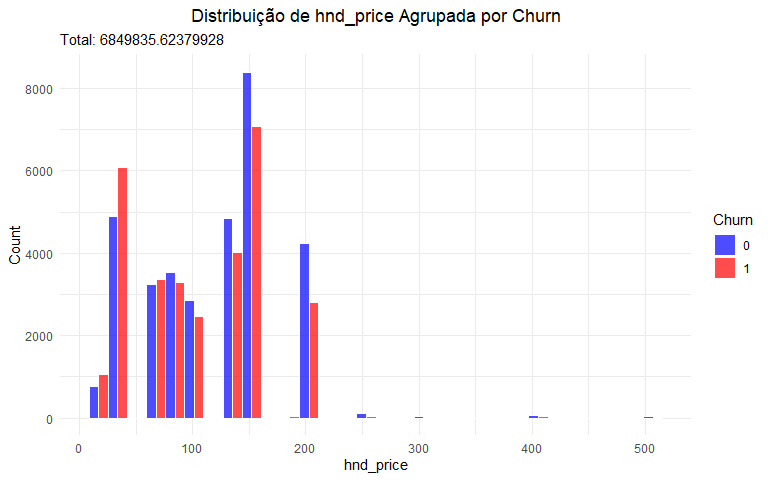<!-- -->


```r
teste_ks("hnd_price")
```

```
## Warning in ks.test.default(amostra_churn_0[[x]], amostra_churn_1[[x]]): p-value
## will be approximate in the presence of ties
```

```
## 
## 	Asymptotic two-sample Kolmogorov-Smirnov test
## 
## data:  amostra_churn_0[[x]] and amostra_churn_1[[x]]
## D = 0.076355, p-value < 2.2e-16
## alternative hypothesis: two-sided
```

### \*6.2.8 avgqty


```r
func_n2("avgqty")
```

```
## A variável avgqty é do tipo numeric   Min. 1st Qu.  Median    Mean 3rd Qu.    Max. 
##    0.00   62.77  123.55  169.50  221.89 3017.11 
##    vars     n  mean     sd median trimmed    mad min     max   range skew
## X1    1 63377 169.5 164.65 123.55  141.92 106.72   0 3017.11 3017.11 2.95
##    kurtosis   se
## X1     17.3 0.65
```

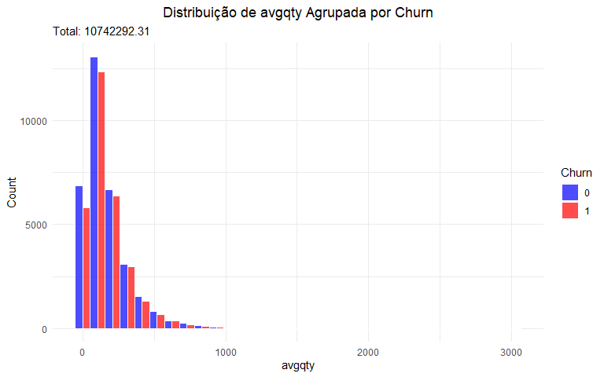<!-- -->


```r
teste_ks("avgqty")
```

```
## Warning in ks.test.default(amostra_churn_0[[x]], amostra_churn_1[[x]]): p-value
## will be approximate in the presence of ties
```

```
## 
## 	Asymptotic two-sample Kolmogorov-Smirnov test
## 
## data:  amostra_churn_0[[x]] and amostra_churn_1[[x]]
## D = 0.022461, p-value = 4.55e-07
## alternative hypothesis: two-sided
```

### \*\*\*6.2.9 rev_Mean


```r
func_n2("rev_Mean")
```

```
## A variável rev_Mean é do tipo numeric    Min.  1st Qu.   Median     Mean  3rd Qu.     Max. 
##   -5.862   33.240   47.675   58.285   69.775 3843.262 
##    vars     n  mean    sd median trimmed   mad   min     max   range  skew
## X1    1 63377 58.28 46.67  47.67    51.3 24.19 -5.86 3843.26 3849.12 11.81
##    kurtosis   se
## X1   709.55 0.19
```

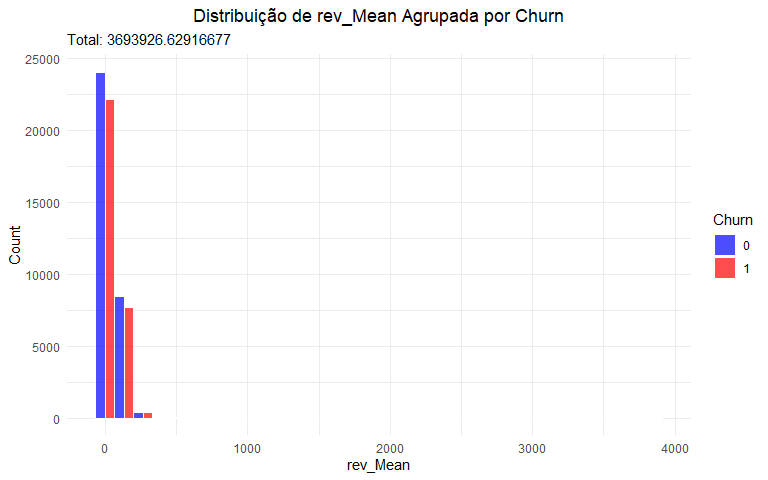<!-- -->


```r
teste_ks("rev_Mean")
```

```
## Warning in ks.test.default(amostra_churn_0[[x]], amostra_churn_1[[x]]): p-value
## will be approximate in the presence of ties
```

```
## 
## 	Asymptotic two-sample Kolmogorov-Smirnov test
## 
## data:  amostra_churn_0[[x]] and amostra_churn_1[[x]]
## D = 0.018668, p-value = 5.155e-05
## alternative hypothesis: two-sided
```

### \*\*\*6.2.10 totmrc_Mean


```r
func_n2("totmrc_Mean")
```

```
## A variável totmrc_Mean é do tipo numeric   Min. 1st Qu.  Median    Mean 3rd Qu.    Max. 
##  -26.91   30.00   44.99   46.23   59.99  399.99 
##    vars     n  mean   sd median trimmed   mad    min    max  range skew
## X1    1 63377 46.23 23.5  44.99   44.61 22.22 -26.91 399.99 426.91 1.66
##    kurtosis   se
## X1      8.9 0.09
```

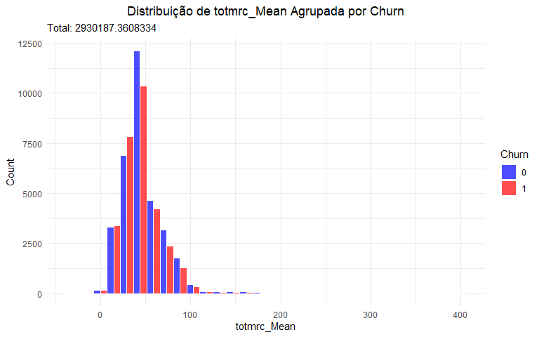<!-- -->


```r
teste_ks("totmrc_Mean")
```

```
## Warning in ks.test.default(amostra_churn_0[[x]], amostra_churn_1[[x]]): p-value
## will be approximate in the presence of ties
```

```
## 
## 	Asymptotic two-sample Kolmogorov-Smirnov test
## 
## data:  amostra_churn_0[[x]] and amostra_churn_1[[x]]
## D = 0.067779, p-value < 2.2e-16
## alternative hypothesis: two-sided
```

### \*\*\*6.2.11 eqpdays

Segundo (LEE et al., 2011) , a variável número de dias do equipamento atual (eqpdays) "está positivamente associada à decisão de desligamento dos usuários do serviço, o que significa que um usuário do serviço que manteve seu atual equipamento móvel por mais tempo terá maior probabilidade de mudar para outro provedor de serviços". Logo, quanto maior o eqpdays, maior a chances de churn.


```r
func_n2("eqpdays")
```

```
## A variável eqpdays é do tipo integer   Min. 1st Qu.  Median    Mean 3rd Qu.    Max. 
##    -5.0   216.0   338.0   374.6   502.0  1465.0 
##    vars     n   mean     sd median trimmed    mad min  max range skew kurtosis
## X1    1 63377 374.57 228.62    338  356.81 200.15  -5 1465  1470 0.78     0.54
##      se
## X1 0.91
```

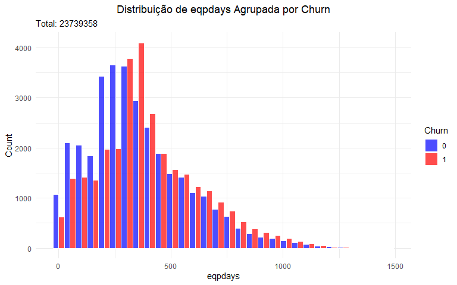<!-- -->


```r
teste_ks("eqpdays")
```

```
## Warning in ks.test.default(amostra_churn_0[[x]], amostra_churn_1[[x]]): p-value
## will be approximate in the presence of ties
```

```
## 
## 	Asymptotic two-sample Kolmogorov-Smirnov test
## 
## data:  amostra_churn_0[[x]] and amostra_churn_1[[x]]
## D = 0.16343, p-value < 2.2e-16
## alternative hypothesis: two-sided
```

### \*6.2.12 ovrmou_Mean


```r
func_n2("ovrmou_Mean")
```

```
## A variável ovrmou_Mean é do tipo numeric   Min. 1st Qu.  Median    Mean 3rd Qu.    Max. 
##    0.00    0.00    2.25   40.16   40.25 4320.75 
##    vars     n  mean    sd median trimmed  mad min     max   range skew kurtosis
## X1    1 63377 40.16 96.48   2.25   18.66 3.34   0 4320.75 4320.75 7.37   126.78
##      se
## X1 0.38
```

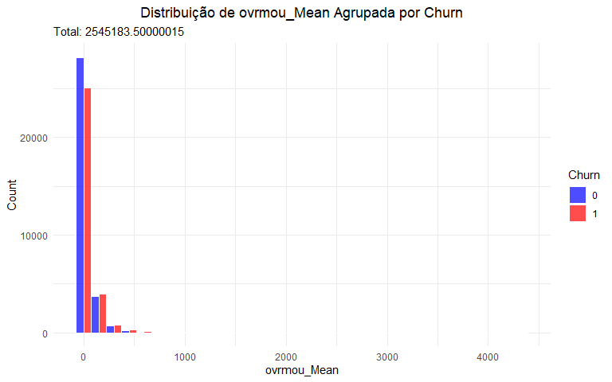<!-- -->


```r
teste_ks("ovrmou_Mean")
```

```
## Warning in ks.test.default(amostra_churn_0[[x]], amostra_churn_1[[x]]): p-value
## will be approximate in the presence of ties
```

```
## 
## 	Asymptotic two-sample Kolmogorov-Smirnov test
## 
## data:  amostra_churn_0[[x]] and amostra_churn_1[[x]]
## D = 0.042614, p-value < 2.2e-16
## alternative hypothesis: two-sided
```

### \*\*6.2.13 mou_cvce_Mean


```r
class(dados3$mou_cvce_Mean)
```

```
## [1] "numeric"
```


```r
func_n2("mou_cvce_Mean")
```

```
## A variável mou_cvce_Mean é do tipo numeric   Min. 1st Qu.  Median    Mean 3rd Qu.    Max. 
##    0.00   49.53  143.08  220.35  297.39 3701.36 
##    vars     n   mean     sd median trimmed    mad min     max   range skew
## X1    1 63377 220.35 255.11 143.08  173.86 164.12   0 3701.36 3701.36 2.62
##    kurtosis   se
## X1    11.45 1.01
```

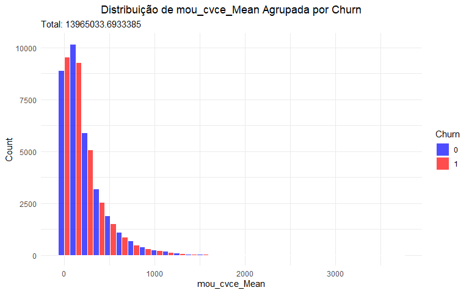<!-- -->


```r
teste_ks("mou_cvce_Mean")
```

```
## Warning in ks.test.default(amostra_churn_0[[x]], amostra_churn_1[[x]]): p-value
## will be approximate in the presence of ties
```

```
## 
## 	Asymptotic two-sample Kolmogorov-Smirnov test
## 
## data:  amostra_churn_0[[x]] and amostra_churn_1[[x]]
## D = 0.050068, p-value < 2.2e-16
## alternative hypothesis: two-sided
```

### \*\*\*6.2.14 asl_flag


```r
class(dados3$asl_flag)
```

```
## [1] "character"
```


```r
func_c2("asl_flag")
```

```
## 
##     N     Y 
## 56191  7186
```

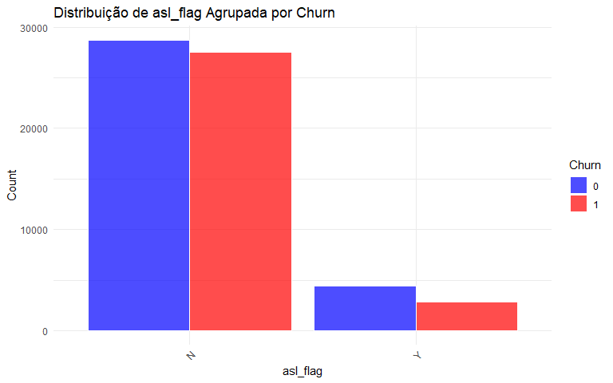<!-- -->

### \*\*\*6.2.15 totmou


```r
class(dados3$totmou)
```

```
## [1] "numeric"
```


```r
func_n2("totmou")
```

```
## A variável totmou é do tipo numeric   Min. 1st Qu.  Median    Mean 3rd Qu.    Max. 
##       0    2517    5128    7683    9733  233419 
##    vars     n    mean      sd median trimmed     mad min      max    range skew
## X1    1 63377 7683.36 8932.48   5128 6106.69 4656.85   0 233419.1 233419.1 4.66
##    kurtosis    se
## X1    45.43 35.48
```

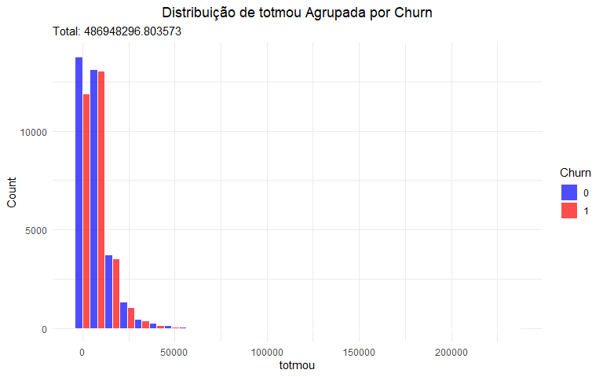<!-- -->


```r
teste_ks("totmou")
```

```
## Warning in ks.test.default(amostra_churn_0[[x]], amostra_churn_1[[x]]): p-value
## will be approximate in the presence of ties
```

```
## 
## 	Asymptotic two-sample Kolmogorov-Smirnov test
## 
## data:  amostra_churn_0[[x]] and amostra_churn_1[[x]]
## D = 0.034797, p-value = 2.22e-16
## alternative hypothesis: two-sided
```

### \*6.2.16 avgmou


```r
class(dados3$avgmou)
```

```
## [1] "numeric"
```


```r
func_n2("avgmou")
```

```
## A variável avgmou é do tipo numeric   Min. 1st Qu.  Median    Mean 3rd Qu.    Max. 
##     0.0   172.9   345.2   463.9   622.2  7040.1 
##    vars     n   mean     sd median trimmed    mad min     max   range skew
## X1    1 63377 463.93 420.64 345.25  396.25 301.52   0 7040.13 7040.13 2.12
##    kurtosis   se
## X1     7.95 1.67
```

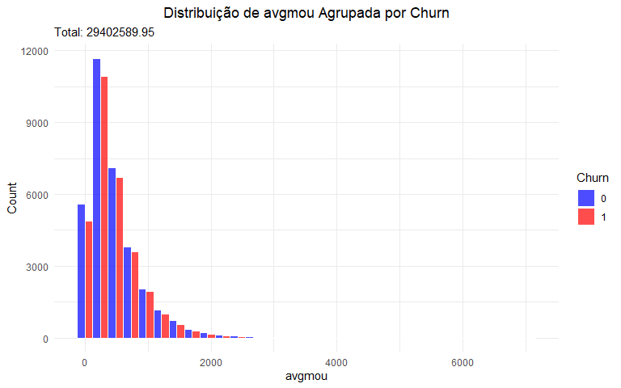<!-- -->


```r
teste_ks("avgmou")
```

```
## Warning in ks.test.default(amostra_churn_0[[x]], amostra_churn_1[[x]]): p-value
## will be approximate in the presence of ties
```

```
## 
## 	Asymptotic two-sample Kolmogorov-Smirnov test
## 
## data:  amostra_churn_0[[x]] and amostra_churn_1[[x]]
## D = 0.013787, p-value = 0.006284
## alternative hypothesis: two-sided
```

### \*6.2.17 vceovr_Mean


```r
class(dados3$vceovr_Mean)
```

```
## [1] "numeric"
```


```r
func_n2("vceovr_Mean")
```

```
## A variável vceovr_Mean é do tipo numeric    Min.  1st Qu.   Median     Mean  3rd Qu.     Max. 
##   0.0000   0.0000   0.4375  12.8923  13.3000 896.0875 
##    vars     n  mean   sd median trimmed  mad min    max  range skew kurtosis
## X1    1 63377 12.89 29.7   0.44     6.1 0.65   0 896.09 896.09  6.1    73.09
##      se
## X1 0.12
```

<!-- -->


```r
teste_ks("vceovr_Mean")
```

```
## Warning in ks.test.default(amostra_churn_0[[x]], amostra_churn_1[[x]]): p-value
## will be approximate in the presence of ties
```

```
## 
## 	Asymptotic two-sample Kolmogorov-Smirnov test
## 
## data:  amostra_churn_0[[x]] and amostra_churn_1[[x]]
## D = 0.041921, p-value < 2.2e-16
## alternative hypothesis: two-sided
```

### \*6.2.18 ovrrev_Mean


```r
class(dados3$ovrrev_Mean)
```

```
## [1] "numeric"
```


```r
func_n2("ovrrev_Mean")
```

```
## A variável ovrrev_Mean é do tipo numeric   Min. 1st Qu.  Median    Mean 3rd Qu.    Max. 
##   0.000   0.000   0.825  13.157  13.688 896.087 
##    vars     n  mean    sd median trimmed  mad min    max  range skew kurtosis
## X1    1 63377 13.16 30.05   0.82    6.31 1.22   0 896.09 896.09 6.09    72.23
##      se
## X1 0.12
```

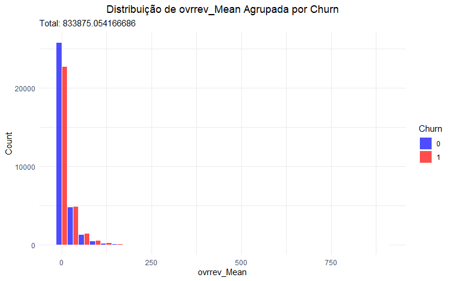<!-- -->


```r
teste_ks("ovrrev_Mean")
```

```
## Warning in ks.test.default(amostra_churn_0[[x]], amostra_churn_1[[x]]): p-value
## will be approximate in the presence of ties
```

```
## 
## 	Asymptotic two-sample Kolmogorov-Smirnov test
## 
## data:  amostra_churn_0[[x]] and amostra_churn_1[[x]]
## D = 0.041327, p-value < 2.2e-16
## alternative hypothesis: two-sided
```

### \*\*\*6.2.19 change_mou


```r
class(dados3$change_mou)
```

```
## [1] "numeric"
```


```r
func_n2("change_mou")
```

```
## A variável change_mou é do tipo numeric    Min.  1st Qu.   Median     Mean  3rd Qu.     Max. 
## -3331.25   -83.75    -6.00   -12.75    61.25 31219.25 
##    vars     n   mean     sd median trimmed    mad      min      max   range
## X1    1 63377 -12.75 275.38     -6   -10.2 107.12 -3331.25 31219.25 34550.5
##     skew kurtosis   se
## X1 22.89  2622.34 1.09
```

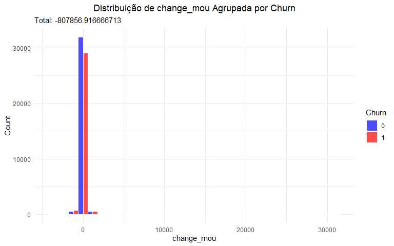<!-- -->


```r
teste_ks("change_mou")
```

```
## Warning in ks.test.default(amostra_churn_0[[x]], amostra_churn_1[[x]]): p-value
## will be approximate in the presence of ties
```

```
## 
## 	Asymptotic two-sample Kolmogorov-Smirnov test
## 
## data:  amostra_churn_0[[x]] and amostra_churn_1[[x]]
## D = 0.0627, p-value < 2.2e-16
## alternative hypothesis: two-sided
```

### \*6.2.20 refurb_new


```r
class(dados3$refurb_new)
```

```
## [1] "character"
```


```r
func_c2("refurb_new")
```

```
## 
##     N     R 
## 54464  8913
```

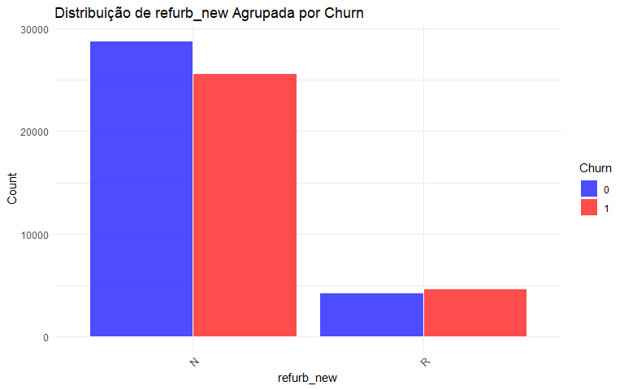<!-- -->


```r
teste_ks("ovrrev_Mean")
```

```
## Warning in ks.test.default(amostra_churn_0[[x]], amostra_churn_1[[x]]): p-value
## will be approximate in the presence of ties
```

```
## 
## 	Asymptotic two-sample Kolmogorov-Smirnov test
## 
## data:  amostra_churn_0[[x]] and amostra_churn_1[[x]]
## D = 0.041327, p-value < 2.2e-16
## alternative hypothesis: two-sided
```

### \*\*\*6.2.21 hnd_webcap


```r
class(dados3$hnd_webcap)
```

```
## [1] "character"
```


```r
unique(dados3$hnd_webcap)
```

```
## [1] "WCMB" "WC"
```


```r
func_c2("hnd_webcap")
```

```
## 
##    WC  WCMB 
## 10284 53093
```

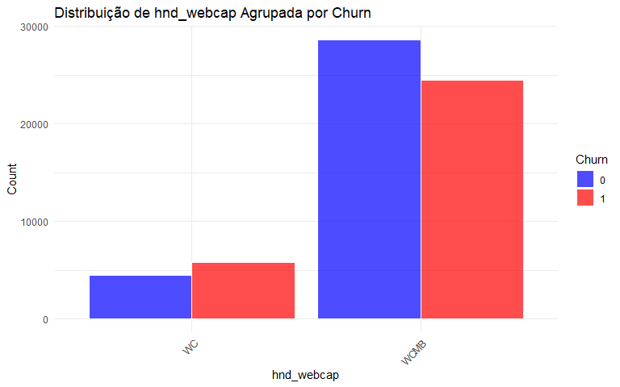<!-- -->

### \*\*\*6.2.22 area


```r
class(dados3$area)
```

```
## [1] "character"
```


```r
unique(dados3$area)
```

```
##  [1] "NORTHWEST/ROCKY MOUNTAIN AREA" "NEW ENGLAND AREA"             
##  [3] "GREAT LAKES AREA"              "DALLAS AREA"                  
##  [5] "CENTRAL/SOUTH TEXAS AREA"      "CHICAGO AREA"                 
##  [7] "TENNESSEE AREA"                "MIDWEST AREA"                 
##  [9] "PHILADELPHIA AREA"             "SOUTHWEST AREA"               
## [11] "OHIO AREA"                     "NEW YORK CITY AREA"           
## [13] "HOUSTON AREA"                  "SOUTH FLORIDA AREA"           
## [15] "ATLANTIC SOUTH AREA"           "CALIFORNIA NORTH AREA"        
## [17] "DC/MARYLAND/VIRGINIA AREA"     "NORTH FLORIDA AREA"           
## [19] ""                              "LOS ANGELES AREA"
```


```r
func_c2("area")
```

```
## 
##                                         ATLANTIC SOUTH AREA 
##                            27                          3807 
##         CALIFORNIA NORTH AREA      CENTRAL/SOUTH TEXAS AREA 
##                          3482                          2745 
##                  CHICAGO AREA                   DALLAS AREA 
##                          3378                          3385 
##     DC/MARYLAND/VIRGINIA AREA              GREAT LAKES AREA 
##                          4052                          3141 
##                  HOUSTON AREA              LOS ANGELES AREA 
##                          2820                          4059 
##                  MIDWEST AREA              NEW ENGLAND AREA 
##                          4110                          3500 
##            NEW YORK CITY AREA            NORTH FLORIDA AREA 
##                          7085                          2796 
## NORTHWEST/ROCKY MOUNTAIN AREA                     OHIO AREA 
##                          2592                          3125 
##             PHILADELPHIA AREA            SOUTH FLORIDA AREA 
##                          1613                          2145 
##                SOUTHWEST AREA                TENNESSEE AREA 
##                          3737                          1778
```

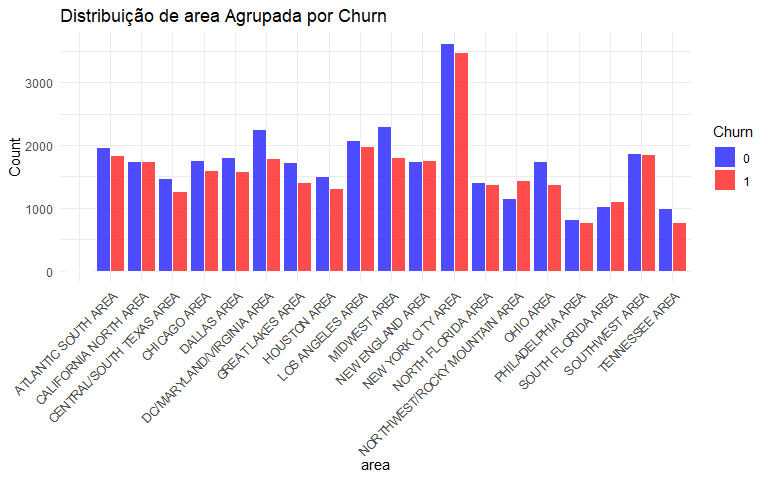<!-- -->

### \*6.2.23 income:


```r
func_n2("income")
```

```
## A variável income é do tipo integer   Min. 1st Qu.  Median    Mean 3rd Qu.    Max. 
##   1.000   4.000   6.000   5.777   7.000   9.000 
##    vars     n mean   sd median trimmed  mad min max range  skew kurtosis   se
## X1    1 63377 5.78 2.19      6     5.9 1.48   1   9     8 -0.38    -0.46 0.01
```

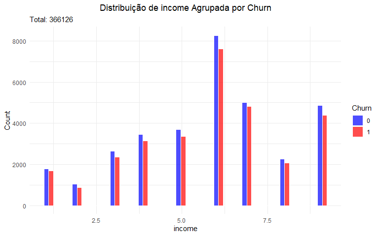<!-- -->


```r
teste_ks("income")
```

```
## Warning in ks.test.default(amostra_churn_0[[x]], amostra_churn_1[[x]]): p-value
## will be approximate in the presence of ties
```

```
## 
## 	Asymptotic two-sample Kolmogorov-Smirnov test
## 
## data:  amostra_churn_0[[x]] and amostra_churn_1[[x]]
## D = 0.0054751, p-value = 0.7538
## alternative hypothesis: two-sided
```

### \*6.2.24 roam_Mean


```r
class(dados3$roam_Mean)
```

```
## [1] "numeric"
```


```r
func_n2("roam_Mean")
```

```
## A variável roam_Mean é do tipo numeric    Min.  1st Qu.   Median     Mean  3rd Qu.     Max. 
##    0.000    0.000    0.000    1.311    0.270 3685.200 
##    vars     n mean    sd median trimmed mad min    max  range   skew kurtosis
## X1    1 63377 1.31 17.15      0    0.18   0   0 3685.2 3685.2 162.48 33788.63
##      se
## X1 0.07
```

<!-- -->


```r
teste_ks("roam_Mean")
```

```
## Warning in ks.test.default(amostra_churn_0[[x]], amostra_churn_1[[x]]): p-value
## will be approximate in the presence of ties
```

```
## 
## 	Asymptotic two-sample Kolmogorov-Smirnov test
## 
## data:  amostra_churn_0[[x]] and amostra_churn_1[[x]]
## D = 0.011049, p-value = 0.04937
## alternative hypothesis: two-sided
```

### \*6.2.25 cc_mou_Mean


```r
func_n2("cc_mou_Mean")
```

```
## A variável cc_mou_Mean é do tipo numeric   Min. 1st Qu.  Median    Mean 3rd Qu.    Max. 
##   0.000   0.000   0.000   3.287   2.443 533.727 
##    vars     n mean   sd median trimmed mad min    max  range  skew kurtosis
## X1    1 63377 3.29 9.78      0    1.18   0   0 533.73 533.73 11.53   318.22
##      se
## X1 0.04
```

<!-- -->

------------------------------------------------------------------------

### \#

### \*6.2.26 attempt_Mean


```r
func_n2("attempt_Mean")
```

```
## A variável attempt_Mean é do tipo numeric   Min. 1st Qu.  Median    Mean 3rd Qu.    Max. 
##    0.00   38.67   99.00  142.89  194.67 2289.00 
##    vars     n   mean     sd median trimmed    mad min  max range skew kurtosis
## X1    1 63377 142.89 156.14     99  116.21 105.76   0 2289  2289 2.68    13.04
##      se
## X1 0.62
```

<!-- -->


```r
teste_ks("attempt_Mean")
```

```
## Warning in ks.test.default(amostra_churn_0[[x]], amostra_churn_1[[x]]): p-value
## will be approximate in the presence of ties
```

```
## 
## 	Asymptotic two-sample Kolmogorov-Smirnov test
## 
## data:  amostra_churn_0[[x]] and amostra_churn_1[[x]]
## D = 0.034269, p-value = 6.661e-16
## alternative hypothesis: two-sided
```

O p-valor é maior que o nível de significância. Logo, não há evidências para rejeitar H0.

### \*6.2.27 avg3mou


```r
func_n2("avg3mou")
```

```
## A variável avg3mou é do tipo integer   Min. 1st Qu.  Median    Mean 3rd Qu.    Max. 
##     0.0   153.0   348.0   505.9   683.0  7716.0 
##    vars     n   mean     sd median trimmed    mad min  max range skew kurtosis
## X1    1 63377 505.94 519.29    348  415.94 346.93   0 7716  7716 2.28     8.59
##      se
## X1 2.06
```

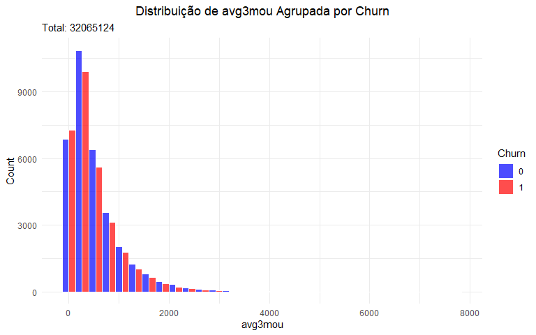<!-- -->


```r
teste_ks("avg3mou")
```

```
## Warning in ks.test.default(amostra_churn_0[[x]], amostra_churn_1[[x]]): p-value
## will be approximate in the presence of ties
```

```
## 
## 	Asymptotic two-sample Kolmogorov-Smirnov test
## 
## data:  amostra_churn_0[[x]] and amostra_churn_1[[x]]
## D = 0.035885, p-value < 2.2e-16
## alternative hypothesis: two-sided
```

O teste deu um p-valor muito alto, portanto, não há indicios para rejeitar H0. Logo, esta variável não é uma boa preditora.

### \*\*6.2.28 avg3rev


```r
func_n2("avg3rev")
```

```
## A variável avg3rev é do tipo integer   Min. 1st Qu.  Median    Mean 3rd Qu.    Max. 
##    1.00   33.00   48.00   58.64   70.00 1239.00 
##    vars     n  mean    sd median trimmed   mad min  max range skew kurtosis
## X1    1 63377 58.64 46.11     48   51.27 23.72   1 1239  1238 4.41    44.43
##      se
## X1 0.18
```

<!-- -->


```r
teste_ks("avg3rev")
```

```
## Warning in ks.test.default(amostra_churn_0[[x]], amostra_churn_1[[x]]): p-value
## will be approximate in the presence of ties
```

```
## 
## 	Asymptotic two-sample Kolmogorov-Smirnov test
## 
## data:  amostra_churn_0[[x]] and amostra_churn_1[[x]]
## D = 0.016096, p-value = 0.0007759
## alternative hypothesis: two-sided
```

O teste deu um p-valor menor que o nível de significância. Logo, há um indícios que as amostras tem distribuições diferentes. Portanto, esta é uma boa variável preditora

### 6.2.28 avg6mou


```r
func_n2("avg6mou")
```

```
## A variável avg6mou é do tipo integer   Min. 1st Qu.  Median    Mean 3rd Qu.    Max. 
##     0.0   165.0   354.0   498.1   674.0  7217.0 
##    vars     n   mean     sd median trimmed    mad min  max range skew kurtosis
## X1    1 63377 498.09 484.93    354  416.91 335.07   0 7217  7217 2.18     7.95
##      se
## X1 1.93
```

<!-- -->


```r
teste_ks("avg6mou")
```

```
## Warning in ks.test.default(amostra_churn_0[[x]], amostra_churn_1[[x]]): p-value
## will be approximate in the presence of ties
```

```
## 
## 	Asymptotic two-sample Kolmogorov-Smirnov test
## 
## data:  amostra_churn_0[[x]] and amostra_churn_1[[x]]
## D = 0.02167, p-value = 1.312e-06
## alternative hypothesis: two-sided
```

O p-valor deu um resultado próximo porém acima do nível de significância. Logo, há indícios que as amostras tem a mesma distribuição, porém o resultado não é conclusivo.

### 6.2.29 avg3qty


```r
func_n2("avg3qty")
```

```
## A variável avg3qty é do tipo integer   Min. 1st Qu.  Median    Mean 3rd Qu.    Max. 
##     0.0    55.0   123.0   178.3   235.0  3261.0 
##    vars     n   mean     sd median trimmed    mad min  max range skew kurtosis
## X1    1 63377 178.25 189.78    123   145.3 118.61   0 3261  3261 3.01    17.46
##      se
## X1 0.75
```

<!-- -->


```r
teste_ks("avg3qty")
```

```
## Warning in ks.test.default(amostra_churn_0[[x]], amostra_churn_1[[x]]): p-value
## will be approximate in the presence of ties
```

```
## 
## 	Asymptotic two-sample Kolmogorov-Smirnov test
## 
## data:  amostra_churn_0[[x]] and amostra_churn_1[[x]]
## D = 0.023286, p-value = 1.45e-07
## alternative hypothesis: two-sided
```

O p-valor é maior que o nível de significância.Log, esta não é uma boa variável preditora.

### 6.2.30 avg6qty


```r
func_n2("avg6qty")
```

```
## A variável avg6qty é do tipo integer   Min. 1st Qu.  Median    Mean 3rd Qu.    Max. 
##     0.0    59.0   125.0   176.6   233.0  2817.0 
##    vars     n   mean     sd median trimmed    mad min  max range skew kurtosis
## X1    1 63377 176.62 180.44    125  145.76 115.64   0 2817  2817 2.93    16.44
##      se
## X1 0.72
```

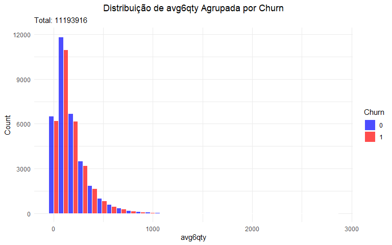<!-- -->


```r
teste_ks("avg6qty")
```

```
## Warning in ks.test.default(amostra_churn_0[[x]], amostra_churn_1[[x]]): p-value
## will be approximate in the presence of ties
```

```
## 
## 	Asymptotic two-sample Kolmogorov-Smirnov test
## 
## data:  amostra_churn_0[[x]] and amostra_churn_1[[x]]
## D = 0.014084, p-value = 0.00489
## alternative hypothesis: two-sided
```

O p-valor é maior que o nível de significância.Log, esta não é uma boa variável preditora.

### \*6.2.31 avgrev


```r
func_n2("avgrev")
```

```
## A variável avgrev é do tipo numeric   Min. 1st Qu.  Median    Mean 3rd Qu.    Max. 
##    1.55   35.18   48.83   56.86   67.77  924.27 
##    vars     n  mean    sd median trimmed   mad  min    max  range skew kurtosis
## X1    1 63377 56.86 35.25  48.83   51.72 22.36 1.55 924.27 922.72 3.36    30.72
##      se
## X1 0.14
```

<!-- -->


```r
teste_ks("avgrev")
```

```
## Warning in ks.test.default(amostra_churn_0[[x]], amostra_churn_1[[x]]): p-value
## will be approximate in the presence of ties
```

```
## 
## 	Asymptotic two-sample Kolmogorov-Smirnov test
## 
## data:  amostra_churn_0[[x]] and amostra_churn_1[[x]]
## D = 0.02477, p-value = 1.668e-08
## alternative hypothesis: two-sided
```

O p-valor é maior que o nível de significância.Log, esta não é uma boa variável preditora.

### \*6.2.32 comp_vce_Mean


```r
func_n2("comp_vce_Mean")
```

```
## A variável comp_vce_Mean é do tipo numeric   Min. 1st Qu.  Median    Mean 3rd Qu.    Max. 
##    0.00   28.67   74.67  107.05  146.67 1894.33 
##    vars     n   mean     sd median trimmed   mad min     max   range skew
## X1    1 63377 107.05 116.38  74.67   87.35 80.06   0 1894.33 1894.33 2.65
##    kurtosis   se
## X1    13.11 0.46
```

<!-- -->


```r
teste_ks("comp_vce_Mean")
```

```
## Warning in ks.test.default(amostra_churn_0[[x]], amostra_churn_1[[x]]): p-value
## will be approximate in the presence of ties
```

```
## 
## 	Asymptotic two-sample Kolmogorov-Smirnov test
## 
## data:  amostra_churn_0[[x]] and amostra_churn_1[[x]]
## D = 0.036941, p-value < 2.2e-16
## alternative hypothesis: two-sided
```

O p-valor é maior que o nível de significância.Log, esta não é uma boa variável preditora.

### \*\*\*6.2.33 complete_Mean


```r
func_n2("complete_Mean")
```

```
## A variável complete_Mean é do tipo numeric   Min. 1st Qu.  Median    Mean 3rd Qu.    Max. 
##     0.0    29.0    75.0   107.9   147.7  1894.3 
##    vars     n   mean     sd median trimmed   mad min     max   range skew
## X1    1 63377 107.86 117.52     75   87.89 80.55   0 1894.33 1894.33 2.65
##    kurtosis   se
## X1    12.97 0.47
```

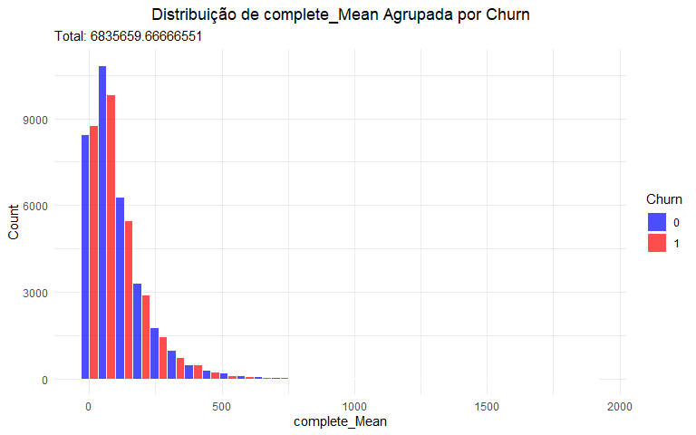<!-- -->


```r
teste_ks("complete_Mean")
```

```
## Warning in ks.test.default(amostra_churn_0[[x]], amostra_churn_1[[x]]): p-value
## will be approximate in the presence of ties
```

```
## 
## 	Asymptotic two-sample Kolmogorov-Smirnov test
## 
## data:  amostra_churn_0[[x]] and amostra_churn_1[[x]]
## D = 0.036743, p-value < 2.2e-16
## alternative hypothesis: two-sided
```

O p-valor é menor que o nível de significância, sendo este um indício para rejeitar H0. Portanto, há evidências de que as amostras tem distribuições diferentes. Conclui-se que esta é uma boa variável preditora.

### \*\*6.2.34 drop_blk_Mean


```r
class(dados2$drop_blck_Mean)
```

```
## [1] "NULL"
```


```r
func_n2("drop_blk_Mean")
```

```
## A variável drop_blk_Mean é do tipo numeric   Min. 1st Qu.  Median    Mean 3rd Qu.    Max. 
##   0.000   1.667   5.333   9.737  12.000 420.000 
##    vars     n mean    sd median trimmed  mad min max range skew kurtosis   se
## X1    1 63377 9.74 14.96   5.33    6.87 6.42   0 420   420 5.95    72.67 0.06
```

<!-- -->


```r
teste_ks("drop_blk_Mean")
```

```
## Warning in ks.test.default(amostra_churn_0[[x]], amostra_churn_1[[x]]): p-value
## will be approximate in the presence of ties
```

```
## 
## 	Asymptotic two-sample Kolmogorov-Smirnov test
## 
## data:  amostra_churn_0[[x]] and amostra_churn_1[[x]]
## D = 0.023747, p-value = 7.506e-08
## alternative hypothesis: two-sided
```

O p-valor é muito alto, logo, há indícios que está não é uma boa preditora.

### \*\*6.2.35 mou_Mean


```r
func_n2("mou_Mean")
```

```
## A variável mou_Mean é do tipo numeric   Min. 1st Qu.  Median    Mean 3rd Qu.    Max. 
##     0.0   152.5   347.0   501.0   675.8 12206.8 
##    vars     n   mean     sd median trimmed    mad min      max    range skew
## X1    1 63377 500.98 512.09    347  413.22 345.08   0 12206.75 12206.75 2.43
##    kurtosis   se
## X1    12.67 2.03
```

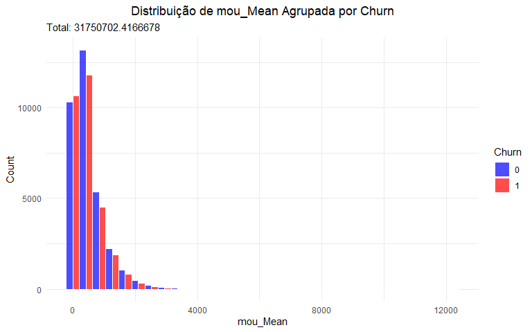<!-- -->


```r
teste_ks("mou_Mean")
```

```
## Warning in ks.test.default(amostra_churn_0[[x]], amostra_churn_1[[x]]): p-value
## will be approximate in the presence of ties
```

```
## 
## 	Asymptotic two-sample Kolmogorov-Smirnov test
## 
## data:  amostra_churn_0[[x]] and amostra_churn_1[[x]]
## D = 0.043504, p-value < 2.2e-16
## alternative hypothesis: two-sided
```

### \*6.2.36 mou_pead_Mean


```r
head(dados3$mou_pead_Mean)
```

```
## [1] 0.00000000 0.00000000 0.00000000 0.00000000 0.00000000 0.05666667
```


```r
func_n2("mou_pead_Mean")
```

```
## A variável mou_pead_Mean é do tipo numeric     Min.   1st Qu.    Median      Mean   3rd Qu.      Max. 
##    0.0000    0.0000    0.0000    0.7348    0.0000 1036.0533 
##    vars     n mean   sd median trimmed mad min     max   range  skew kurtosis
## X1    1 63377 0.73 8.87      0       0   0   0 1036.05 1036.05 46.17   3889.8
##      se
## X1 0.04
```

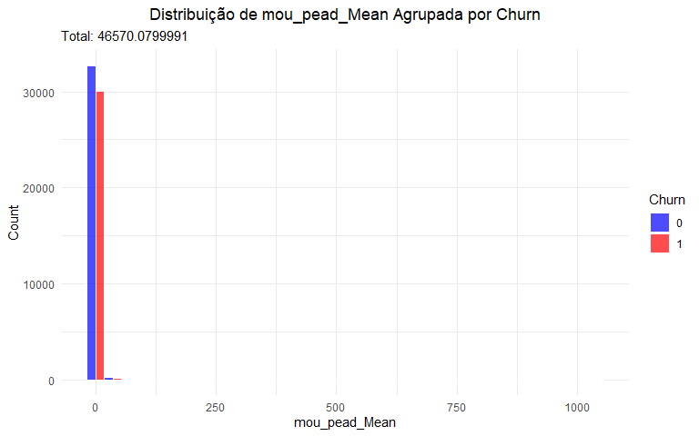<!-- -->


```r
teste_ks("mou_pead_Mean")
```

```
## Warning in ks.test.default(amostra_churn_0[[x]], amostra_churn_1[[x]]): p-value
## will be approximate in the presence of ties
```

```
## 
## 	Asymptotic two-sample Kolmogorov-Smirnov test
## 
## data:  amostra_churn_0[[x]] and amostra_churn_1[[x]]
## D = 0.0060688, p-value = 0.6319
## alternative hypothesis: two-sided
```

O p-valor é muito alto, logo, esta não é uma boa variável preditora.

### \*6.2.37 mou_rvce_Mean


```r
func_n2("mou_rvce_Mean")
```

```
## A variável mou_rvce_Mean é do tipo numeric   Min. 1st Qu.  Median    Mean 3rd Qu.    Max. 
##    0.00    7.66   48.16  108.49  143.68 2619.28 
##    vars     n   mean     sd median trimmed   mad min     max   range skew
## X1    1 63377 108.49 159.61  48.16   74.67 70.31   0 2619.28 2619.28  3.1
##    kurtosis   se
## X1    15.41 0.63
```

<!-- -->


```r
teste_ks("mou_rvce_Mean")
```

```
## Warning in ks.test.default(amostra_churn_0[[x]], amostra_churn_1[[x]]): p-value
## will be approximate in the presence of ties
```

```
## 
## 	Asymptotic two-sample Kolmogorov-Smirnov test
## 
## data:  amostra_churn_0[[x]] and amostra_churn_1[[x]]
## D = 0.030938, p-value = 4.989e-13
## alternative hypothesis: two-sided
```

O p-valor é muito alto, logo, esta não é uma boa variável preditora.

### \*6.2.38 owylis_vce_Mean


```r
func_n2("owylis_vce_Mean")
```

```
## A variável owylis_vce_Mean é do tipo numeric   Min. 1st Qu.  Median    Mean 3rd Qu.    Max. 
##    0.00    3.00   12.67   23.99   31.67  644.33 
##    vars     n  mean    sd median trimmed  mad min    max  range skew kurtosis
## X1    1 63377 23.99 33.21  12.67   17.34 17.3   0 644.33 644.33 3.39     20.4
##      se
## X1 0.13
```

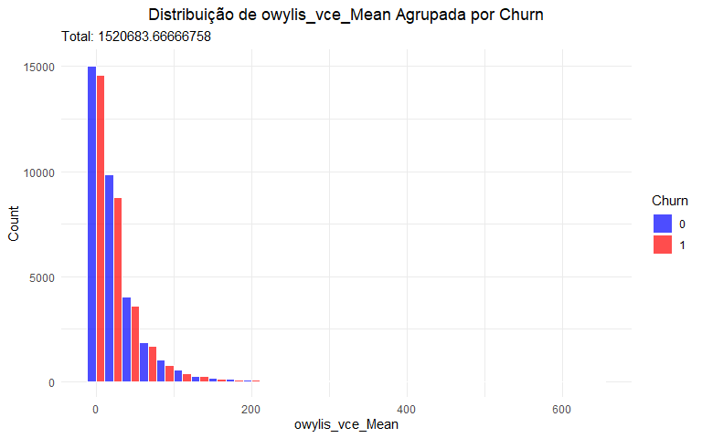<!-- -->


```r
teste_ks("owylis_vce_Mean")
```

```
## Warning in ks.test.default(amostra_churn_0[[x]], amostra_churn_1[[x]]): p-value
## will be approximate in the presence of ties
```

```
## 
## 	Asymptotic two-sample Kolmogorov-Smirnov test
## 
## data:  amostra_churn_0[[x]] and amostra_churn_1[[x]]
## D = 0.039282, p-value < 2.2e-16
## alternative hypothesis: two-sided
```

O p-valor é muito alto, logo, esta não é uma boa variável preditora.

### \*\*6.2.39 peak_vce_Mean


```r
func_n2("peak_vce_Mean")
```

```
## A variável peak_vce_Mean é do tipo numeric   Min. 1st Qu.  Median    Mean 3rd Qu.    Max. 
##    0.00   22.00   60.00   88.09  118.00 2090.67 
##    vars     n  mean     sd median trimmed   mad min     max   range skew
## X1    1 63377 88.09 102.54     60   70.04 65.73   0 2090.67 2090.67  3.3
##    kurtosis   se
## X1    21.58 0.41
```

<!-- -->


```r
teste_ks("peak_vce_Mean")
```

```
## Warning in ks.test.default(amostra_churn_0[[x]], amostra_churn_1[[x]]): p-value
## will be approximate in the presence of ties
```

```
## 
## 	Asymptotic two-sample Kolmogorov-Smirnov test
## 
## data:  amostra_churn_0[[x]] and amostra_churn_1[[x]]
## D = 0.035357, p-value < 2.2e-16
## alternative hypothesis: two-sided
```

O p-valor é menor que o nível de significância (0.05), isto é um indício para rejeitar H0. Logo, é provável que as amostras tenham distribuições diferentes. Conclui-se que esta é uma boa variável preditora.

### \*\*6.2.40 plcd_vce_Mean


```r
func_n2("plcd_vce_Mean")
```

```
## A variável plcd_vce_Mean é do tipo numeric   Min. 1st Qu.  Median    Mean 3rd Qu.    Max. 
##    0.00   38.33   98.33  141.99  193.67 2289.00 
##    vars     n   mean     sd median trimmed    mad min  max range skew kurtosis
## X1    1 63377 141.99 154.96  98.33  115.59 105.26   0 2289  2289 2.68    13.21
##      se
## X1 0.62
```

<!-- -->

Pela análise gráfica, nota-se uma diferença entre as duas distribuições. Logo, há indícios que esta seja uma variável preditora.

### 6.2.41 mou_Mean


```r
func_n2("mou_Mean")
```

```
## A variável mou_Mean é do tipo numeric   Min. 1st Qu.  Median    Mean 3rd Qu.    Max. 
##     0.0   152.5   347.0   501.0   675.8 12206.8 
##    vars     n   mean     sd median trimmed    mad min      max    range skew
## X1    1 63377 500.98 512.09    347  413.22 345.08   0 12206.75 12206.75 2.43
##    kurtosis   se
## X1    12.67 2.03
```

<!-- -->


```r
teste_ks("mou_Mean")
```

```
## Warning in ks.test.default(amostra_churn_0[[x]], amostra_churn_1[[x]]): p-value
## will be approximate in the presence of ties
```

```
## 
## 	Asymptotic two-sample Kolmogorov-Smirnov test
## 
## data:  amostra_churn_0[[x]] and amostra_churn_1[[x]]
## D = 0.043504, p-value < 2.2e-16
## alternative hypothesis: two-sided
```

O p-valor é maior que o nível de significância. Logo, esta variável não é uma boa preditora

### 6.2.42 da_Mean


```r
func_n2("da_Mean")
```

```
## A variável da_Mean é do tipo numeric    Min.  1st Qu.   Median     Mean  3rd Qu.     Max. 
##   0.0000   0.0000   0.2475   0.8710   0.7425 159.3900 
##    vars     n mean   sd median trimmed  mad min    max  range  skew kurtosis
## X1    1 63377 0.87 2.16   0.25    0.41 0.37   0 159.39 159.39 12.62   551.87
##      se
## X1 0.01
```

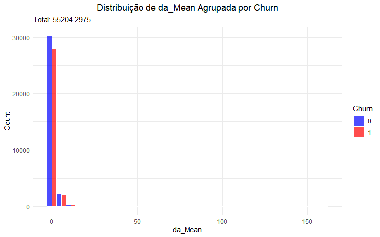<!-- -->


```r
teste_ks("da_Mean")
```

```
## Warning in ks.test.default(amostra_churn_0[[x]], amostra_churn_1[[x]]): p-value
## will be approximate in the presence of ties
```

```
## 
## 	Asymptotic two-sample Kolmogorov-Smirnov test
## 
## data:  amostra_churn_0[[x]] and amostra_churn_1[[x]]
## D = 0.021076, p-value = 2.833e-06
## alternative hypothesis: two-sided
```

O p-valor deu um número muito alto. Esta não é uma boa preditora.

### 6.2.41 datovr_Mean


```r
func_n2("datovr_Mean")
```

```
## A variável datovr_Mean é do tipo numeric    Min.  1st Qu.   Median     Mean  3rd Qu.     Max. 
##   0.0000   0.0000   0.0000   0.2621   0.0000 423.5400 
##    vars     n mean   sd median trimmed mad min    max  range  skew kurtosis
## X1    1 63377 0.26 3.05      0    0.01   0   0 423.54 423.54 62.61  6861.93
##      se
## X1 0.01
```

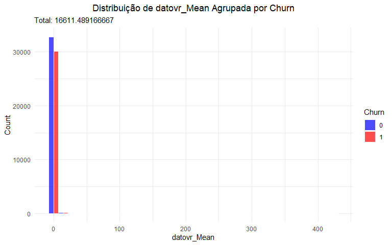<!-- -->


```r
teste_ks("datovr_Mean")
```

```
## Warning in ks.test.default(amostra_churn_0[[x]], amostra_churn_1[[x]]): p-value
## will be approximate in the presence of ties
```

```
## 
## 	Asymptotic two-sample Kolmogorov-Smirnov test
## 
## data:  amostra_churn_0[[x]] and amostra_churn_1[[x]]
## D = 0.0062337, p-value = 0.5978
## alternative hypothesis: two-sided
```

O p-valor deu um número muito alto. Esta não é uma boa preditora.

### 6.2.43 change_rev


```r
func_n2("change_rev")
```

```
## A variável change_rev é do tipo numeric    Min.  1st Qu.   Median     Mean  3rd Qu.     Max. 
## -851.105   -6.832   -0.292   -0.945    1.485 9963.658 
##    vars     n  mean    sd median trimmed  mad    min     max    range  skew
## X1    1 63377 -0.95 55.18  -0.29    -1.9 6.09 -851.1 9963.66 10814.76 95.13
##    kurtosis   se
## X1 16861.58 0.22
```

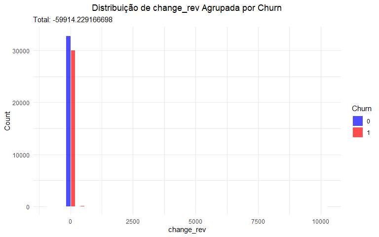<!-- -->


```r
teste_ks("change_rev")
```

```
## Warning in ks.test.default(amostra_churn_0[[x]], amostra_churn_1[[x]]): p-value
## will be approximate in the presence of ties
```

```
## 
## 	Asymptotic two-sample Kolmogorov-Smirnov test
## 
## data:  amostra_churn_0[[x]] and amostra_churn_1[[x]]
## D = 0.029519, p-value = 6.715e-12
## alternative hypothesis: two-sided
```

O p-valor deu um número muito alto. Esta não é uma boa preditora.

### \*\*6.2.44 unan_vce_Mean


```r
func_n2("unan_vce_Mean")
```

```
## A variável unan_vce_Mean é do tipo numeric   Min. 1st Qu.  Median    Mean 3rd Qu.    Max. 
##    0.00    5.00   15.33   27.00   34.67  848.67 
##    vars     n mean    sd median trimmed   mad min    max  range skew kurtosis
## X1    1 63377   27 37.53  15.33   19.75 18.78   0 848.67 848.67 4.39    38.61
##      se
## X1 0.15
```

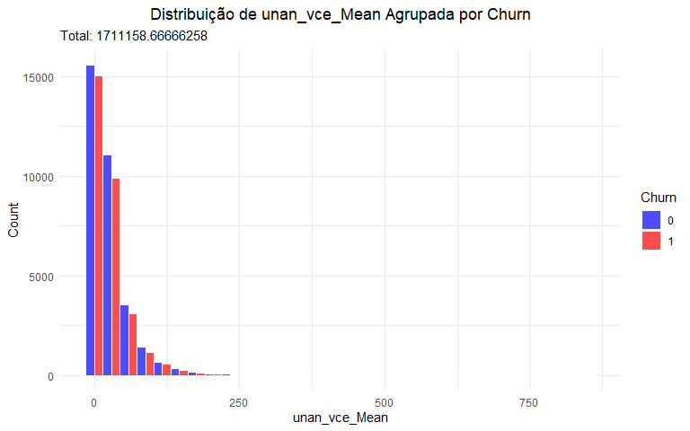<!-- -->


```r
teste_ks("unan_vce_Mean")
```

```
## Warning in ks.test.default(amostra_churn_0[[x]], amostra_churn_1[[x]]): p-value
## will be approximate in the presence of ties
```

```
## 
## 	Asymptotic two-sample Kolmogorov-Smirnov test
## 
## data:  amostra_churn_0[[x]] and amostra_churn_1[[x]]
## D = 0.030575, p-value = 9.814e-13
## alternative hypothesis: two-sided
```

O p-valor deu um resultado menor que o nível de significância (0.05), portanto rejeita-se H0, isso significa que há indícios que as duas amostras tenham distribuições diferentes.

Com o resultado do teste de hipótese junto com a análise do gráfico, é possível concluir que esta é uma boa variável preditora.

### 6.2.45 unan_dat_Mean


```r
func_n2("unan_dat_Mean")
```

```
## A variável unan_dat_Mean é do tipo numeric    Min.  1st Qu.   Median     Mean  3rd Qu.     Max. 
##  0.00000  0.00000  0.00000  0.03013  0.00000 81.66667 
##    vars     n mean   sd median trimmed mad min   max range  skew kurtosis se
## X1    1 63377 0.03 0.53      0       0   0   0 81.67 81.67 90.31 11432.09  0
```

<!-- -->


```r
teste_ks("unan_dat_Mean")
```

```
## Warning in ks.test.default(amostra_churn_0[[x]], amostra_churn_1[[x]]): p-value
## will be approximate in the presence of ties
```

```
## 
## 	Asymptotic two-sample Kolmogorov-Smirnov test
## 
## data:  amostra_churn_0[[x]] and amostra_churn_1[[x]]
## D = 0.0048814, p-value = 0.8629
## alternative hypothesis: two-sided
```

O p-valor é muito alto , portanto, esta não é uma boa variável preditora.

### \*\*\*6.2.46 plcd_vce_Mean


```r
func_n2("plcd_vce_Mean")
```

```
## A variável plcd_vce_Mean é do tipo numeric   Min. 1st Qu.  Median    Mean 3rd Qu.    Max. 
##    0.00   38.33   98.33  141.99  193.67 2289.00 
##    vars     n   mean     sd median trimmed    mad min  max range skew kurtosis
## X1    1 63377 141.99 154.96  98.33  115.59 105.26   0 2289  2289 2.68    13.21
##      se
## X1 0.62
```

<!-- -->

Ao analisar o gráfico é possível perceber grandes diferenças entre as duas distribuições. Logo, esta é uma boa variável preditora.

### 6.2.47 plcd_dat_Mean


```r
func_n2("plcd_dat_Mean")
```

```
## A variável plcd_dat_Mean é do tipo numeric    Min.  1st Qu.   Median     Mean  3rd Qu.     Max. 
##   0.0000   0.0000   0.0000   0.8989   0.0000 733.6667 
##    vars     n mean   sd median trimmed mad min    max  range  skew kurtosis
## X1    1 63377  0.9 9.54      0    0.02   0   0 733.67 733.67 31.28  1494.16
##      se
## X1 0.04
```

<!-- -->


```r
teste_ks("plcd_dat_Mean")
```

```
## Warning in ks.test.default(amostra_churn_0[[x]], amostra_churn_1[[x]]): p-value
## will be approximate in the presence of ties
```

```
## 
## 	Asymptotic two-sample Kolmogorov-Smirnov test
## 
## data:  amostra_churn_0[[x]] and amostra_churn_1[[x]]
## D = 0.010983, p-value = 0.0516
## alternative hypothesis: two-sided
```

### 6.2.48 recv_vce_Mean


```r
func_n2("recv_vce_Mean")
```

```
## A variável recv_vce_Mean é do tipo numeric    Min.  1st Qu.   Median     Mean  3rd Qu.     Max. 
##    0.000    5.333   26.000   54.143   70.000 3369.333 
##    vars     n  mean    sd median trimmed   mad min     max   range skew
## X1    1 63377 54.14 84.89     26   37.25 36.57   0 3369.33 3369.33  5.7
##    kurtosis   se
## X1    85.62 0.34
```

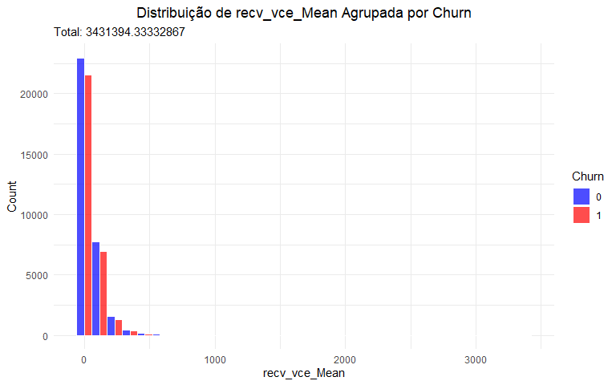<!-- -->


```r
teste_ks("recv_vce_Mean")
```

```
## Warning in ks.test.default(amostra_churn_0[[x]], amostra_churn_1[[x]]): p-value
## will be approximate in the presence of ties
```

```
## 
## 	Asymptotic two-sample Kolmogorov-Smirnov test
## 
## data:  amostra_churn_0[[x]] and amostra_churn_1[[x]]
## D = 0.022758, p-value = 3.029e-07
## alternative hypothesis: two-sided
```

O p-valor deu um resultado muito alto. Portanto, esta não é uma boa variável preditora.

### 6.2.49 recv_vce_Mean


```r
func_n2("recv_vce_Mean")
```

```
## A variável recv_vce_Mean é do tipo numeric    Min.  1st Qu.   Median     Mean  3rd Qu.     Max. 
##    0.000    5.333   26.000   54.143   70.000 3369.333 
##    vars     n  mean    sd median trimmed   mad min     max   range skew
## X1    1 63377 54.14 84.89     26   37.25 36.57   0 3369.33 3369.33  5.7
##    kurtosis   se
## X1    85.62 0.34
```

<!-- -->


```r
teste_ks("recv_vce_Mean")
```

```
## Warning in ks.test.default(amostra_churn_0[[x]], amostra_churn_1[[x]]): p-value
## will be approximate in the presence of ties
```

```
## 
## 	Asymptotic two-sample Kolmogorov-Smirnov test
## 
## data:  amostra_churn_0[[x]] and amostra_churn_1[[x]]
## D = 0.022758, p-value = 3.029e-07
## alternative hypothesis: two-sided
```

O p-valor deu um resultado muito alto. Portanto, esta não é uma boa variável preditora.

### 6.2.50 recv_sms_Mean


```r
func_n2("recv_sms_Mean")
```

```
## A variável recv_sms_Mean é do tipo numeric     Min.   1st Qu.    Median      Mean   3rd Qu.      Max. 
##   0.00000   0.00000   0.00000   0.04566   0.00000 247.66667 
##    vars     n mean   sd median trimmed mad min    max  range  skew kurtosis
## X1    1 63377 0.05 1.51      0       0   0   0 247.67 247.67 96.64 13255.69
##      se
## X1 0.01
```

<!-- -->


```r
teste_ks("recv_sms_Mean")
```

```
## Warning in ks.test.default(amostra_churn_0[[x]], amostra_churn_1[[x]]): p-value
## will be approximate in the presence of ties
```

```
## 
## 	Asymptotic two-sample Kolmogorov-Smirnov test
## 
## data:  amostra_churn_0[[x]] and amostra_churn_1[[x]]
## D = 0.0012863, p-value = 1
## alternative hypothesis: two-sided
```

O p-valor deu um resultado muito alto. Portanto, esta não é uma boa variável preditora.

### 6.2.51 comp_dat_Mean


```r
func_n2("comp_dat_Mean")
```

```
## A variável comp_dat_Mean é do tipo numeric    Min.  1st Qu.   Median     Mean  3rd Qu.     Max. 
##   0.0000   0.0000   0.0000   0.8055   0.0000 559.3333 
##    vars     n mean   sd median trimmed mad min    max  range  skew kurtosis
## X1    1 63377 0.81 8.72      0    0.02   0   0 559.33 559.33 29.81  1291.78
##      se
## X1 0.03
```

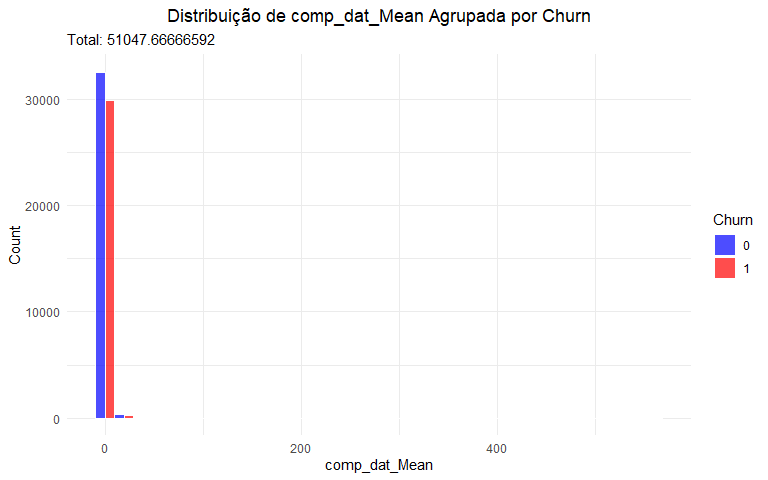<!-- -->

Esta não é uma boa variável preditora

### 6.2.52 custcare_Mean


```r
func_n2("custcare_Mean")
```

```
## A variável custcare_Mean é do tipo numeric   Min. 1st Qu.  Median    Mean 3rd Qu.    Max. 
##   0.000   0.000   0.000   1.617   1.333 365.667 
##    vars     n mean   sd median trimmed mad min    max  range  skew kurtosis
## X1    1 63377 1.62 4.77      0    0.64   0   0 365.67 365.67 20.63  1136.68
##      se
## X1 0.02
```

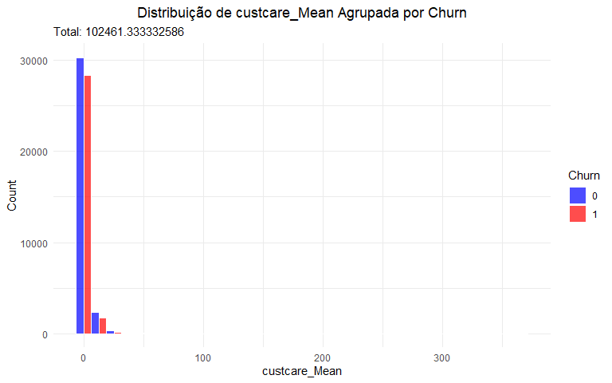<!-- -->


```r
teste_ks("custcare_Mean")
```

```
## Warning in ks.test.default(amostra_churn_0[[x]], amostra_churn_1[[x]]): p-value
## will be approximate in the presence of ties
```

```
## 
## 	Asymptotic two-sample Kolmogorov-Smirnov test
## 
## data:  amostra_churn_0[[x]] and amostra_churn_1[[x]]
## D = 0.04169, p-value < 2.2e-16
## alternative hypothesis: two-sided
```

O p-valor deu um resultado muito alto. Portanto, esta não é uma boa variável preditora.

### 6.2.53 inonemin_Mean


```r
func_n2("inonemin_Mean")
```

```
## A variável inonemin_Mean é do tipo numeric    Min.  1st Qu.   Median     Mean  3rd Qu.     Max. 
##    0.000    2.667   12.333   29.288   35.000 3086.667 
##    vars     n  mean    sd median trimmed  mad min     max   range skew kurtosis
## X1    1 63377 29.29 54.83  12.33    18.6 17.3   0 3086.67 3086.67 9.64   259.26
##      se
## X1 0.22
```

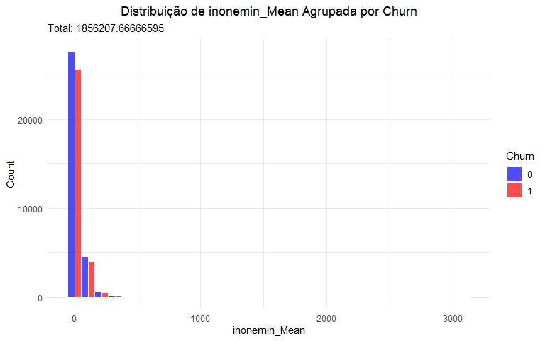<!-- -->


```r
teste_ks("inonemin_Mean")
```

```
## Warning in ks.test.default(amostra_churn_0[[x]], amostra_churn_1[[x]]): p-value
## will be approximate in the presence of ties
```

```
## 
## 	Asymptotic two-sample Kolmogorov-Smirnov test
## 
## data:  amostra_churn_0[[x]] and amostra_churn_1[[x]]
## D = 0.021043, p-value = 2.954e-06
## alternative hypothesis: two-sided
```

O p-valor deu um resultado muito alto. Portanto, esta não é uma boa variável preditora.

### 6.2.54 threeway_Mean


```r
func_n2("threeway_Mean")
```

```
## A variável threeway_Mean é do tipo numeric   Min. 1st Qu.  Median    Mean 3rd Qu.    Max. 
##  0.0000  0.0000  0.0000  0.2786  0.3333 66.0000 
##    vars     n mean   sd median trimmed mad min max range  skew kurtosis se
## X1    1 63377 0.28 1.07      0    0.09   0   0  66    66 17.96   653.88  0
```

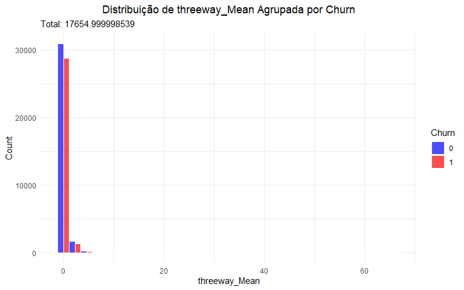<!-- -->


```r
teste_ks("threeway_Mean")
```

```
## Warning in ks.test.default(amostra_churn_0[[x]], amostra_churn_1[[x]]): p-value
## will be approximate in the presence of ties
```

```
## 
## 	Asymptotic two-sample Kolmogorov-Smirnov test
## 
## data:  amostra_churn_0[[x]] and amostra_churn_1[[x]]
## D = 0.026452, p-value = 1.224e-09
## alternative hypothesis: two-sided
```

O p-valor deu um resultado muito alto. Portanto, esta não é uma boa variável preditora.

### 6.2.55 mou_cdat_Mean


```r
func_n2("mou_cdat_Mean")
```

```
## A variável mou_cdat_Mean é do tipo numeric    Min.  1st Qu.   Median     Mean  3rd Qu.     Max. 
##    0.000    0.000    0.000    1.785    0.000 2060.690 
##    vars     n mean   sd median trimmed mad min     max   range  skew kurtosis
## X1    1 63377 1.78 21.5      0       0   0   0 2060.69 2060.69 41.16  2726.57
##      se
## X1 0.09
```

<!-- -->

```r
teste_ks("mou_cdat_Mean")
```

```
## Warning in ks.test.default(amostra_churn_0[[x]], amostra_churn_1[[x]]): p-value
## will be approximate in the presence of ties
```

```
## 
## 	Asymptotic two-sample Kolmogorov-Smirnov test
## 
## data:  amostra_churn_0[[x]] and amostra_churn_1[[x]]
## D = 0.0072232, p-value = 0.4076
## alternative hypothesis: two-sided
```

O p-valor deu um resultado muito alto. Portanto, esta não é uma boa variável preditora.

### 6.2.56 mou_rvce_Mean


```r
func_n2("mou_rvce_Mean")
```

```
## A variável mou_rvce_Mean é do tipo numeric   Min. 1st Qu.  Median    Mean 3rd Qu.    Max. 
##    0.00    7.66   48.16  108.49  143.68 2619.28 
##    vars     n   mean     sd median trimmed   mad min     max   range skew
## X1    1 63377 108.49 159.61  48.16   74.67 70.31   0 2619.28 2619.28  3.1
##    kurtosis   se
## X1    15.41 0.63
```

<!-- -->

```r
teste_ks("mou_rvce_Mean")
```

```
## Warning in ks.test.default(amostra_churn_0[[x]], amostra_churn_1[[x]]): p-value
## will be approximate in the presence of ties
```

```
## 
## 	Asymptotic two-sample Kolmogorov-Smirnov test
## 
## data:  amostra_churn_0[[x]] and amostra_churn_1[[x]]
## D = 0.030938, p-value = 4.989e-13
## alternative hypothesis: two-sided
```

O p-valor deu um resultado muito alto. Portanto, esta não é uma boa variável preditora.

### 6.2.57 owylis_vce_Mean


```r
func_n2("owylis_vce_Mean")
```

```
## A variável owylis_vce_Mean é do tipo numeric   Min. 1st Qu.  Median    Mean 3rd Qu.    Max. 
##    0.00    3.00   12.67   23.99   31.67  644.33 
##    vars     n  mean    sd median trimmed  mad min    max  range skew kurtosis
## X1    1 63377 23.99 33.21  12.67   17.34 17.3   0 644.33 644.33 3.39     20.4
##      se
## X1 0.13
```

<!-- -->

```r
teste_ks("owylis_vce_Mean")
```

```
## Warning in ks.test.default(amostra_churn_0[[x]], amostra_churn_1[[x]]): p-value
## will be approximate in the presence of ties
```

```
## 
## 	Asymptotic two-sample Kolmogorov-Smirnov test
## 
## data:  amostra_churn_0[[x]] and amostra_churn_1[[x]]
## D = 0.039282, p-value < 2.2e-16
## alternative hypothesis: two-sided
```

O p-valor deu um resultado muito alto. Portanto, esta não é uma boa variável preditora.

### 6.2.57 mouowylisv_Mean


```r
func_n2("mouowylisv_Mean")
```

```
## A variável mouowylisv_Mean é do tipo numeric    Min.  1st Qu.   Median     Mean  3rd Qu.     Max. 
##    0.000    2.357   11.550   27.115   32.690 1802.707 
##    vars     n  mean    sd median trimmed   mad min     max   range skew
## X1    1 63377 27.12 46.26  11.55   17.43 16.42   0 1802.71 1802.71 5.53
##    kurtosis   se
## X1    74.18 0.18
```

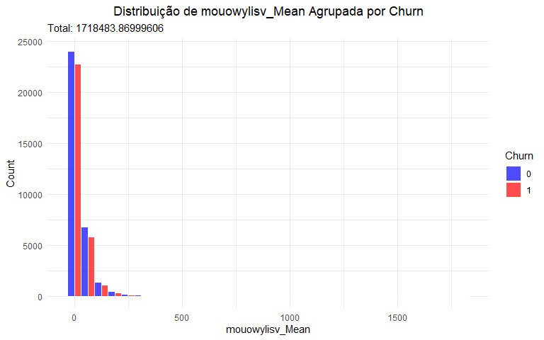<!-- -->

```r
teste_ks("mouowylisv_Mean")
```

```
## Warning in ks.test.default(amostra_churn_0[[x]], amostra_churn_1[[x]]): p-value
## will be approximate in the presence of ties
```

```
## 
## 	Asymptotic two-sample Kolmogorov-Smirnov test
## 
## data:  amostra_churn_0[[x]] and amostra_churn_1[[x]]
## D = 0.044823, p-value < 2.2e-16
## alternative hypothesis: two-sided
```

O p-valor deu um resultado muito alto. Portanto, esta não é uma boa variável preditora.

### 6.2.58 peak_dat_Mean


```r
func_n2("peak_dat_Mean")
```

```
## A variável peak_dat_Mean é do tipo numeric    Min.  1st Qu.   Median     Mean  3rd Qu.     Max. 
##   0.0000   0.0000   0.0000   0.3809   0.0000 281.0000 
##    vars     n mean   sd median trimmed mad min max range skew kurtosis   se
## X1    1 63377 0.38 4.41      0       0   0   0 281   281 30.4  1293.49 0.02
```

<!-- -->

```r
teste_ks("peak_dat_Mean")
```

```
## Warning in ks.test.default(amostra_churn_0[[x]], amostra_churn_1[[x]]): p-value
## will be approximate in the presence of ties
```

```
## 
## 	Asymptotic two-sample Kolmogorov-Smirnov test
## 
## data:  amostra_churn_0[[x]] and amostra_churn_1[[x]]
## D = 0.0041228, p-value = 0.9589
## alternative hypothesis: two-sided
```

O p-valor deu um resultado muito alto. Portanto, esta não é uma boa variável preditora.

### 6.2.59 mou_peav_Mean


```r
func_n2("mou_peav_Mean")
```

```
## A variável mou_peav_Mean é do tipo numeric   Min. 1st Qu.  Median    Mean 3rd Qu.    Max. 
##    0.00   38.42  114.16  172.70  229.24 4015.35 
##    vars     n  mean     sd median trimmed    mad min     max   range skew
## X1    1 63377 172.7 207.34 114.16  134.48 129.77   0 4015.35 4015.35 3.12
##    kurtosis   se
## X1    18.04 0.82
```

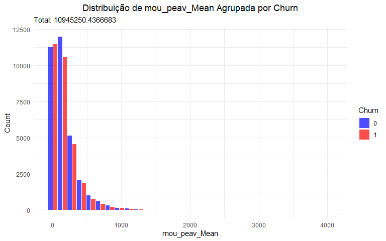<!-- -->


```r
teste_ks("mou_peav_Mean")
```

```
## Warning in ks.test.default(amostra_churn_0[[x]], amostra_churn_1[[x]]): p-value
## will be approximate in the presence of ties
```

```
## 
## 	Asymptotic two-sample Kolmogorov-Smirnov test
## 
## data:  amostra_churn_0[[x]] and amostra_churn_1[[x]]
## D = 0.042086, p-value < 2.2e-16
## alternative hypothesis: two-sided
```

O p-valor deu um resultado muito alto. Portanto, esta não é uma boa variável preditora.

### 6.2.60 mou_pead_Mean


```r
func_n2("mou_pead_Mean")
```

```
## A variável mou_pead_Mean é do tipo numeric     Min.   1st Qu.    Median      Mean   3rd Qu.      Max. 
##    0.0000    0.0000    0.0000    0.7348    0.0000 1036.0533 
##    vars     n mean   sd median trimmed mad min     max   range  skew kurtosis
## X1    1 63377 0.73 8.87      0       0   0   0 1036.05 1036.05 46.17   3889.8
##      se
## X1 0.04
```

<!-- -->

```r
teste_ks("mou_pead_Mean")
```

```
## Warning in ks.test.default(amostra_churn_0[[x]], amostra_churn_1[[x]]): p-value
## will be approximate in the presence of ties
```

```
## 
## 	Asymptotic two-sample Kolmogorov-Smirnov test
## 
## data:  amostra_churn_0[[x]] and amostra_churn_1[[x]]
## D = 0.0060688, p-value = 0.6319
## alternative hypothesis: two-sided
```

O p-valor deu um resultado muito alto. Portanto, esta não é uma boa variável preditora.

### 6.2.61 opk_vce_Mean


```r
func_n2("opk_vce_Mean")
```

```
## A variável opk_vce_Mean é do tipo numeric   Min. 1st Qu.  Median    Mean 3rd Qu.    Max. 
##    0.00   10.33   33.00   63.89   83.00 1438.33 
##    vars     n  mean   sd median trimmed   mad min     max   range skew kurtosis
## X1    1 63377 63.89 88.8     33   45.94 41.51   0 1438.33 1438.33 3.53     22.3
##      se
## X1 0.35
```

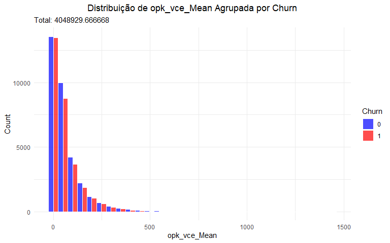<!-- -->

```r
teste_ks("opk_vce_Mean")
```

```
## Warning in ks.test.default(amostra_churn_0[[x]], amostra_churn_1[[x]]): p-value
## will be approximate in the presence of ties
```

```
## 
## 	Asymptotic two-sample Kolmogorov-Smirnov test
## 
## data:  amostra_churn_0[[x]] and amostra_churn_1[[x]]
## D = 0.040437, p-value < 2.2e-16
## alternative hypothesis: two-sided
```

O p-valor deu um resultado muito alto. Portanto, esta não é uma boa variável preditora.

### 6.2.62 mou_opkv_Mean


```r
func_n2("mou_opkv_Mean")
```

```
## A variável mou_opkv_Mean é do tipo numeric   Min. 1st Qu.  Median    Mean 3rd Qu.    Max. 
##    0.00   18.58   72.51  156.08  197.24 2986.75 
##    vars     n   mean     sd median trimmed   mad min     max   range skew
## X1    1 63377 156.08 225.37  72.51  107.57 97.91   0 2986.75 2986.75    3
##    kurtosis  se
## X1    13.07 0.9
```

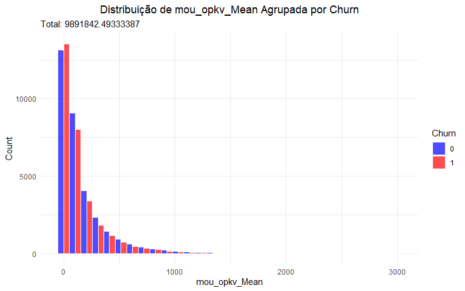<!-- -->

```r
teste_ks("mou_opkv_Mean")
```

```
## Warning in ks.test.default(amostra_churn_0[[x]], amostra_churn_1[[x]]): p-value
## will be approximate in the presence of ties
```

```
## 
## 	Asymptotic two-sample Kolmogorov-Smirnov test
## 
## data:  amostra_churn_0[[x]] and amostra_churn_1[[x]]
## D = 0.053762, p-value < 2.2e-16
## alternative hypothesis: two-sided
```

O p-valor deu um resultado muito alto. Portanto, esta não é uma boa variável preditora.

### 6.2.63 drop_blk_Mean


```r
func_n2("drop_blk_Mean")
```

```
## A variável drop_blk_Mean é do tipo numeric   Min. 1st Qu.  Median    Mean 3rd Qu.    Max. 
##   0.000   1.667   5.333   9.737  12.000 420.000 
##    vars     n mean    sd median trimmed  mad min max range skew kurtosis   se
## X1    1 63377 9.74 14.96   5.33    6.87 6.42   0 420   420 5.95    72.67 0.06
```

<!-- -->

```r
teste_ks("drop_blk_Mean")
```

```
## Warning in ks.test.default(amostra_churn_0[[x]], amostra_churn_1[[x]]): p-value
## will be approximate in the presence of ties
```

```
## 
## 	Asymptotic two-sample Kolmogorov-Smirnov test
## 
## data:  amostra_churn_0[[x]] and amostra_churn_1[[x]]
## D = 0.023747, p-value = 7.506e-08
## alternative hypothesis: two-sided
```

O p-valor deu um resultado muito alto. Portanto, esta não é uma boa variável preditora.

### 6.2.64 callfwdv_Mean


```r
func_n2("callfwdv_Mean")
```

```
## A variável callfwdv_Mean é do tipo numeric    Min.  1st Qu.   Median     Mean  3rd Qu.     Max. 
##  0.00000  0.00000  0.00000  0.01044  0.00000 55.66667 
##    vars     n mean   sd median trimmed mad min   max range  skew kurtosis se
## X1    1 63377 0.01 0.49      0       0   0   0 55.67 55.67 84.51  8307.28  0
```

<!-- -->


```r
teste_ks("callfwdv_Mean")
```

```
## Warning in ks.test.default(amostra_churn_0[[x]], amostra_churn_1[[x]]): p-value
## will be approximate in the presence of ties
```

```
## 
## 	Asymptotic two-sample Kolmogorov-Smirnov test
## 
## data:  amostra_churn_0[[x]] and amostra_churn_1[[x]]
## D = 0.00098948, p-value = 1
## alternative hypothesis: two-sided
```

O p-valor deu um resultado muito alto. Portanto, esta não é uma boa variável preditora.

### 6.2.65 uniqsubs


```r
func_n2("uniqsubs")
```

```
## A variável uniqsubs é do tipo integer   Min. 1st Qu.  Median    Mean 3rd Qu.    Max. 
##   1.000   1.000   1.000   1.555   2.000  13.000 
##    vars     n mean   sd median trimmed mad min max range skew kurtosis se
## X1    1 63377 1.56 0.87      1    1.37   0   1  13    12 2.29     8.34  0
```

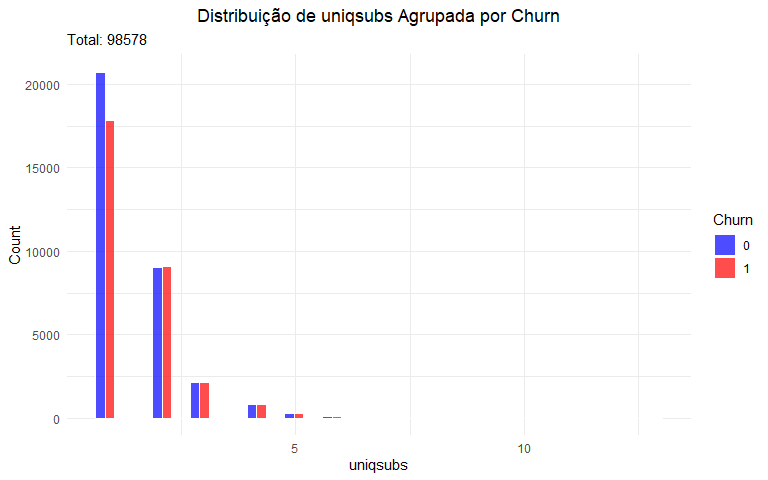<!-- -->

```r
teste_ks("uniqsubs")
```

```
## Warning in ks.test.default(amostra_churn_0[[x]], amostra_churn_1[[x]]): p-value
## will be approximate in the presence of ties
```

```
## 
## 	Asymptotic two-sample Kolmogorov-Smirnov test
## 
## data:  amostra_churn_0[[x]] and amostra_churn_1[[x]]
## D = 0.038952, p-value < 2.2e-16
## alternative hypothesis: two-sided
```

O p-valor deu um resultado muito alto. Portanto, esta não é uma boa variável preditora.

### 6.2.67 actvsubs


```r
func_n2("actvsubs")
```

```
## A variável actvsubs é do tipo integer   Min. 1st Qu.  Median    Mean 3rd Qu.    Max. 
##   0.000   1.000   1.000   1.385   2.000   9.000 
##    vars     n mean   sd median trimmed mad min max range skew kurtosis se
## X1    1 63377 1.38 0.65      1    1.27   0   0   9     9 1.95     5.14  0
```

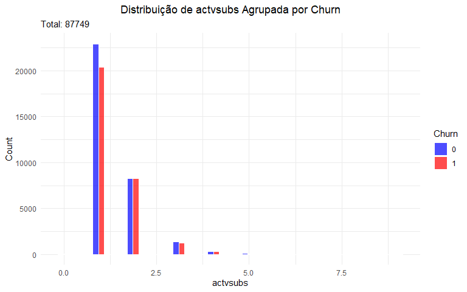<!-- -->

```r
teste_ks("actvsubs")
```

```
## Warning in ks.test.default(amostra_churn_0[[x]], amostra_churn_1[[x]]): p-value
## will be approximate in the presence of ties
```

```
## 
## 	Asymptotic two-sample Kolmogorov-Smirnov test
## 
## data:  amostra_churn_0[[x]] and amostra_churn_1[[x]]
## D = 0.021307, p-value = 2.105e-06
## alternative hypothesis: two-sided
```

O p-valor deu um resultado muito alto. Portanto, esta não é uma boa variável preditora.

### 6.2.68 new_cell


```r
func_c2("new_cell")
```

```
## 
##     N     U     Y 
##  8708 42424 12245
```

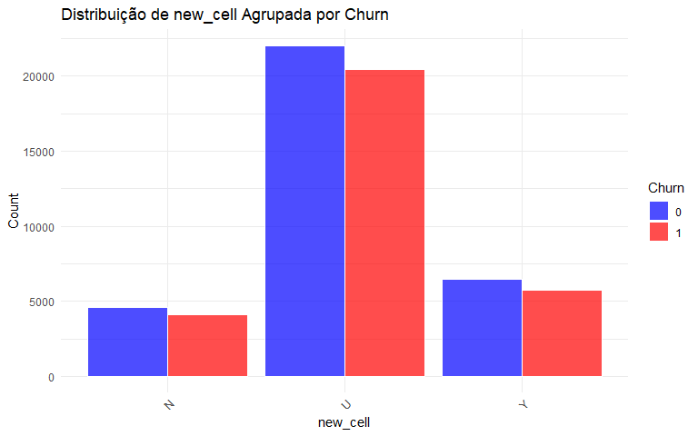<!-- -->

As variáveis são do tipo categóricas e há uma leve variação nas distribuições.Pela análise gráfica conclui-se que há indícios dessa variável ser uma boa preditora.

### 6.2.69 crclscod


```r
func_c2("crclscod")
```

```
## 
##     A    A2    A3    AA     B    B2    BA     C    C2    C5    CA    CC    CY 
## 10714   451     1 25990  2560    33  7972   897    96    47  5058    15   108 
##     D    D2    D4    D5    DA     E    E2    E4    EA    EC    EF    EM     G 
##   135     1   134    56  1933   194    12   375  3760    22     1    38   145 
##    GA    GY     H     I     J    JF     K     L     M     O    P1    TP     U 
##   159    21     6    69    14   134     8     1   105    14     1     4   266 
##    U1     V    V1     W     Y     Z    Z1    Z2    Z4    Z5    ZA    ZY 
##    31     1    25    54     6    91     5     3    83    14  1452    62
```

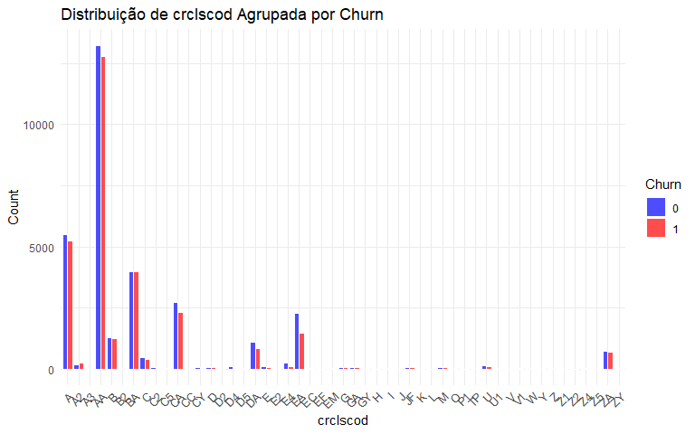<!-- -->

Observa-se uma leve variação nas duas distribuições. E, esta variável ajuda a entender o perfil de cada cliente. Portanto, é uma boa variável preditora.

### \*\*\*6.2.70 totcalls


```r
func_n2("totcalls")
```

```
## A variável totcalls é do tipo integer   Min. 1st Qu.  Median    Mean 3rd Qu.    Max. 
##       0     884    1825    2926    3544   98874 
##    vars     n    mean      sd median trimmed     mad min   max range skew
## X1    1 63377 2926.29 3918.82   1825  2213.9 1682.75   0 98874 98874  6.1
##    kurtosis    se
## X1    71.47 15.57
```

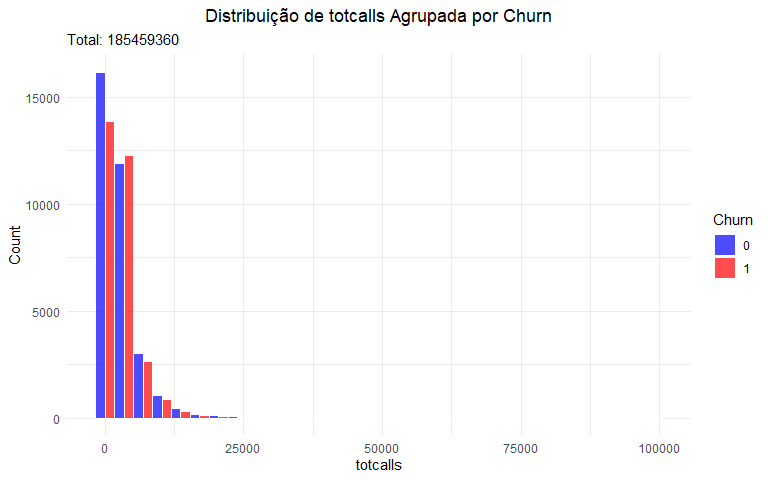<!-- -->

```r
teste_ks("totcalls")
```

```
## Warning in ks.test.default(amostra_churn_0[[x]], amostra_churn_1[[x]]): p-value
## will be approximate in the presence of ties
```

```
## 
## 	Asymptotic two-sample Kolmogorov-Smirnov test
## 
## data:  amostra_churn_0[[x]] and amostra_churn_1[[x]]
## D = 0.047429, p-value < 2.2e-16
## alternative hypothesis: two-sided
```

O p-valor deu um resultado menor que o nível de significância.Isso junto com a análise gráfica, leva a crer que esta é uma boa variável preditora.

### \*\*6.2.71 totrev


```r
func_n2("totrev")
```

```
## A variável totrev é do tipo numeric    Min.  1st Qu.   Median     Mean  3rd Qu.     Max. 
##    23.75   523.34   806.83  1041.81  1271.65 27321.50 
##    vars     n    mean     sd median trimmed    mad   min     max    range skew
## X1    1 63377 1041.81 870.01 806.83  896.38 499.16 23.75 27321.5 27297.75 4.04
##    kurtosis   se
## X1    39.96 3.46
```

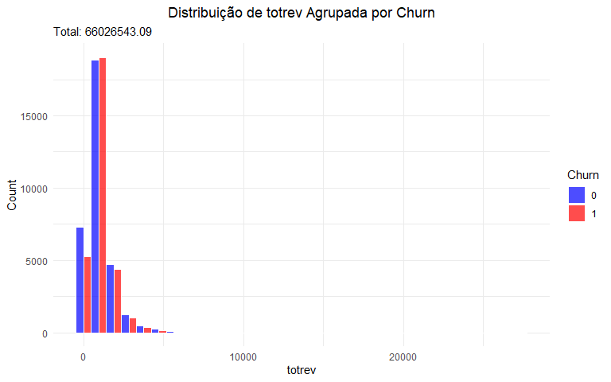<!-- -->

```r
teste_ks("totrev")
```

```
## Warning in ks.test.default(amostra_churn_0[[x]], amostra_churn_1[[x]]): p-value
## will be approximate in the presence of ties
```

```
## 
## 	Asymptotic two-sample Kolmogorov-Smirnov test
## 
## data:  amostra_churn_0[[x]] and amostra_churn_1[[x]]
## D = 0.057522, p-value < 2.2e-16
## alternative hypothesis: two-sided
```

O p-valor deu um resultado menor que o nível de significância.Isso junto com a análise gráfica, leva a crer que esta é uma boa variável preditora.

### \*\*\*6.2.72 adjrev


```r
func_n2("adjrev")
```

```
## A variável adjrev é do tipo numeric    Min.  1st Qu.   Median     Mean  3rd Qu.     Max. 
##    17.46   455.63   740.14   970.37  1196.62 27071.30 
##    vars     n   mean     sd median trimmed    mad   min     max    range skew
## X1    1 63377 970.36 857.28 740.14  826.71 496.23 17.46 27071.3 27053.84 4.06
##    kurtosis   se
## X1    40.77 3.41
```

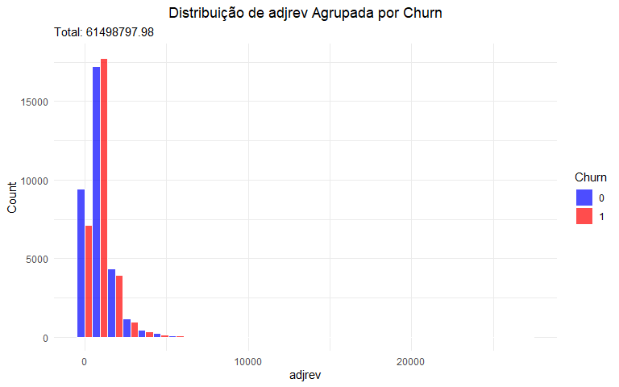<!-- -->

```r
teste_ks("adjrev")
```

```
## Warning in ks.test.default(amostra_churn_0[[x]], amostra_churn_1[[x]]): p-value
## will be approximate in the presence of ties
```

```
## 
## 	Asymptotic two-sample Kolmogorov-Smirnov test
## 
## data:  amostra_churn_0[[x]] and amostra_churn_1[[x]]
## D = 0.058412, p-value < 2.2e-16
## alternative hypothesis: two-sided
```

O p-valor deu um resultado menor que o nível de significância.Isso junto com a análise gráfica, leva a crer que esta é uma boa variável preditora.

### \*\*6.2.73 adjmou


```r
func_n2("adjmou")
```

```
## A variável adjmou é do tipo numeric   Min. 1st Qu.  Median    Mean 3rd Qu.    Max. 
##       0    2467    5047    7587    9619  232855 
##    vars     n    mean      sd median trimmed     mad min      max    range skew
## X1    1 63377 7587.35 8859.98   5047 6021.73 4604.96   0 232855.1 232855.1 4.69
##    kurtosis    se
## X1    46.01 35.19
```

<!-- -->

```r
teste_ks("adjmou")
```

```
## Warning in ks.test.default(amostra_churn_0[[x]], amostra_churn_1[[x]]): p-value
## will be approximate in the presence of ties
```

```
## 
## 	Asymptotic two-sample Kolmogorov-Smirnov test
## 
## data:  amostra_churn_0[[x]] and amostra_churn_1[[x]]
## D = 0.034401, p-value = 5.551e-16
## alternative hypothesis: two-sided
```

O p-valor deu um resultado menor que o nível de significância.Isso junto com a análise gráfica, leva a crer que esta é uma boa variável preditora.

### \*\*6.2.75 adjqty


```r
func_n2("adjqty")
```

```
## A variável adjqty é do tipo integer   Min. 1st Qu.  Median    Mean 3rd Qu.    Max. 
##       0     866    1793    2887    3496   98705 
##    vars     n    mean      sd median trimmed     mad min   max range skew
## X1    1 63377 2886.91 3884.11   1793 2180.84 1660.51   0 98705 98705 6.14
##    kurtosis    se
## X1    72.34 15.43
```

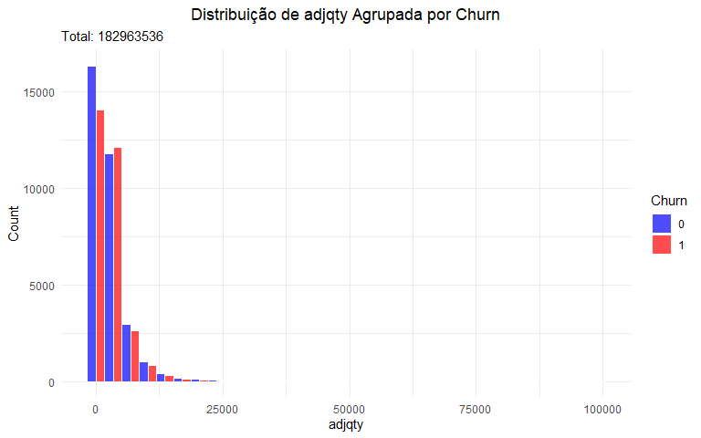<!-- -->

```r
teste_ks("adjqty")
```

```
## Warning in ks.test.default(amostra_churn_0[[x]], amostra_churn_1[[x]]): p-value
## will be approximate in the presence of ties
```

```
## 
## 	Asymptotic two-sample Kolmogorov-Smirnov test
## 
## data:  amostra_churn_0[[x]] and amostra_churn_1[[x]]
## D = 0.045318, p-value < 2.2e-16
## alternative hypothesis: two-sided
```

O p-valor deu um resultado menor que o nível de significância.Isso junto com a análise gráfica, leva a crer que esta é uma boa variável preditora.

### 6.2.76 avgrev


```r
func_n2("avgrev")
```

```
## A variável avgrev é do tipo numeric   Min. 1st Qu.  Median    Mean 3rd Qu.    Max. 
##    1.55   35.18   48.83   56.86   67.77  924.27 
##    vars     n  mean    sd median trimmed   mad  min    max  range skew kurtosis
## X1    1 63377 56.86 35.25  48.83   51.72 22.36 1.55 924.27 922.72 3.36    30.72
##      se
## X1 0.14
```

<!-- -->

```r
teste_ks("avgrev")
```

```
## Warning in ks.test.default(amostra_churn_0[[x]], amostra_churn_1[[x]]): p-value
## will be approximate in the presence of ties
```

```
## 
## 	Asymptotic two-sample Kolmogorov-Smirnov test
## 
## data:  amostra_churn_0[[x]] and amostra_churn_1[[x]]
## D = 0.02477, p-value = 1.668e-08
## alternative hypothesis: two-sided
```

O p-valor deu um resultado muito alto. Portanto, esta não é uma boa variável preditora.

### 6.2.77 avg6mou


```r
func_n2("avg6mou")
```

```
## A variável avg6mou é do tipo integer   Min. 1st Qu.  Median    Mean 3rd Qu.    Max. 
##     0.0   165.0   354.0   498.1   674.0  7217.0 
##    vars     n   mean     sd median trimmed    mad min  max range skew kurtosis
## X1    1 63377 498.09 484.93    354  416.91 335.07   0 7217  7217 2.18     7.95
##      se
## X1 1.93
```

<!-- -->

```r
teste_ks("avg6mou")
```

```
## Warning in ks.test.default(amostra_churn_0[[x]], amostra_churn_1[[x]]): p-value
## will be approximate in the presence of ties
```

```
## 
## 	Asymptotic two-sample Kolmogorov-Smirnov test
## 
## data:  amostra_churn_0[[x]] and amostra_churn_1[[x]]
## D = 0.02167, p-value = 1.312e-06
## alternative hypothesis: two-sided
```

O p-valor deu um resultado um pouco acima do nível de significância. Isso é um indício que esta variável não é uma boa preditora, porém não é algo conclusivo.

### 6.2.78 avg6qty


```r
func_n2("avg6qty")
```

```
## A variável avg6qty é do tipo integer   Min. 1st Qu.  Median    Mean 3rd Qu.    Max. 
##     0.0    59.0   125.0   176.6   233.0  2817.0 
##    vars     n   mean     sd median trimmed    mad min  max range skew kurtosis
## X1    1 63377 176.62 180.44    125  145.76 115.64   0 2817  2817 2.93    16.44
##      se
## X1 0.72
```

<!-- -->

```r
teste_ks("avg6qty")
```

```
## Warning in ks.test.default(amostra_churn_0[[x]], amostra_churn_1[[x]]): p-value
## will be approximate in the presence of ties
```

```
## 
## 	Asymptotic two-sample Kolmogorov-Smirnov test
## 
## data:  amostra_churn_0[[x]] and amostra_churn_1[[x]]
## D = 0.014084, p-value = 0.00489
## alternative hypothesis: two-sided
```

O p-valor deu um resultado um pouco acima do nível de significância. Isso éum indício que esta variável não é uma boa preditora, porém não é algo conclusivo.

### \*\*6.2.79 avg6rev


```r
func_n2("avg6rev")
```

```
## A variável avg6rev é do tipo integer   Min. 1st Qu.  Median    Mean 3rd Qu.    Max. 
##   -1.00   34.00   49.00   58.16   70.00  866.00 
##    vars     n  mean    sd median trimmed   mad min max range skew kurtosis   se
## X1    1 63377 58.16 40.33     49   52.04 23.72  -1 866   867 3.51    27.35 0.16
```

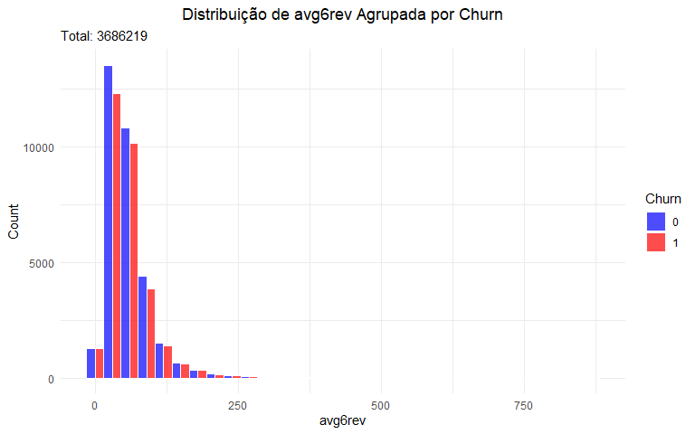<!-- -->

```r
teste_ks("avg6rev")
```

```
## Warning in ks.test.default(amostra_churn_0[[x]], amostra_churn_1[[x]]): p-value
## will be approximate in the presence of ties
```

```
## 
## 	Asymptotic two-sample Kolmogorov-Smirnov test
## 
## data:  amostra_churn_0[[x]] and amostra_churn_1[[x]]
## D = 0.010983, p-value = 0.0516
## alternative hypothesis: two-sided
```

O p-valor (0.05486) deu um resultado um pouco acima do nível de significância (0.05).Porém, como a diferença foi menos de 1% e a análise gráfica mostra que há diferenças sutis nas duas distribuições. Esta variável será considerada uma boa preditora.

### 6.2.80 phones


```r
func_n2("phones")
```

```
## A variável phones é do tipo integer   Min. 1st Qu.  Median    Mean 3rd Qu.    Max. 
##   1.000   1.000   1.000   1.847   2.000  28.000 
##    vars     n mean   sd median trimmed mad min max range skew kurtosis   se
## X1    1 63377 1.85 1.36      1    1.56   0   1  28    27 3.22    20.05 0.01
```

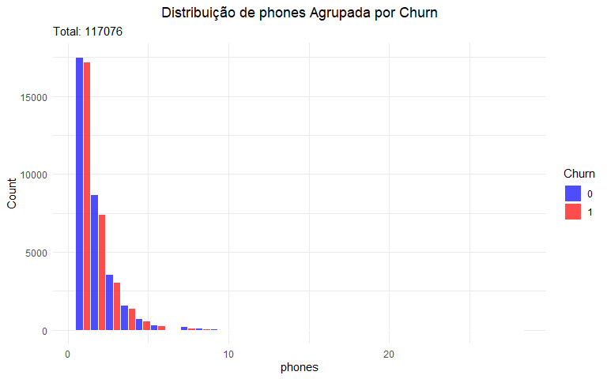<!-- -->

```r
teste_ks("phones")
```

```
## Warning in ks.test.default(amostra_churn_0[[x]], amostra_churn_1[[x]]): p-value
## will be approximate in the presence of ties
```

```
## 
## 	Asymptotic two-sample Kolmogorov-Smirnov test
## 
## data:  amostra_churn_0[[x]] and amostra_churn_1[[x]]
## D = 0.035126, p-value < 2.2e-16
## alternative hypothesis: two-sided
```

O p-valor deu um resultado muito alto. Portanto, esta não é uma boa variável preditora.

### 6.2.81 models


```r
func_n2("models")
```

```
## A variável models é do tipo integer   Min. 1st Qu.  Median    Mean 3rd Qu.    Max. 
##   1.000   1.000   1.000   1.593   2.000  16.000 
##    vars     n mean   sd median trimmed mad min max range skew kurtosis se
## X1    1 63377 1.59 0.93      1     1.4   0   1  16    15 2.37     9.74  0
```

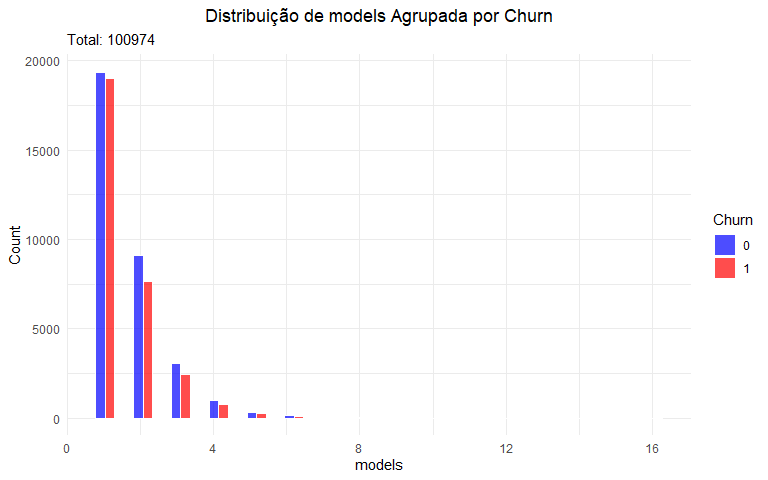<!-- -->

```r
teste_ks("models")
```

```
## Warning in ks.test.default(amostra_churn_0[[x]], amostra_churn_1[[x]]): p-value
## will be approximate in the presence of ties
```

```
## 
## 	Asymptotic two-sample Kolmogorov-Smirnov test
## 
## data:  amostra_churn_0[[x]] and amostra_churn_1[[x]]
## D = 0.043042, p-value < 2.2e-16
## alternative hypothesis: two-sided
```

O p-valor deu um resultado muito alto. Portanto, esta não é uma boa variável preditora.

### \*\*\*6.2.82 ownrent


```r
func_c2("ownrent")
```

```
## 
##           O     R 
##  7373 54269  1735
```

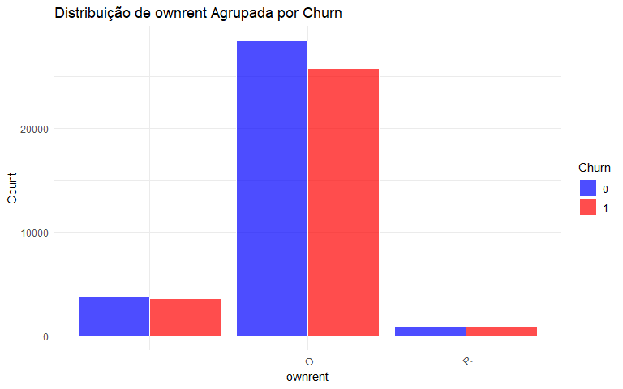<!-- -->

Pela análise gráfica é possível notar que diferença nas duas distribuições. Logo esta é uma boa variável preditora.

### \*\*\*6.2.83 dwlltype


```r
func_c2("dwlltype")
```

```
## 
##           M     S 
##  6005 16401 40971
```

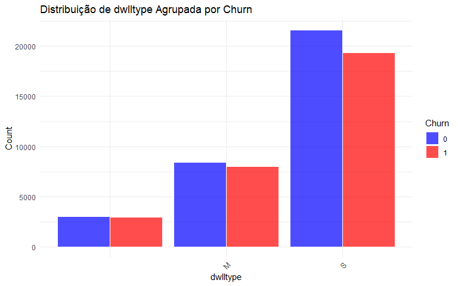<!-- -->

Pela análise gráfica é possível notar que diferença nas duas distribuições. Logo esta é uma boa variável preditora.

### \*\*\*6.2.84 marital


```r
func_c2("marital")
```

```
## 
##     A     B     M     S     U 
##  4303  5760 25961 15055 12298
```

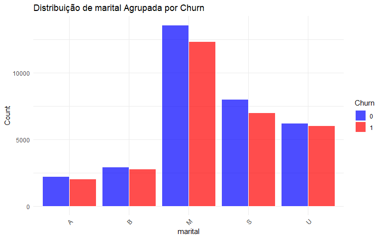<!-- -->

Pela análise gráfica é possível notar que diferença nas duas distribuições. Logo esta é uma boa variável preditora.

### 6.2.85 numbcars


```r
func_n2("numbcars")
```

```
## A variável numbcars é do tipo numeric   Min. 1st Qu.  Median    Mean 3rd Qu.    Max. 
##   0.000   0.000   1.000   1.063   2.000   3.000 
##    vars     n mean  sd median trimmed  mad min max range skew kurtosis se
## X1    1 63377 1.06 0.9      1    1.02 1.48   0   3     3 0.29    -0.94  0
```

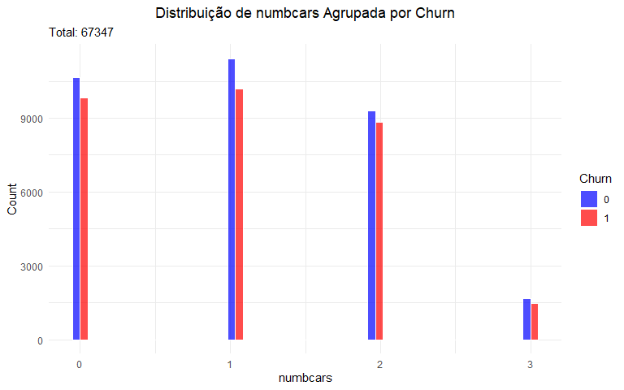<!-- -->

```r
teste_ks("numbcars")
```

```
## Warning in ks.test.default(amostra_churn_0[[x]], amostra_churn_1[[x]]): p-value
## will be approximate in the presence of ties
```

```
## 
## 	Asymptotic two-sample Kolmogorov-Smirnov test
## 
## data:  amostra_churn_0[[x]] and amostra_churn_1[[x]]
## D = 0.012896, p-value = 0.01292
## alternative hypothesis: two-sided
```

### 6.2.86 HHstatin


```r
func_c2("HHstatin")
```

```
## 
##           A     B     C     G     H     I 
## 12444  3289  2773 32409  1478   751 10233
```

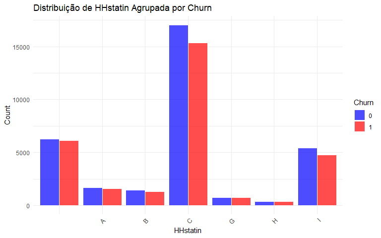<!-- -->

### 6.2.87 dwllsize


```r
func_c2("dwllsize")
```

```
## 
##           A     B     C     D     E     F     G     H     I     J     K     L 
## 11066 39827  4426  1307   648   475   361   318   250   232  1234   578   447 
##     M     N     O 
##   327   848  1033
```

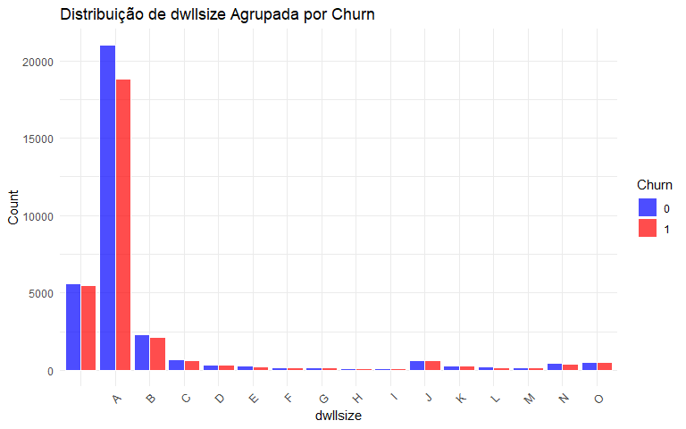<!-- -->

### 6.2.88 ethnic


```r
func_c2("ethnic")
```

```
## 
##     B     C     D     F     G     H     I     J     M     N     O     P     R 
##   789   110   586  1352  3953  8647  2584  1903   101 21953  2606   249   606 
##     S     U     X     Z 
##  8353  6600    38  2947
```

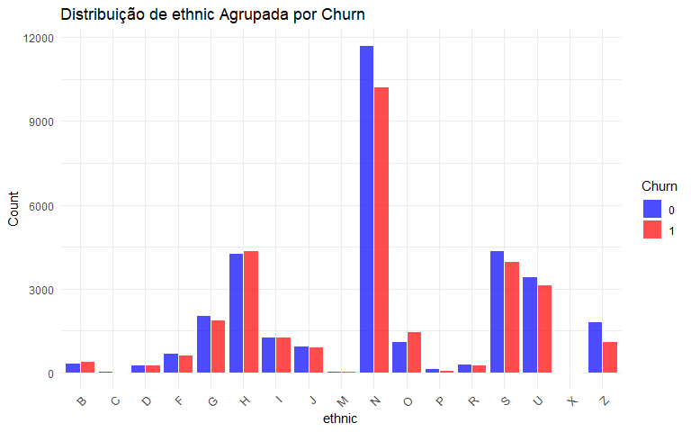<!-- -->

### 6.2.89 kid


```r
func_n2("kid")
```

```
## A variável kid é do tipo numeric   Min. 1st Qu.  Median    Mean 3rd Qu.    Max. 
##  0.0000  0.0000  0.0000  0.3097  1.0000  1.0000 
##    vars     n mean   sd median trimmed mad min max range skew kurtosis se
## X1    1 63377 0.31 0.46      0    0.26   0   0   1     1 0.82    -1.32  0
```

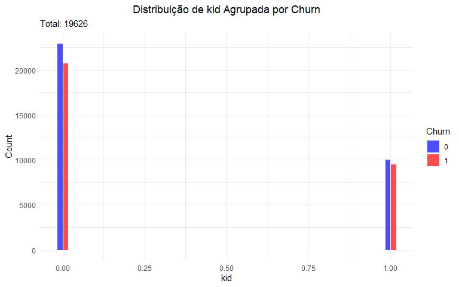<!-- -->

```r
teste_ks("kid")
```

```
## Warning in ks.test.default(amostra_churn_0[[x]], amostra_churn_1[[x]]): p-value
## will be approximate in the presence of ties
```

```
## 
## 	Asymptotic two-sample Kolmogorov-Smirnov test
## 
## data:  amostra_churn_0[[x]] and amostra_churn_1[[x]]
## D = 0.017415, p-value = 0.0002031
## alternative hypothesis: two-sided
```

### 6.2.90 creditcd


```r
func_c2("creditcd")
```

```
## 
##     N     Y 
##  6492 56885
```

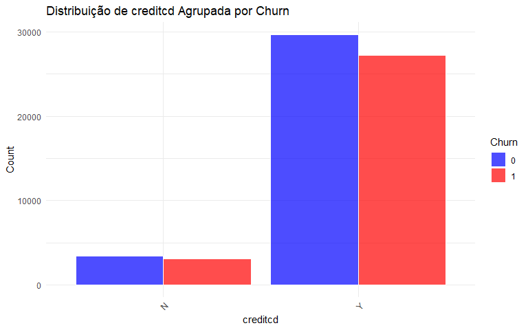<!-- -->

A análise gráfica leva a crer que esta é uma boa variável preditora.

## 6.3 Pré-seleção das variáveis preditoras

Foram pré-selecionadas 41 variáveis preditoras.Agora será análisado a correlação de entre elas.


O critério para seleção da variável será com base no p-valor. As variáveis que tiverem o p-valor maior da dupla, serão eliminadas.

Portanto, as variáveis eliminadas da seleção são:

-   avg3rev

-   adjmou

## 6.4 Variáveis selecionadas

### 6.4.1 Seleção inicial

Será criado um data frame com as 39 variáveis selecionadas para modelagem.Além da coluna churn.

{width="595"}


```r
df_final <- dados3 %>% select(
  "churn",
  "months",
 "drop_vce_Mean",
 "drop_dat_Mean", 
 "blck_vce_Mean",
 "blck_dat_Mean",
 "hnd_price",
 "avgqty",
 "rev_Mean",
 "totmrc_Mean",
 "eqpdays",
 "ovrmou_Mean",
 "mou_cvce_Mean",
 "asl_flag",
 "totmou",
 "avgmou",
 "vceovr_Mean",
 "ovrrev_Mean",
 "change_mou",
 "refurb_new",
 "hnd_webcap",
 "area",
 "income", 
 "roam_Mean",
 "cc_mou_Mean",
 "complete_Mean",
 "peak_vce_Mean",
 "unan_vce_Mean",
 "plcd_vce_Mean",
 "new_cell",
 "crclscod",
 "totcalls",
 "totrev",
 "adjmou",
 "adjqty",
 "avg6rev",
 "ownrent",
 "dwlltype",
 "marital",
 "creditcd"
)
```


```r
#Verificar se todas as colunas foram incluídas
ncol(df_final)
```

```
## [1] 40
```

```r
#Salvar a tabela
#write.csv(df_final,"df_final.csv", row.names = FALSE)
```


```r
df_final <- read.csv("df_final.csv")
```

### 6.4.2 Transformar colunas categóricas em numéricas

Antes de comerçar a modelagem é necessário transformar as colunas categóricas em númericas


```r
# Identificar colunas não numéricas
colunas_nao_numericas <- names(df_final)[!sapply(df_final, is.numeric)]

# Imprimir as colunas não numéricas
print(colunas_nao_numericas)
```

```
##  [1] "asl_flag"   "refurb_new" "hnd_webcap" "area"       "new_cell"  
##  [6] "crclscod"   "ownrent"    "dwlltype"   "marital"    "creditcd"
```

#### asl_flag


```r
unique(df_final$asl_flag)
```

```
## [1] "N" "Y"
```


```r
df_final1 <- df_final %>% 
  dummy_cols(select_columns = c("asl_flag")) %>% 
  subset(select = -asl_flag)
```

#### refurb_new


```r
unique(df_final$refurb_new)
```

```
## [1] "N" "R"
```


```r
df_final1 <- df_final1 %>% 
  dummy_cols(select_columns = c("refurb_new")) %>% 
  subset(select=-refurb_new)
```

#### hnd_webcap


```r
unique(df_final$hnd_webcap)
```

```
## [1] "WCMB" "WC"
```


```r
df_final1 <- df_final1 %>% 
  dummy_cols(select_columns = c("hnd_webcap")) %>% 
  subset(select=-hnd_webcap)
```

#### area


```r
unique(df_final1$area)
```

```
##  [1] "NORTHWEST/ROCKY MOUNTAIN AREA" "NEW ENGLAND AREA"             
##  [3] "GREAT LAKES AREA"              "DALLAS AREA"                  
##  [5] "CENTRAL/SOUTH TEXAS AREA"      "CHICAGO AREA"                 
##  [7] "TENNESSEE AREA"                "MIDWEST AREA"                 
##  [9] "PHILADELPHIA AREA"             "SOUTHWEST AREA"               
## [11] "OHIO AREA"                     "NEW YORK CITY AREA"           
## [13] "HOUSTON AREA"                  "SOUTH FLORIDA AREA"           
## [15] "ATLANTIC SOUTH AREA"           "CALIFORNIA NORTH AREA"        
## [17] "DC/MARYLAND/VIRGINIA AREA"     "NORTH FLORIDA AREA"           
## [19] ""                              "LOS ANGELES AREA"
```


```r
df_final1 <- df_final1 %>% mutate(
  area = case_when(
    area =="NORTHWEST/ROCKY MOUNTAIN AREA" ~ "oeste",
    area =="NEW ENGLAND AREA" ~ "nordeste",
    area =="GREAT LAKES AREA" ~ "centro_oeste", 
    area =="DALLAS AREA" ~ "sudoeste",
    area =="CENTRAL/SOUTH TEXAS AREA" ~ "sudoeste",
    area =="CHICAGO AREA" ~ "centro_oeste",
    area =="TENNESSEE AREA" ~ "sudeste",
    area =="MIDWEST AREA" ~ "centro_oeste" ,
    area =="PHILADELPHIA AREA" ~ "nordeste",
    area =="SOUTHWEST AREA" ~ "sudoeste",
    area =="OHIO AREA" ~ "centro_oeste",
    area =="NEW YORK CITY AREA" ~ "nordeste",
    area =="HOUSTON AREA" ~ "sudoeste" , 
    area =="SOUTH FLORIDA AREA" ~ "sudeste", 
    area =="ATLANTIC SOUTH AREA" ~ "sudeste",
    area =="CALIFORNIA NORTH AREA" ~ "oeste",
    area =="DC/MARYLAND/VIRGINIA AREA" ~ "nordeste",
    area =="NORTH FLORIDA AREA" ~ "sudeste", 
    area =="LOS ANGELES AREA" ~ "oeste",
    TRUE ~ as.character(area)
  )
)
```


```r
df_final1 <- df_final1 %>% 
  dummy_cols(select_columns = c("area")) %>% 
  subset(select=-area)
```


```r
# Calcular a porcentagem de 1s em relação ao total
porcentagem_1 <- 100 * (mean(df_final1$area_ ))

# Exibir o resultado
print(porcentagem_1)
```

```
## [1] 0.04260221
```


```r
df_final1 <- df_final1 %>% subset(select=-area_)
```

#### new_cell


```r
unique(df_final$new_cell)
```

```
## [1] "U" "Y" "N"
```


```r
df_final1 <- df_final1 %>% 
  dummy_cols(select_columns = c("new_cell")) %>% 
  subset(select=-new_cell)
```

#### (?) crclscod


```r
unique(df_final$crclscod)
```

```
##  [1] "A"  "C"  "B"  "BA" "D"  "G"  "CA" "AA" "U"  "E"  "EA" "J"  "W"  "Y"  "Z" 
## [16] "CC" "GA" "DA" "ZA" "JF" "K"  "Z1" "O"  "U1" "E4" "A2" "V"  "M"  "I"  "TP"
## [31] "C5" "Z4" "C2" "EM" "D5" "Z5" "D4" "GY" "E2" "A3" "V1" "CY" "B2" "EC" "D2"
## [46] "Z2" "ZY" "P1" "H"  "EF" "L"
```


```r
df_final1<- df_final1 %>% 
  subset(select=-crclscod)
```

#### ownrent


```r
unique(df_final$ownrent)
```

```
## [1] "O" "R" ""
```


```r
df_final1 <- df_final1 %>% 
  dummy_cols(select_columns = c("ownrent")) %>% 
  subset(select=-ownrent)
```


```r
# Calcular a porcentagem de 1s em relação ao total
porcentagem_1 <- 100 * (mean(df_final1$ownrent_ ))

# Exibir o resultado
print(porcentagem_1)
```

```
## [1] 11.63356
```


```r
df_final1 <- df_final1 %>%  subset(select=- ownrent_)
```

#### dwlltype


```r
unique(df_final$dwlltype)
```

```
## [1] "S" "M" ""
```


```r
df_final1 <- df_final1 %>% 
  dummy_cols(select_columns = c("dwlltype")) %>% 
  subset(select=-dwlltype)
```


```r
# Calcular a porcentagem de 1s em relação ao total
porcentagem_1 <- 100 * (mean(df_final1$dwlltype_ ))

# Exibir o resultado
print(porcentagem_1)
```

```
## [1] 9.475046
```


```r
df_final1 <- df_final1 %>% subset(select=-dwlltype_)
```

### marital


```r
unique(df_final$marital)
```

```
## [1] "S" "M" "A" "U" "B"
```


```r
df_final1 <- df_final1 %>% 
  dummy_cols(select_columns = c("marital")) %>% 
  subset(select=-marital)
```

### creditcd


```r
unique(df_final$creditcd)
```

```
## [1] "Y" "N"
```


```r
df_final1 <- df_final1 %>% 
  dummy_cols(select_columns = c("creditcd")) %>% 
  subset(select=-creditcd)
```

### 6.4.2 Salvar a tabela que será usada na modelagem


```r
#Verificar quantidade de colunas 
ncol(df_final1)
```

```
## [1] 56
```

```r
#Salvar a tabela
#write.csv(df_final1,"df_final_modelagem.csv", row.names = FALSE)
```


```r
df_final1 <- read.csv("df_final_modelagem.csv")
```


# Referências

GOPAL, R. K.; MEHER, S. K. Customer Churn Time Prediction in Mobile Telecommunication Industry Using Ordinal Regression. p. 884--889, 20 maio 2008. Disponível em: <https://link.springer.com/chapter/10.1007/978-3-540-68125-0_88>

HUNG, S.-Y.; YEN, D. C.; WANG, H.-Y. Applying data mining to telecom churn management. Expert Systems with Applications, v. 31, n. 3, p. 515--524, out. 2006.Disponível em : <https://www.sciencedirect.com/science/article/pii/S0957417405002654>

KIM, H.-S.; YOON, C.-H. Determinants of subscriber churn and customer loyalty in the Korean mobile telephony market. Telecommunications Policy, v. 28, n. 9-10, p. 751--765, out. 2004. Disponível em: <https://www.sciencedirect.com/science/article/pii/S0308596104000783>

LEE, H. et al. Mining churning behaviors and developing retention strategies based on a partial least squares (PLS) model. Decision Support Systems, v. 52, n. 1, p. 207--216, dez. 2011.Disponível em: <https://www.sciencedirect.com/science/article/pii/S0167923611001254>

LU, N. et al. A Customer Churn Prediction Model in Telecom Industry Using Boosting. IEEE Transactions on Industrial Informatics, v. 10, n. 2, p. 1659--1665, maio 2014.Disponível em: <https://ieeexplore.ieee.org/abstract/document/6329952>

TSAI, C.-F.; CHEN, M.-Y. Variable selection by association rules for customer churn prediction of multimedia on demand. Expert Systems with Applications, v. 37, n. 3, p. 2006--2015, 15 mar. 2010.Disponível em: <https://www.sciencedirect.com/science/article/pii/S0957417409006459>

KERAMATI, A. et al. Improved churn prediction in telecommunication industry using data mining techniques. **Applied Soft Computing**, v. 24, p. 994--1012, nov. 2014. Disponível em: <https://www.sciencedirect.com/science/article/pii/S1568494614004062>

ZHANG, X. et al. Predicting customer churn through interpersonal influence. Knowledge-KERAMATI, A. et al. Improved churn prediction in telecommunication industry using data mining techniques. **Applied Soft Computing**, v. 24, p. 994--1012, nov. 2014.Based Systems, v. 28, p. 97--104, abr. 2012. Disponível em: <https://www.sciencedirect.com/science/article/pii/S0950705111002693>o
