# Carregar os pacotes


```r
library(dplyr)
library(data.table)
library(tidyr)
library(ggplot2)
library(tidyverse)
library(psych) # função describe
library(ggcorrplot) # grafico de correlação
library(pastecs)
library(dummy) #Criar dummy: linhas passam a ser colunas binárias 
library(randomForest) #Usar no algoritmo Random Forest
library(boot)#Fazer CrossValidation
library(fastDummies) 
library(stats) #Métrica KS
#install.packages("ROCR")
library(ROCR)#para fazer a curva ROC
library(pROC)
```


```r
#install.packages("caret")
#install.packages("randomForest")
library(lattice) #necessária para usar o pacote caret
library(caret) #Fazer avaliação dos modelos, padronizar os dados etc
library(randomForest) 
```


```r
#Boruta
#("ParamHelpers")
library(ParamHelpers)

#install.packages("mlr")
library(mlr)

#install.packages("Boruta")
library(Boruta)
```

# Carregar a base de dados


```r
df_final1 <- read.csv("df_final_modelagem.csv")
```

# Quebrar o dataset em teste, treino e validação


```r
# Definindo a semente para reproduzibilidade
set.seed(123)

# Índices para amostra de treino (70% dos dados)
indice_treino <- sample(1:nrow(df_final1), 0.7 * nrow(df_final1), replace=FALSE)

# Índices para amostra de teste (15% dos dados)
indice_teste <- sample(setdiff(1:nrow(df_final1), indice_treino), 0.15* nrow(df_final1), replace=FALSE) 

# Índices para amostra de validação (15% dos dados restantes)
indice_validacao <- setdiff(1:nrow(df_final1), c(indice_treino, indice_teste))


#Conjunto de dados dividos
dados_treino <- df_final1[indice_treino, ]
dados_teste <- df_final1[indice_teste, ]
dados_validacao <- df_final1[indice_validacao, ]

#OBS: Índices para amostra de treino (indices_treino): São os índices das linhas do seu conjunto de dados original que foram selecionadas para compor o conjunto de treino. Esses índices são utilizados para extrair as linhas correspondentes do conjunto de dados original. Essencialmente, indices_treino são os números que indicam quais observações (linhas) do seu dataset original fazem parte do conjunto de treino
```

# Padronizar e Pré Processar os dados


```r
# Criar um objeto de pré-processamento com base nos dados de treinamento
preproc <- preProcess(dados_treino, method = c("range"))
```


```r
# Aplique o mesmo pré-processamento aos conjuntos de treinamento, teste e validação
dados_treino1<- predict(preproc, dados_treino)
dados_teste1 <- predict(preproc, dados_teste)
dados_validacao1<- predict(preproc, dados_validacao)
```


```r
dados_treino1 <- data.frame(dados_treino1)
dados_teste1 <- data.frame(dados_teste1)
dados_validacao1 <- data.frame(dados_validacao1)
```


```r
#write.csv(dados_treino1,"dados_treino1.csv", row.names = FALSE)
```

# Dados de Treino e Teste


```r
setwd("C:/0.Projetos/2.Telecom_customer_(Churn)/Scripts")
dados_treino1 <- read.csv("dados_treino1.csv")
dados_teste1 <- read.csv("dados_teste1.csv")
```

# Verificar se os dados estão balanceados


```r
#Verificar se os dados estão balanceados
table(dados_treino1$churn)
```

```
## 
##     0     1 
## 23113 21250
```

```r
prop.table(table(dados_treino1$churn))
```

```
## 
##         0         1 
## 0.5209972 0.4790028
```

# Logistico 1

Modelo com todas as variáveis preditoras selecionadas na análise descritiva

## Treinar o modelo


```r
#Treinar o modelo
logistico1 <- glm(churn ~ ., data= dados_treino1, family = binomial(link = "logit"))
summary(logistico1)
```

```
## 
## Call:
## glm(formula = churn ~ ., family = binomial(link = "logit"), data = dados_treino1)
## 
## Coefficients: (6 not defined because of singularities)
##                    Estimate Std. Error z value Pr(>|z|)    
## (Intercept)         1.56246    0.53113   2.942  0.00326 ** 
## months             -0.77310    0.09869  -7.834 4.74e-15 ***
## drop_vce_Mean       0.93950    0.32057   2.931  0.00338 ** 
## drop_dat_Mean       0.44397    1.08304   0.410  0.68186    
## blck_vce_Mean       1.06020    0.57458   1.845  0.06501 .  
## blck_dat_Mean       0.30233    1.18901   0.254  0.79929    
## hnd_price          -0.62862    0.11234  -5.596 2.20e-08 ***
## avgqty              1.23334    0.94344   1.307  0.19112    
## rev_Mean            1.97753    1.03849   1.904  0.05688 .  
## totmrc_Mean        -1.88537    0.41876  -4.502 6.72e-06 ***
## eqpdays             1.46493    0.08358  17.528  < 2e-16 ***
## ovrmou_Mean         1.04754    1.58238   0.662  0.50797    
## mou_cvce_Mean      -2.61222    0.36773  -7.104 1.22e-12 ***
## totmou             42.37043   32.80490   1.292  0.19650    
## avgmou              2.64040    0.84516   3.124  0.00178 ** 
## vceovr_Mean         3.51816    3.71259   0.948  0.34332    
## ovrrev_Mean        -0.89690    3.86787  -0.232  0.81663    
## change_mou         -3.38532    0.34943  -9.688  < 2e-16 ***
## income             -0.04927    0.03905  -1.262  0.20700    
## roam_Mean           2.16123    1.19958   1.802  0.07160 .  
## cc_mou_Mean        -1.13941    0.54014  -2.109  0.03490 *  
## complete_Mean      -1.01595    2.62342  -0.387  0.69856    
## peak_vce_Mean      -2.61252    0.57325  -4.557 5.18e-06 ***
## unan_vce_Mean       0.07723    1.28837   0.060  0.95220    
## plcd_vce_Mean       1.00270    3.25282   0.308  0.75789    
## totcalls            6.60441   34.32087   0.192  0.84740    
## totrev              1.70886    0.98471   1.735  0.08267 .  
## adjmou            -42.69718   32.92925  -1.297  0.19476    
## adjqty             -6.95938   34.50000  -0.202  0.84013    
## avg6rev            -1.67795    0.62823  -2.671  0.00756 ** 
## asl_flag_N          0.39465    0.03371  11.709  < 2e-16 ***
## asl_flag_Y               NA         NA      NA       NA    
## refurb_new_N       -0.27992    0.03208  -8.727  < 2e-16 ***
## refurb_new_R             NA         NA      NA       NA    
## hnd_webcap_WC       0.03606    0.03441   1.048  0.29472    
## hnd_webcap_WCMB          NA         NA      NA       NA    
## area_centro_oeste  -0.43462    0.51075  -0.851  0.39481    
## area_nordeste      -0.33859    0.51076  -0.663  0.50738    
## area_oeste         -0.19642    0.51098  -0.384  0.70068    
## area_sudeste       -0.28357    0.51089  -0.555  0.57886    
## area_sudoeste      -0.32995    0.51081  -0.646  0.51833    
## new_cell_N          0.03556    0.03444   1.033  0.30175    
## new_cell_U          0.02171    0.02549   0.851  0.39449    
## new_cell_Y               NA         NA      NA       NA    
## ownrent_O          -0.06544    0.03598  -1.819  0.06895 .  
## ownrent_R           0.08631    0.06734   1.282  0.19993    
## dwlltype_M         -0.01607    0.03764  -0.427  0.66942    
## dwlltype_S         -0.09196    0.03564  -2.580  0.00988 ** 
## marital_A          -0.01510    0.04375  -0.345  0.73000    
## marital_B          -0.06864    0.03944  -1.740  0.08185 .  
## marital_M          -0.06557    0.02882  -2.275  0.02291 *  
## marital_S          -0.12201    0.03037  -4.018 5.87e-05 ***
## marital_U                NA         NA      NA       NA    
## creditcd_N         -0.01554    0.03627  -0.428  0.66839    
## creditcd_Y               NA         NA      NA       NA    
## ---
## Signif. codes:  0 '***' 0.001 '**' 0.01 '*' 0.05 '.' 0.1 ' ' 1
## 
## (Dispersion parameter for binomial family taken to be 1)
## 
##     Null deviance: 61422  on 44362  degrees of freedom
## Residual deviance: 59750  on 44314  degrees of freedom
## AIC: 59848
## 
## Number of Fisher Scoring iterations: 4
```

## Previsão do modelo


```r
# A type="response" opção informa Rpara gerar probabilidades no formato P(Y = 1|X)
#https://www.science.smith.edu/~jcrouser/SDS293/labs/lab4-r.html#:~:text=The%20predict()%20function%20can,information%20such%20as%20the%20logit%20.

#Previsão do Modelo
pred_log1 <- predict(logistico1, newdata = dados_treino1)
```

```
## Warning in predict.lm(object, newdata, se.fit, scale = 1, type = if (type == :
## prediction from rank-deficient fit; attr(*, "non-estim") has doubtful cases
```

## Matriz de Confusão


```r
# Ponto de corte = 0.5
#Ponto de Corte: Transformar as probabilidades em rótulos de classe (0 ou 1) com base em um ponto de corte típico de 0.5
#se o valor da variável pred_log1 for maior ou igual a 0.4, então prob_log2 recebe o valor 1, caso contrário, recebe o valor 0
prob_log1 <- ifelse(pred_log1 >= 0.4, 1, 0)
prob_log1 <- as.factor(prob_log1)

#Criar uma tabela com todos os dados e o ponto de corte
df_log1 <- cbind(dados_treino1, prob_log1) #Unir ponto de corte e dados_treino1
#Mudar a posição do de prob_log1(ponto de corte) para que fique ao lado de churn
df_log1 <- df_log1 %>% select(1, 56, 2:55)  

#Para visualizar
df_log1a <- df_log1 %>% select(1:4) 
head(df_log1a)
```

```
##   churn prob_log1     months drop_vce_Mean
## 1     1         0 0.07547170   0.002004008
## 2     1         0 0.03773585   0.038076152
## 3     0         1 0.47169811   0.000000000
## 4     1         0 0.07547170   0.006012024
## 5     0         0 0.16981132   0.004008016
## 6     1         0 0.13207547   0.010020040
```

```r
verdadeiro <- factor(dados_treino1$churn)

# Criar a matriz de confusão
matrix_log1 <- confusionMatrix(prob_log1, verdadeiro, positive = "1")
```


```r
matrix_log1$table 
```

```
##           Reference
## Prediction     0     1
##          0 21448 18496
##          1  1665  2754
```

## Métricas


```r
# Calcular a precisão
precision_log1 <- matrix_log1$byClass["Pos Pred Value"]

# Calcular a revocação
recall_log1 <- matrix_log1$byClass["Sensitivity"]

# Calcular o F1-Score
f1_score_log1 <- 2 * (precision_log1 * recall_log1) / (precision_log1 + recall_log1)


#Calcular Teste KS
ks_log1 <- ks.test(pred_log1, as.numeric(verdadeiro))
```

```
## Warning in ks.test.default(pred_log1, as.numeric(verdadeiro)): p-value will be
## approximate in the presence of ties
```

```r
# Exibir as métricas
cat("Precision:", precision_log1, "\n")
```

```
## Precision: 0.6232179
```

```r
cat("Recall:", recall_log1, "\n")
```

```
## Recall: 0.1296
```

```r
cat("F1-Score:", f1_score_log1, "\n")
```

```
## F1-Score: 0.2145779
```

```r
cat("Valor do KS:", ks_log1$statistic, "\n")
```

```
## Valor do KS: 0.9953565
```

## Curva ROC


```r
# Calcule a curva ROC
roc_log1 <- roc(dados_treino1$churn, pred_log1)
```

```
## Setting levels: control = 0, case = 1
```

```
## Setting direction: controls < cases
```

```r
roc_log1 
```

```
## 
## Call:
## roc.default(response = dados_treino1$churn, predictor = pred_log1)
## 
## Data: pred_log1 in 23113 controls (dados_treino1$churn 0) < 21250 cases (dados_treino1$churn 1).
## Area under the curve: 0.6132
```

```r
# Calcule o AUC
auc_log1<- auc(roc_log1)
auc_log1
```

```
## Area under the curve: 0.6132
```


```r
# Criar um gráfico da curva ROC 
par(mar = c(5, 5, 4, 2) + 0.1)  # Ajustar as margens
plot(roc_log1, col = "#EAB200", main = "Curva ROC", print.thres = T)
legend("bottomright", legend = c("Logistico 1"), col = c("#EAB200"), lwd = 2)
```

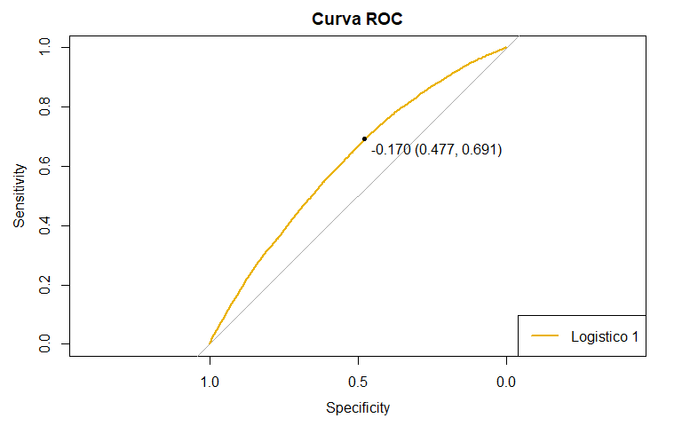<!-- -->

# Teste da Razão de Verossimilhança do Modelo 1


```r
#Serve para comparar cada coeficiente de mandeira individual

#1. Utilizando Anova
anova(logistico1, test="Chisq")
```

```
## Analysis of Deviance Table
## 
## Model: binomial, link: logit
## 
## Response: churn
## 
## Terms added sequentially (first to last)
## 
## 
##                   Df Deviance Resid. Df Resid. Dev  Pr(>Chi)    
## NULL                              44362      61422              
## months             1     0.37     44361      61422 0.5404125    
## drop_vce_Mean      1     6.78     44360      61415 0.0091993 ** 
## drop_dat_Mean      1     0.21     44359      61415 0.6497715    
## blck_vce_Mean      1     0.14     44358      61414 0.7057683    
## blck_dat_Mean      1     0.06     44357      61414 0.8066478    
## hnd_price          1   416.76     44356      60998 < 2.2e-16 ***
## avgqty             1     2.61     44355      60995 0.1059470    
## rev_Mean           1     0.02     44354      60995 0.8840522    
## totmrc_Mean        1   207.79     44353      60787 < 2.2e-16 ***
## eqpdays            1   336.44     44352      60451 < 2.2e-16 ***
## ovrmou_Mean        1     0.89     44351      60450 0.3455767    
## mou_cvce_Mean      1   120.60     44350      60329 < 2.2e-16 ***
## totmou             1    22.81     44349      60306 1.784e-06 ***
## avgmou             1    54.00     44348      60252 2.009e-13 ***
## vceovr_Mean        1     4.90     44347      60248 0.0268261 *  
## ovrrev_Mean        1     0.30     44346      60247 0.5837551    
## change_mou         1    85.63     44345      60162 < 2.2e-16 ***
## income             1     0.10     44344      60162 0.7516476    
## roam_Mean          1     2.62     44343      60159 0.1056524    
## cc_mou_Mean        1    10.18     44342      60149 0.0014207 ** 
## complete_Mean      1    14.53     44341      60134 0.0001381 ***
## peak_vce_Mean      1    18.22     44340      60116 1.971e-05 ***
## unan_vce_Mean      1     0.95     44339      60115 0.3304842    
## plcd_vce_Mean      1     0.06     44338      60115 0.8022930    
## totcalls           1     0.75     44337      60114 0.3871964    
## totrev             1     0.47     44336      60114 0.4943271    
## adjmou             1    24.74     44335      60089 6.548e-07 ***
## adjqty             1     0.16     44334      60089 0.6886495    
## avg6rev            1     7.28     44333      60082 0.0069556 ** 
## asl_flag_N         1   140.15     44332      59941 < 2.2e-16 ***
## asl_flag_Y         0     0.00     44332      59941              
## refurb_new_N       1    76.79     44331      59865 < 2.2e-16 ***
## refurb_new_R       0     0.00     44331      59865              
## hnd_webcap_WC      1     1.36     44330      59863 0.2438747    
## hnd_webcap_WCMB    0     0.00     44330      59863              
## area_centro_oeste  1    39.12     44329      59824 3.976e-10 ***
## area_nordeste      1     5.62     44328      59819 0.0177931 *  
## area_oeste         1    17.29     44327      59801 3.214e-05 ***
## area_sudeste       1     1.98     44326      59799 0.1592482    
## area_sudoeste      1     0.37     44325      59799 0.5409113    
## new_cell_N         1     0.48     44324      59798 0.4874039    
## new_cell_U         1     0.65     44323      59798 0.4191760    
## new_cell_Y         0     0.00     44323      59798              
## ownrent_O          1    14.62     44322      59783 0.0001318 ***
## ownrent_R          1     0.62     44321      59782 0.4298436    
## dwlltype_M         1     5.93     44320      59777 0.0149108 *  
## dwlltype_S         1     8.26     44319      59768 0.0040453 ** 
## marital_A          1     1.73     44318      59767 0.1886661    
## marital_B          1     0.03     44317      59767 0.8655366    
## marital_M          1     0.00     44316      59767 0.9665472    
## marital_S          1    15.98     44315      59751 6.391e-05 ***
## marital_U          0     0.00     44315      59751              
## creditcd_N         1     0.18     44314      59750 0.6683704    
## creditcd_Y         0     0.00     44314      59750              
## ---
## Signif. codes:  0 '***' 0.001 '**' 0.01 '*' 0.05 '.' 0.1 ' ' 1
```

```r
# adiciona as variáveis sequencialmente (a variável adicional melhora o modelo?)

#2.Utilizando Drop1
drop1(logistico1, test="Chisq")
```

```
## Single term deletions
## 
## Model:
## churn ~ months + drop_vce_Mean + drop_dat_Mean + blck_vce_Mean + 
##     blck_dat_Mean + hnd_price + avgqty + rev_Mean + totmrc_Mean + 
##     eqpdays + ovrmou_Mean + mou_cvce_Mean + totmou + avgmou + 
##     vceovr_Mean + ovrrev_Mean + change_mou + income + roam_Mean + 
##     cc_mou_Mean + complete_Mean + peak_vce_Mean + unan_vce_Mean + 
##     plcd_vce_Mean + totcalls + totrev + adjmou + adjqty + avg6rev + 
##     asl_flag_N + asl_flag_Y + refurb_new_N + refurb_new_R + hnd_webcap_WC + 
##     hnd_webcap_WCMB + area_centro_oeste + area_nordeste + area_oeste + 
##     area_sudeste + area_sudoeste + new_cell_N + new_cell_U + 
##     new_cell_Y + ownrent_O + ownrent_R + dwlltype_M + dwlltype_S + 
##     marital_A + marital_B + marital_M + marital_S + marital_U + 
##     creditcd_N + creditcd_Y
##                   Df Deviance   AIC     LRT  Pr(>Chi)    
## <none>                  59750 59848                      
## months             1    59812 59908  62.094 3.274e-15 ***
## drop_vce_Mean      1    59759 59855   8.555  0.003447 ** 
## drop_dat_Mean      1    59751 59847   0.170  0.680232    
## blck_vce_Mean      1    59754 59850   3.361  0.066768 .  
## blck_dat_Mean      1    59750 59846   0.064  0.800054    
## hnd_price          1    59782 59878  31.461 2.035e-08 ***
## avgqty             1    59752 59848   1.711  0.190834    
## rev_Mean           1    59754 59850   3.625  0.056905 .  
## totmrc_Mean        1    59771 59867  20.325 6.534e-06 ***
## eqpdays            1    60061 60157 310.780 < 2.2e-16 ***
## ovrmou_Mean        1    59751 59847   0.430  0.511941    
## mou_cvce_Mean      1    59801 59897  50.942 9.515e-13 ***
## totmou             1    59752 59848   1.672  0.195966    
## avgmou             1    59760 59856   9.760  0.001783 ** 
## vceovr_Mean        1    59751 59847   0.894  0.344314    
## ovrrev_Mean        1    59750 59846   0.054  0.816634    
## change_mou         1    59846 59942  95.285 < 2.2e-16 ***
## income             1    59752 59848   1.592  0.206997    
## roam_Mean          1    59754 59850   3.408  0.064900 .  
## cc_mou_Mean        1    59755 59851   4.505  0.033788 *  
## complete_Mean      1    59751 59847   0.151  0.697924    
## peak_vce_Mean      1    59771 59867  20.847 4.975e-06 ***
## unan_vce_Mean      1    59750 59846   0.004  0.952215    
## plcd_vce_Mean      1    59750 59846   0.095  0.757505    
## totcalls           1    59750 59846   0.037  0.847401    
## totrev             1    59753 59849   3.029  0.081774 .  
## adjmou             1    59752 59848   1.685  0.194201    
## adjqty             1    59750 59846   0.041  0.840132    
## avg6rev            1    59758 59854   7.209  0.007255 ** 
## asl_flag_N         0    59750 59848   0.000              
## asl_flag_Y         0    59750 59848   0.000              
## refurb_new_N       0    59750 59848   0.000              
## refurb_new_R       0    59750 59848   0.000              
## hnd_webcap_WC      0    59750 59848   0.000              
## hnd_webcap_WCMB    0    59750 59848   0.000              
## area_centro_oeste  1    59751 59847   0.731  0.392414    
## area_nordeste      1    59751 59847   0.443  0.505441    
## area_oeste         1    59751 59847   0.149  0.699775    
## area_sudeste       1    59751 59847   0.311  0.577296    
## area_sudoeste      1    59751 59847   0.421  0.516444    
## new_cell_N         0    59750 59848   0.000              
## new_cell_U         0    59750 59848   0.000              
## new_cell_Y         0    59750 59848   0.000              
## ownrent_O          1    59754 59850   3.308  0.068960 .  
## ownrent_R          1    59752 59848   1.643  0.199899    
## dwlltype_M         1    59751 59847   0.182  0.669426    
## dwlltype_S         1    59757 59853   6.655  0.009891 ** 
## marital_A          0    59750 59848   0.000              
## marital_B          0    59750 59848   0.000              
## marital_M          0    59750 59848   0.000              
## marital_S          0    59750 59848   0.000              
## marital_U          0    59750 59848   0.000              
## creditcd_N         0    59750 59848   0.000              
## creditcd_Y         0    59750 59848   0.000              
## ---
## Signif. codes:  0 '***' 0.001 '**' 0.01 '*' 0.05 '.' 0.1 ' ' 1
```

```r
# remove as variáveis sequencialmente (a variável adicional melhora o modelo?)
```

# Logistico 2

Modelo com as variáveis mais significativas do Teste da Razão de Verossimilhança do Modelo 1

## Treinar o modelo


```r
logistico2 <- glm(churn ~ hnd_price+ totmrc_Mean + eqpdays + mou_cvce_Mean +
                    totmou + avgmou + change_mou +complete_Mean + peak_vce_Mean+
                    adjmou+ asl_flag_N + refurb_new_N + area_centro_oeste +     area_oeste +
                    ownrent_O + marital_S +
                    months + 
                    drop_vce_Mean +vceovr_Mean + cc_mou_Mean + avg6rev + area_nordeste+
                    dwlltype_M + dwlltype_S+ cc_mou_Mean+
                    blck_vce_Mean + roam_Mean + totrev + ownrent_O , 
                  data= dados_treino1, family = binomial(link = "logit"))

#summary(logistico2)
```

## Previsão do modelo


```r
pred_log2 <- predict(logistico2, newdata = dados_treino1)
```

## Matriz de Confusão


```r
# Ponto de corte = 0.4
#Ponto de Corte: Transformar as probabilidades em rótulos de classe (0 ou 1) com base em um ponto de corte típico de 0.4
#OBS: se o valor da variável pred_log2 for maior ou igual a 0.4, então prob_log2 recebe o valor 1, caso contrário, recebe o valor 0
prob_log2 <- ifelse(pred_log2 >= 0.4, 1, 0)
prob_log2 <- as.factor(prob_log2)

#Criar uma tabela com todos os dados e o ponto de corte
df_log2 <- cbind(dados_treino1, prob_log2) #Unir ponto de corte e dados_treino1
#Mudar a posição do de prob_log2(ponto de corte) para que fique ao lado de churn
df_log2 <- df_log2 %>% select(1, 56, 2:55)

#Para visualizar
df_log2a <- df_log2 %>% select(1:4) 
head(df_log2a)
```

```
##   churn prob_log2     months drop_vce_Mean
## 1     1         0 0.07547170   0.002004008
## 2     1         0 0.03773585   0.038076152
## 3     0         1 0.47169811   0.000000000
## 4     1         0 0.07547170   0.006012024
## 5     0         0 0.16981132   0.004008016
## 6     1         0 0.13207547   0.010020040
```

```r
# Vetor com os valores verdadeiros de churn
verdadeiro <- factor(dados_treino1$churn)


# Criar a matriz de confusão
matrix_log2 <- confusionMatrix(prob_log2, verdadeiro, positive = "1")
matrix_log2$table
```

```
##           Reference
## Prediction     0     1
##          0 21519 18622
##          1  1594  2628
```

## Métricas


```r
# Calcular a precisão
precision_log2 <- matrix_log2$byClass["Pos Pred Value"]

# Calcular a revocação
recall_log2 <- matrix_log2$byClass["Sensitivity"]

# Calcular o F1-Score
f1_score_log2 <- 2 * (precision_log2 * recall_log2) / (precision_log2 + recall_log2)

#Calcular Teste KS
ks_log2 <- ks.test(pred_log2, as.numeric(verdadeiro))
```

```
## Warning in ks.test.default(pred_log2, as.numeric(verdadeiro)): p-value will be
## approximate in the presence of ties
```

```r
# Exibir as métricas
cat("Precision:", precision_log2, "\n")
```

```
## Precision: 0.6224538
```

```r
cat("Recall:", recall_log2, "\n")
```

```
## Recall: 0.1236706
```

```r
cat("F1-Score:", f1_score_log2, "\n")
```

```
## F1-Score: 0.2063442
```

```r
cat("Valor do KS:", ks_log2$statistic, "\n")
```

```
## Valor do KS: 0.9956721
```

## Curva ROC


```r
# Calcule a curva ROC
roc_log2 <- roc(dados_treino1$churn, pred_log2)
```

```
## Setting levels: control = 0, case = 1
```

```
## Setting direction: controls < cases
```

```r
# Calcule o AUC
auc_log2<- auc(roc_log2)
auc_log2
```

```
## Area under the curve: 0.6124
```


```r
# Criar um gráfico da curva ROC 
par(mar = c(5, 5, 4, 2) + 0.1)  # Ajustar as margens
plot(roc_log2, col = "blue", main = "Curva ROC ", print.thres = T)
legend("bottomright", legend = c("Modelo 2"), col = c("blue"), lwd = 2)
```

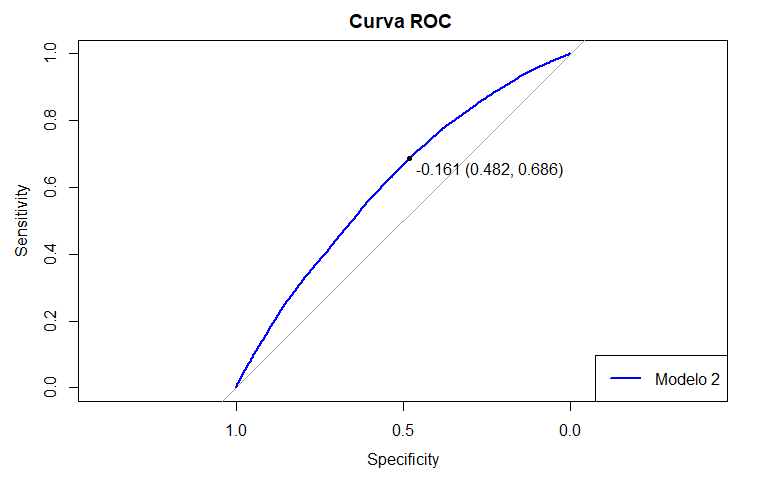<!-- -->

# ANOVA entre Modelo 1 e Modelo 2


```r
# Comparando modelo menor com o maior
#Queremos descobrir se as varivaveis que omitimos do modelo menor são significativas
anova(logistico2, logistico1, test="LRT") # se valor p > niv.sig., as variáveis omitidas não são significativas 
```

```
## Analysis of Deviance Table
## 
## Model 1: churn ~ hnd_price + totmrc_Mean + eqpdays + mou_cvce_Mean + totmou + 
##     avgmou + change_mou + complete_Mean + peak_vce_Mean + adjmou + 
##     asl_flag_N + refurb_new_N + area_centro_oeste + area_oeste + 
##     ownrent_O + marital_S + months + drop_vce_Mean + vceovr_Mean + 
##     cc_mou_Mean + avg6rev + area_nordeste + dwlltype_M + dwlltype_S + 
##     cc_mou_Mean + blck_vce_Mean + roam_Mean + totrev + ownrent_O
## Model 2: churn ~ months + drop_vce_Mean + drop_dat_Mean + blck_vce_Mean + 
##     blck_dat_Mean + hnd_price + avgqty + rev_Mean + totmrc_Mean + 
##     eqpdays + ovrmou_Mean + mou_cvce_Mean + totmou + avgmou + 
##     vceovr_Mean + ovrrev_Mean + change_mou + income + roam_Mean + 
##     cc_mou_Mean + complete_Mean + peak_vce_Mean + unan_vce_Mean + 
##     plcd_vce_Mean + totcalls + totrev + adjmou + adjqty + avg6rev + 
##     asl_flag_N + asl_flag_Y + refurb_new_N + refurb_new_R + hnd_webcap_WC + 
##     hnd_webcap_WCMB + area_centro_oeste + area_nordeste + area_oeste + 
##     area_sudeste + area_sudoeste + new_cell_N + new_cell_U + 
##     new_cell_Y + ownrent_O + ownrent_R + dwlltype_M + dwlltype_S + 
##     marital_A + marital_B + marital_M + marital_S + marital_U + 
##     creditcd_N + creditcd_Y
##   Resid. Df Resid. Dev Df Deviance Pr(>Chi)
## 1     44335      59775                     
## 2     44314      59750 21   24.647   0.2628
```

```r
# pode ser Chisq no lugar de LRT

#O p-valor valor foi MAIOR que o nível de significancia de 0.05. 
#Isso significa que o modelo NÃO omitiu variaveis significativas
```

# Logistico 3

Modelo com as variáveis selecionadas automáticamente pela função setp() cujo critério de seleção é Akaike information criterion (AIC). O modelo mais adequado de acordo com a AIC é aquele que explica a maior quantidade de variação usando o menor número possível de variáveis independentes.


```r
#Seleção automatica das variaveis
#step_log3 <- step(logistico1, direction = "backward") # baseado no AIC
#summary(step_log3)
```

## Treinar o modelo


```r
logistico3 <- glm(formula = churn ~ months + drop_vce_Mean + blck_vce_Mean + 
                    hnd_price + avgqty + rev_Mean + totmrc_Mean + eqpdays + mou_cvce_Mean + 
                    totmou + avgmou + vceovr_Mean + change_mou + roam_Mean + 
                    cc_mou_Mean + peak_vce_Mean + totrev + adjmou + avg6rev + 
                    asl_flag_N + refurb_new_N + area_centro_oeste + area_nordeste + 
                    area_sudeste + area_sudoeste + ownrent_O + dwlltype_S + marital_B + 
                    marital_M + marital_S, family = binomial(link = "logit"), 
                  data = dados_treino1)
```

## Previsão do modelo


```r
pred_log3 <- predict(logistico3, newdata = dados_treino1)
```

## Matriz de confusão


```r
# Ponto de corte = 0.4
#Ponto de Corte: Transformar as probabilidades em rótulos de classe (0 ou 1) com base em um ponto de corte típico de 0.4
prob_log3 <- ifelse(pred_log3 >= 0.4, 1, 0)
prob_log3 <- as.factor(prob_log3)
```


```r
#Criar uma tabela com todos os dados e o ponto de corte
df_log3 <- cbind(dados_treino1, prob_log3) #Unir ponto de corte e dados_treino1
#Mudar a posição do de prob_log3(ponto de corte) para que fique ao lado de churn
df_log3 <- df_log3 %>% select(1, 56, 2:55)
#Para visualizar
df_log3a <- df_log3 %>% select(1:4) 
head(df_log3a)
```

```
##   churn prob_log3     months drop_vce_Mean
## 1     1         0 0.07547170   0.002004008
## 2     1         0 0.03773585   0.038076152
## 3     0         1 0.47169811   0.000000000
## 4     1         0 0.07547170   0.006012024
## 5     0         0 0.16981132   0.004008016
## 6     1         0 0.13207547   0.010020040
```


```r
# Vetor com os valores verdadeiros de churn
verdadeiro <- factor(dados_treino1$churn)

# Criar a matriz de confusão
matrix_log3 <- confusionMatrix(prob_log3, verdadeiro, positive = "1")
matrix_log3$table
```

```
##           Reference
## Prediction     0     1
##          0 21498 18545
##          1  1615  2705
```

## Métricas


```r
# Calcular a precisão
precision_log3 <- matrix_log3$byClass["Pos Pred Value"]

# Calcular a revocação
recall_log3 <- matrix_log3$byClass["Sensitivity"]

# Calcular o F1-Score
f1_score_log3 <- 2 * (precision_log3 * recall_log3) / (precision_log3 + recall_log3)

#Calcular Teste KS
ks_log3 <- ks.test(pred_log3, as.numeric(verdadeiro))
```

```
## Warning in ks.test.default(pred_log3, as.numeric(verdadeiro)): p-value will be
## approximate in the presence of ties
```

```r
# Exibir as métricas
cat("Precision:", precision_log3, "\n")
```

```
## Precision: 0.6261574
```

```r
cat("Recall:", recall_log3, "\n")
```

```
## Recall: 0.1272941
```

```r
cat("F1-Score:", f1_score_log3, "\n")
```

```
## F1-Score: 0.2115761
```

```r
cat("Valor do KS:", ks_log3$statistic, "\n")
```

```
## Valor do KS: 0.9955368
```

## Curva ROC


```r
# Calcule a curva ROC
roc_log3 <- roc(dados_treino1$churn, pred_log3)
```

```
## Setting levels: control = 0, case = 1
```

```
## Setting direction: controls < cases
```

```r
# Calcule o AUC
auc_log3<- auc(roc_log3)
auc_log3
```

```
## Area under the curve: 0.6127
```

O melhor ponto de corte é de -0.158

-   Specifity= 0.488;

-   Sensibility= 0.681


```r
# Criar um gráfico da curva ROC 
par(mar = c(5, 5, 4, 2) + 0.1)  # Ajustar as margens
plot(roc_log3, col = "#2C0E87", main = "Curva ROC ", print.thres = T)
legend("bottomright", legend = c("Modelo 3"), col = c("#2C0E87"), lwd = 2)
```

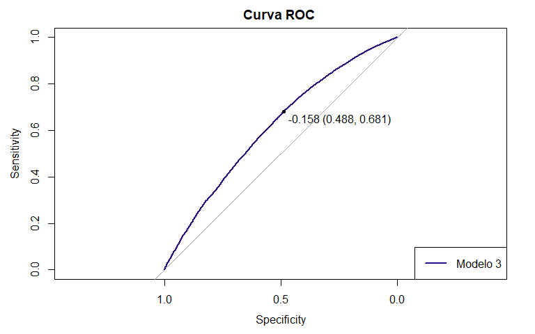<!-- -->

# ANOVA entre Modelo 3 e Modelo 1


```r
#Comparar os modleos
anova(logistico3, logistico1, test="LRT") # a variável Embarked pode ser excluída
```

```
## Analysis of Deviance Table
## 
## Model 1: churn ~ months + drop_vce_Mean + blck_vce_Mean + hnd_price + 
##     avgqty + rev_Mean + totmrc_Mean + eqpdays + mou_cvce_Mean + 
##     totmou + avgmou + vceovr_Mean + change_mou + roam_Mean + 
##     cc_mou_Mean + peak_vce_Mean + totrev + adjmou + avg6rev + 
##     asl_flag_N + refurb_new_N + area_centro_oeste + area_nordeste + 
##     area_sudeste + area_sudoeste + ownrent_O + dwlltype_S + marital_B + 
##     marital_M + marital_S
## Model 2: churn ~ months + drop_vce_Mean + drop_dat_Mean + blck_vce_Mean + 
##     blck_dat_Mean + hnd_price + avgqty + rev_Mean + totmrc_Mean + 
##     eqpdays + ovrmou_Mean + mou_cvce_Mean + totmou + avgmou + 
##     vceovr_Mean + ovrrev_Mean + change_mou + income + roam_Mean + 
##     cc_mou_Mean + complete_Mean + peak_vce_Mean + unan_vce_Mean + 
##     plcd_vce_Mean + totcalls + totrev + adjmou + adjqty + avg6rev + 
##     asl_flag_N + asl_flag_Y + refurb_new_N + refurb_new_R + hnd_webcap_WC + 
##     hnd_webcap_WCMB + area_centro_oeste + area_nordeste + area_oeste + 
##     area_sudeste + area_sudoeste + new_cell_N + new_cell_U + 
##     new_cell_Y + ownrent_O + ownrent_R + dwlltype_M + dwlltype_S + 
##     marital_A + marital_B + marital_M + marital_S + marital_U + 
##     creditcd_N + creditcd_Y
##   Resid. Df Resid. Dev Df Deviance Pr(>Chi)
## 1     44332      59759                     
## 2     44314      59750 18    8.725   0.9658
```

```r
#O p-valor valor foi MAIOR que o nível de significancia de 0.05. 
#Isso significa que o modelo NÃO omitiu variaveis significativas
```

# Logistico 4

Seleção automática com base nas 15 melhores variaveis do Modelo 2

## 1º) ANOVA do Modelo 2


```r
#1. Utilizando Anova
anova(logistico2, test="Chisq")
```

```
## Analysis of Deviance Table
## 
## Model: binomial, link: logit
## 
## Response: churn
## 
## Terms added sequentially (first to last)
## 
## 
##                   Df Deviance Resid. Df Resid. Dev  Pr(>Chi)    
## NULL                              44362      61422              
## hnd_price          1   414.07     44361      61008 < 2.2e-16 ***
## totmrc_Mean        1   111.05     44360      60897 < 2.2e-16 ***
## eqpdays            1   212.43     44359      60684 < 2.2e-16 ***
## mou_cvce_Mean      1     6.46     44358      60678 0.0110291 *  
## totmou             1    30.44     44357      60647 3.446e-08 ***
## avgmou             1   221.66     44356      60426 < 2.2e-16 ***
## change_mou         1    70.49     44355      60355 < 2.2e-16 ***
## complete_Mean      1     0.61     44354      60355 0.4346493    
## peak_vce_Mean      1     1.65     44353      60353 0.1992729    
## adjmou             1    17.16     44352      60336 3.441e-05 ***
## asl_flag_N         1   140.69     44351      60195 < 2.2e-16 ***
## refurb_new_N       1    61.72     44350      60133 3.961e-15 ***
## area_centro_oeste  1    35.94     44349      60098 2.038e-09 ***
## area_oeste         1    18.18     44348      60079 2.010e-05 ***
## ownrent_O          1    19.16     44347      60060 1.203e-05 ***
## marital_S          1     6.26     44346      60054 0.0123323 *  
## months             1    66.06     44345      59988 4.380e-16 ***
## drop_vce_Mean      1    18.22     44344      59970 1.971e-05 ***
## vceovr_Mean        1   144.26     44343      59825 < 2.2e-16 ***
## cc_mou_Mean        1     2.87     44342      59823 0.0904696 .  
## avg6rev            1     0.09     44341      59822 0.7620335    
## area_nordeste      1     1.30     44340      59821 0.2537470    
## dwlltype_M         1     7.86     44339      59813 0.0050427 ** 
## dwlltype_S         1    10.15     44338      59803 0.0014396 ** 
## blck_vce_Mean      1    14.74     44337      59788 0.0001235 ***
## roam_Mean          1    10.55     44336      59778 0.0011615 ** 
## totrev             1     2.83     44335      59775 0.0926825 .  
## ---
## Signif. codes:  0 '***' 0.001 '**' 0.01 '*' 0.05 '.' 0.1 ' ' 1
```

```r
# adiciona as variáveis sequencialmente (a variável adcional melhora o modelo?)

#2.Utilizando Drop1
drop1(logistico2, test="Chisq")
```

```
## Single term deletions
## 
## Model:
## churn ~ hnd_price + totmrc_Mean + eqpdays + mou_cvce_Mean + totmou + 
##     avgmou + change_mou + complete_Mean + peak_vce_Mean + adjmou + 
##     asl_flag_N + refurb_new_N + area_centro_oeste + area_oeste + 
##     ownrent_O + marital_S + months + drop_vce_Mean + vceovr_Mean + 
##     cc_mou_Mean + avg6rev + area_nordeste + dwlltype_M + dwlltype_S + 
##     cc_mou_Mean + blck_vce_Mean + roam_Mean + totrev + ownrent_O
##                   Df Deviance   AIC    LRT  Pr(>Chi)    
## <none>                  59775 59831                     
## hnd_price          1    59820 59874  45.42 1.589e-11 ***
## totmrc_Mean        1    59797 59851  21.84 2.963e-06 ***
## eqpdays            1    60115 60169 339.86 < 2.2e-16 ***
## mou_cvce_Mean      1    59904 59958 128.52 < 2.2e-16 ***
## totmou             1    59790 59844  14.60 0.0001331 ***
## avgmou             1    59839 59893  64.39 1.021e-15 ***
## change_mou         1    59866 59920  90.66 < 2.2e-16 ***
## complete_Mean      1    59776 59830   0.75 0.3871981    
## peak_vce_Mean      1    59794 59848  19.00 1.310e-05 ***
## adjmou             1    59790 59844  14.80 0.0001193 ***
## asl_flag_N         1    59912 59966 137.21 < 2.2e-16 ***
## refurb_new_N       1    59853 59907  77.80 < 2.2e-16 ***
## area_centro_oeste  1    59800 59854  24.97 5.813e-07 ***
## area_oeste         1    59789 59843  14.06 0.0001772 ***
## ownrent_O          1    59784 59838   8.86 0.0029187 ** 
## marital_S          1    59784 59838   8.84 0.0029436 ** 
## months             1    59840 59894  64.56 9.353e-16 ***
## drop_vce_Mean      1    59791 59845  16.01 6.293e-05 ***
## vceovr_Mean        1    59868 59922  93.02 < 2.2e-16 ***
## cc_mou_Mean        1    59778 59832   3.48 0.0621750 .  
## avg6rev            1    59779 59833   3.92 0.0476504 *  
## area_nordeste      1    59777 59831   1.57 0.2102253    
## dwlltype_M         1    59775 59829   0.33 0.5634658    
## dwlltype_S         1    59785 59839   9.78 0.0017642 ** 
## blck_vce_Mean      1    59790 59844  14.56 0.0001355 ***
## roam_Mean          1    59785 59839  10.30 0.0013272 ** 
## totrev             1    59778 59832   2.83 0.0926825 .  
## ---
## Signif. codes:  0 '***' 0.001 '**' 0.01 '*' 0.05 '.' 0.1 ' ' 1
```

```r
# remove as variáveis sequencialmente (a variável adcional melhora o modelo?)

#As melhores varivaveis são:
dados_best1 <- dados_treino1 %>% select(
"hnd_price", "totmrc_Mean", "eqpdays", "avgmou", "change_mou", "complete_Mean",
"asl_flag_N", "vceovr_Mean", "refurb_new_N", "area_centro_oeste", "months",
"area_oeste" , "drop_vce_Mean", "peak_vce_Mean", "blck_vce_Mean", "churn"
)
```

## 2º) Seleção Automática

A seleção terá como critério Bayesian information criterion (BIC). Ele é similiar ao AIC, porém penaliza com mais rigor modelos complexos.


```r
#best1 <- bestglm(Xy =dados_best1, IC = "BIC", TopModels = 5 ,family = binomial(link = "logit"))
#print.bestglm(best1)
#summary.bestglm(best1)
```

## Treinar o modelo

O modelo será treinado com as variáveis encontradas na etapa anterior


```r
logistico4 <- glm(churn ~ hnd_price+totmrc_Mean+ eqpdays+ avgmou +
                    change_mou+ complete_Mean + asl_flag_N+ vceovr_Mean +
                    refurb_new_N+ area_centro_oeste + months +
                    area_oeste + drop_vce_Mean+ blck_vce_Mean,
                  data= dados_treino1, family = binomial(link = "logit"))
```

## Previsão do modelo


```r
pred_log4 <- predict(logistico4, newdata = dados_treino1)
```

## Matriz de Confusão


```r
# Ponto de corte = 0.4
#Ponto de Corte: Transformar as probabilidades em rótulos de classe (0 ou 1) com base em um ponto de corte típico de 0.4
prob_log4 <- ifelse(pred_log4 >= 0.4, 1, 0)
prob_log4 <- as.factor(prob_log4)

#Criar uma tabela com todos os dados e o ponto de corte
df_log4 <- cbind(dados_treino1, prob_log4) #Unir ponto de corte e dados_treino1
#Mudar a posição do de prob_log4(ponto de corte) para que fique ao lado de churn
df_log4 <- df_log4 %>% select(1, 56, 2:55)  
#Para visualizar
df_log4a <- df_log4 %>% select(1:4) 
head(df_log4a)
```

```
##   churn prob_log4     months drop_vce_Mean
## 1     1         0 0.07547170   0.002004008
## 2     1         0 0.03773585   0.038076152
## 3     0         1 0.47169811   0.000000000
## 4     1         0 0.07547170   0.006012024
## 5     0         0 0.16981132   0.004008016
## 6     1         0 0.13207547   0.010020040
```

```r
verdadeiro <- factor(dados_treino1$churn)


# Criar a matriz de confusão
matrix_log4 <- confusionMatrix(prob_log4, verdadeiro, positive = "1")
matrix_log4$table
```

```
##           Reference
## Prediction     0     1
##          0 21749 19098
##          1  1364  2152
```

## Métricas


```r
# Calcular a precisão
precision_log4 <- matrix_log4$byClass["Pos Pred Value"]

# Calcular a revocação
recall_log4 <- matrix_log1$byClass["Sensitivity"]

# Calcular o F1-Score
f1_score_log4 <- 2 * (precision_log4 * recall_log4) / (precision_log4 + recall_log4)

#Calcular Teste KS
ks_log4 <- ks.test(pred_log4, as.numeric(verdadeiro))
```

```
## Warning in ks.test.default(pred_log4, as.numeric(verdadeiro)): p-value will be
## approximate in the presence of ties
```

```r
# Exibir as métricas
cat("Precision:", precision_log4, "\n")
```

```
## Precision: 0.6120592
```

```r
cat("Recall:", recall_log4, "\n")
```

```
## Recall: 0.1296
```

```r
cat("F1-Score:", f1_score_log4, "\n")
```

```
## F1-Score: 0.2139065
```

```r
cat("Valor do KS:", ks_log4$statistic, "\n")
```

```
## Valor do KS: 0.9976106
```

## Curva ROC


```r
# Calcule a curva ROC
roc_log4 <- roc(dados_treino1$churn, pred_log4)
```

```
## Setting levels: control = 0, case = 1
```

```
## Setting direction: controls < cases
```

```r
# Calcule o AUC
auc_log4<- auc(roc_log4)
auc_log4
```

```
## Area under the curve: 0.6031
```


```r
# Criar um gráfico da curva ROC 
par(mar = c(5, 5, 4, 2) + 0.1)  # Ajustar as margens
plot(roc_log4, col = "#FF8E00", main = "Curva ROC ", print.thres = T)
legend("bottomright", legend = c("Modelo 4"), col = c("#FF8E00"), lwd = 2)
```

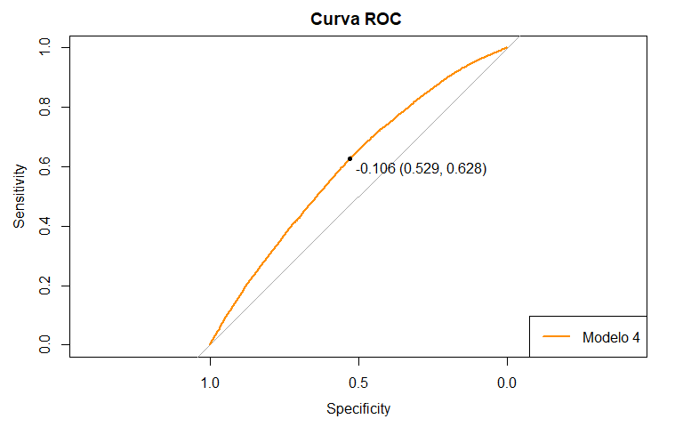<!-- -->

```r
# obs: print.thres = T :descobrimos o ponto de corte que fornece melhor soma de S e E
```

# Logistico 5

Variáveis selecionadas automaticamente pela função Boruta

## Treinar o modelo


```r
logistico5 <- glm(churn ~ months + drop_vce_Mean + blck_vce_Mean + hnd_price+
                    avgqty+ rev_Mean+ totmrc_Mean + eqpdays + 
                    ovrmou_Mean + mou_cvce_Mean + totmou + avgmou +
                    vceovr_Mean + ovrrev_Mean + change_mou + roam_Mean +
                    cc_mou_Mean+ complete_Mean + peak_vce_Mean + unan_vce_Mean +
                    plcd_vce_Mean + totcalls + totrev + adjmou +
                    adjqty + avg6rev + asl_flag_N + asl_flag_Y + refurb_new_N+
                    refurb_new_R + hnd_webcap_WC + hnd_webcap_WCMB , 
                    data= dados_treino1,
                    family = binomial(link = "logit"))
#summary(logistico5)
```

## Previsão do modelo


```r
pred_log5 <- predict(logistico5, newdata = dados_treino1)
```

```
## Warning in predict.lm(object, newdata, se.fit, scale = 1, type = if (type == :
## prediction from rank-deficient fit; attr(*, "non-estim") has doubtful cases
```

## Matriz de Confusão


```r
# Ponto de corte = 0.4
#Ponto de Corte: Transformar as probabilidades em rótulos de classe (0 ou 1) com base em um ponto de corte típico de 0.4
prob_log5 <- ifelse(pred_log5 >= 0.4, 1, 0)
prob_log5 <- as.factor(prob_log5)

#Criar uma tabela com todos os dados e o ponto de corte
df_log5 <- cbind(dados_treino1, prob_log5) #Unir ponto de corte e dados_treino1

df_log5 <- df_log5 %>% select(1, 56, 2:55)
#Para visualizar
df_log5a <- df_log5 %>% select(1:4) 
head(df_log5a)
```

```
##   churn prob_log5     months drop_vce_Mean
## 1     1         0 0.07547170   0.002004008
## 2     1         0 0.03773585   0.038076152
## 3     0         1 0.47169811   0.000000000
## 4     1         0 0.07547170   0.006012024
## 5     0         0 0.16981132   0.004008016
## 6     1         0 0.13207547   0.010020040
```

```r
# Vetor com os valores verdadeiros de churn
verdadeiro <- factor(dados_treino1$churn)


# Criar a matriz de confusão
matrix_log5 <- confusionMatrix(prob_log5, verdadeiro, positive = "1")
matrix_log5$table
```

```
##           Reference
## Prediction     0     1
##          0 21597 18791
##          1  1516  2459
```

## Métricas


```r
# Calcular a precisão
precision_log5 <- matrix_log5$byClass["Pos Pred Value"]

# Calcular a revocação
recall_log5 <- matrix_log5$byClass["Sensitivity"]

# Calcular o F1-Score
f1_score_log5 <- 2 * (precision_log5 * recall_log5) / (precision_log5 + recall_log5)

#Calcular Teste KS
ks_log5 <- ks.test(pred_log5, as.numeric(verdadeiro))
```

```
## Warning in ks.test.default(pred_log5, as.numeric(verdadeiro)): p-value will be
## approximate in the presence of ties
```

```r
# Exibir as métricas
cat("Precision:", precision_log5, "\n")
```

```
## Precision: 0.6186164
```

```r
cat("Recall:", recall_log5, "\n")
```

```
## Recall: 0.1157176
```

```r
cat("F1-Score:", f1_score_log5, "\n")
```

```
## F1-Score: 0.1949653
```

```r
cat("Valor do KS:", ks_log5$statistic, "\n")
```

```
## Valor do KS: 0.9955819
```

## Curva ROC


```r
# Calcule a curva ROC
roc_log5 <- roc(dados_treino1$churn, pred_log5)
```

```
## Setting levels: control = 0, case = 1
```

```
## Setting direction: controls < cases
```

```r
roc_log5 
```

```
## 
## Call:
## roc.default(response = dados_treino1$churn, predictor = pred_log5)
## 
## Data: pred_log5 in 23113 controls (dados_treino1$churn 0) < 21250 cases (dados_treino1$churn 1).
## Area under the curve: 0.6097
```

```r
# Calcule o AUC
auc_log5<- auc(roc_log5)
auc_log5
```

```
## Area under the curve: 0.6097
```


```r
# Criar um gráfico da curva ROC 
par(mar = c(5, 5, 4, 2) + 0.1)  # Ajustar as margens
plot(roc_log5, col = "#057D9F", main = "Curva ROC ", print.thres = T)
legend("bottomright", legend = c("Modelo 5"), col = c( "#057D9F"), lwd = 2)
```

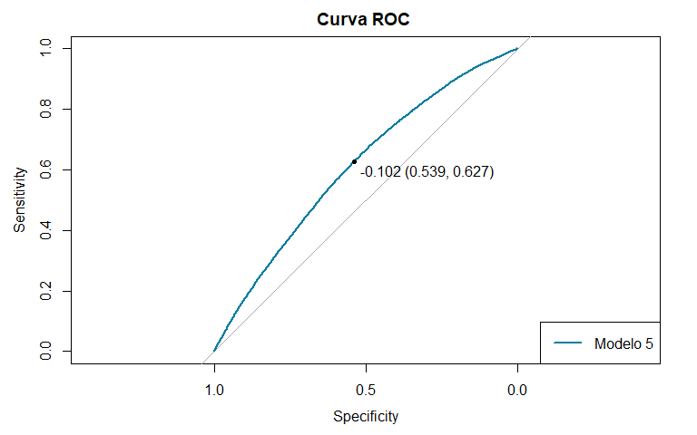<!-- -->

```r
# obs: print.thres = T :descobrimos o ponto de corte que fornece melhor soma de S e E
```

# Logistico 6

Selecionada as variáves do modelo que 1 em que $|Estimate|>|Std.Error|$, também foram excluídas variáveis com NA em Estimate e Std. Error.

## Treinar o modelo


```r
logistico6 <- glm(churn ~ months + drop_vce_Mean +  blck_vce_Mean +  hnd_price + avgqty + rev_Mean + totmrc_Mean + eqpdays + mou_cvce_Mean + totmou + avgmou + change_mou+ income + roam_Mean + cc_mou_Mean + peak_vce_Mean + totrev + adjmou+ avg6rev +  asl_flag_N+ refurb_new_N+ hnd_webcap_WC+ new_cell_N + ownrent_O+  ownrent_R + dwlltype_S + marital_A + marital_B + marital_M+ marital_S+ creditcd_N, data= dados_treino1, family = binomial(link = "logit"))
```

## Previsão do modelo


```r
pred_log6 <- predict(logistico6, newdata = dados_treino1)
```

## Matriz de Confusão


```r
# Ponto de corte = 0.4
#Ponto de Corte: Transformar as probabilidades em rótulos de classe (0 ou 1) com base em um ponto de corte típico de 0.4
prob_log6 <- ifelse(pred_log6 >= 0.4, 1, 0)
prob_log6 <- as.factor(prob_log6)

#Criar uma tabela com todos os dados e o ponto de corte
df_log6 <- cbind(dados_treino1, prob_log6) #Unir ponto de corte e dados_treino1

df_log6 <- df_log6 %>% select(1, 56, 2:55)
#Para visualizar
df_log6a <- df_log6 %>% select(1:4) 
head(df_log6a)
```

```
##   churn prob_log6     months drop_vce_Mean
## 1     1         0 0.07547170   0.002004008
## 2     1         0 0.03773585   0.038076152
## 3     0         1 0.47169811   0.000000000
## 4     1         0 0.07547170   0.006012024
## 5     0         0 0.16981132   0.004008016
## 6     1         0 0.13207547   0.010020040
```

```r
# Vetor com os valores verdadeiros de churn
verdadeiro <- factor(dados_treino1$churn)


# Criar a matriz de confusão
matrix_log6 <- confusionMatrix(prob_log6, verdadeiro, positive = "1")
matrix_log6$table
```

```
##           Reference
## Prediction     0     1
##          0 21546 18675
##          1  1567  2575
```

## Métricas


```r
# Calcular a precisão
precision_log6 <- matrix_log6$byClass["Pos Pred Value"]

# Calcular a revocação
recall_log6 <- matrix_log6$byClass["Sensitivity"]

# Calcular o F1-Score
f1_score_log6 <- 2 * (precision_log6 * recall_log6) / (precision_log6 + recall_log6)

#Calcular Teste KS
ks_log6 <- ks.test(pred_log6, as.numeric(verdadeiro))
```

```
## Warning in ks.test.default(pred_log6, as.numeric(verdadeiro)): p-value will be
## approximate in the presence of ties
```

```r
# Exibir as métricas
cat("Precision:", precision_log6, "\n")
```

```
## Precision: 0.6216803
```

```r
cat("Recall:", recall_log6, "\n")
```

```
## Recall: 0.1211765
```

```r
cat("F1-Score:", f1_score_log6, "\n")
```

```
## F1-Score: 0.2028198
```

```r
cat("Valor do KS:", ks_log6$statistic, "\n")
```

```
## Valor do KS: 0.9960553
```

## Curva ROC


```r
# Calcule a curva ROC
roc_log6 <- roc(dados_treino1$churn, pred_log6)
```

```
## Setting levels: control = 0, case = 1
```

```
## Setting direction: controls < cases
```

```r
roc_log6 
```

```
## 
## Call:
## roc.default(response = dados_treino1$churn, predictor = pred_log6)
## 
## Data: pred_log6 in 23113 controls (dados_treino1$churn 0) < 21250 cases (dados_treino1$churn 1).
## Area under the curve: 0.6104
```

```r
# Calcule o AUC
auc_log6<- auc(roc_log6)
auc_log6
```

```
## Area under the curve: 0.6104
```

# Random Forest 1

## Treinar o modelo


```r
set.seed(123)
rf1 <- randomForest(churn ~ ., data= dados_treino1, importance= T, ntree = 100, 
                    mtry = 8, nodesize= 50, type = "classification")
```

```
## Warning in randomForest.default(m, y, ...): The response has five or fewer
## unique values.  Are you sure you want to do regression?
```

```r
#rf1
#summary(rf1)
```

## Importância das variáveis

### Incremento na taxa de erro médio quadrático (%IncMSE)


```r
# MeanDecreaseAccuracy: permutação
imp_rf1a <-importance(rf1, type = 1)
#OBS:Resultado mostra a importância relativa de cada variável no modelo,
#medida em termos de "Incremento na taxa de erro médio quadrático (%IncMSE)"

#OBS:type=1 especifica que as pontuações de importância devem ser calculadas 
#com base na diminuição média da impureza.
```

**Variáveis com maior importância:** 1. months (28.11%IncMSE), 2. eqpdays (28.49%IncMSE), 3. change_mou (28.28%IncMSE), 4.avgqty (21.11%IncMSE), 5.totmou (19.63%IncMSE), 6. peak_vce_Mean (20.33%IncMSE), 7. totcalls (16.75%IncMSE), 8. totrev (17.14%IncMSE), 9.rev_Mean (19.39%IncMSE), 10. ovrmou_Mean (19.67%IncMSE) 11.avgmou (18.74%IncMSE), 12. mou_cvce_Mean (18.28%IncMSE), 13. vceovr_Mean (15.21%IncMSE), 14. drop_vce_Mean (12.92%IncMSE), 15. hnd_price (11.77%IncMSE)


```r
# Converter a importância das variáveis em um data frame
df_imp_rf1a<- data.frame(variaveis = rownames(imp_rf1a ), importancia = imp_rf1a[, 1])


#Ranking com as 20 variaveis mais importantes
ranking_df_imp_rf1a<- df_imp_rf1a %>%
  arrange(desc(importancia)) %>%
  head(20) 

#ranking_df_imp_rf1a
```


```r
# Criar o gráfico de barras
df_imp_rf1a %>%
  arrange(desc(importancia)) %>% # Classificar por importância (ascendente)
  head(20) %>% 
  ggplot(aes(y = reorder(variaveis, importancia), x = importancia)) +
  geom_bar(stat = "identity", fill = "#9F2042") + # fill : Definir a cor de preenchimento
  labs(title = "Importância das 20 Melhores Variáveis",
       x = "Variável",
       y = "Importância") +
  theme_gray()+
  scale_x_continuous(breaks = seq(0, max(df_imp_rf1a$importancia), by = 30)) +
  theme(axis.text.x = element_text(angle = 0, hjust = 0.5))
```

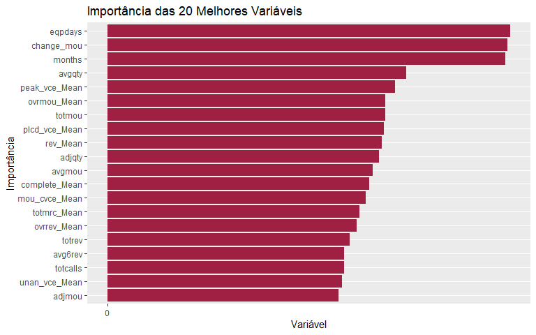<!-- -->

### Índice Gini

O Índice Gini é uma métrica usada para medir a impureza nos nós da árvore de decisão. Valores mais altos indicam maior impureza. No código a seguir, as variáveis são classificadas com base no Índice Gini, o que significa que as variáveis com maiores valores de "IncNodePurity" contribuem mais para a redução da impureza nos nós da árvore de decisão.


```r
# MeanDecreaseGini: diminuição total nas impurezas do nó da divisão na variável, calculada em média para todas as árvores
#Avaliação das impurezas pór meio do Índice Gini
imp_rf1b <- importance(rf1, type = 2)


# Converter a importância das variáveis em um data frame
df_imp_rf1b<- data.frame(variaveis = rownames(imp_rf1b ), importancia = imp_rf1b[, 1])


#Ranking com as 20 variaveis mais importantes
ranking_df_imp_rf1b<- df_imp_rf1b %>%
  arrange(desc(importancia)) %>%
  head(20) 

#ranking_df_imp_rf1b
```

**Variáveis com maior importância:** 1. eqpdays (385.37) 2. months (291.22) 3. change_mou (284.93) 4. mou_cvce_Mean (210.31) 5. totrev (210.54) 6. avgqty (184.63) 7. rev_Mean (182.48) 8. totmou (161.57) 9. avgmou (177.54) 10. totcalls (169.18) 11. adjmou (163.65) 12. peak_vce_Mean (161.55) 13. plcd_vce_Mean (160.82) 14. unan_vce_Mean (146.56) 15. avg6rev (139.40) 16. drop_vce_Mean (123.70) 17. ovrmou_Mean (109.16) 18. hnd_price (102.51) 19. vceovr_Mean (99.66) 20. blck_vce_Mean (98.37)


```r
# Criar o gráfico de barras
df_imp_rf1b %>%
  arrange(desc(importancia)) %>% # Classificar por importância (ascendente)
  head(20) %>% 
  ggplot(aes(y = reorder(variaveis, importancia), x = importancia)) +
  geom_bar(stat = "identity", fill = "#9F2042") + # fill : Definir a cor de preenchimento
  labs(title = "Importância das 20 Melhores Variáveis",
       x = "Variável",
       y = "Importância") +
  theme_gray()+
  scale_x_continuous(breaks = seq(0, max(df_imp_rf1b$importancia), by = 30)) +
  theme(axis.text.x = element_text(angle = 0, hjust = 0.5))
```

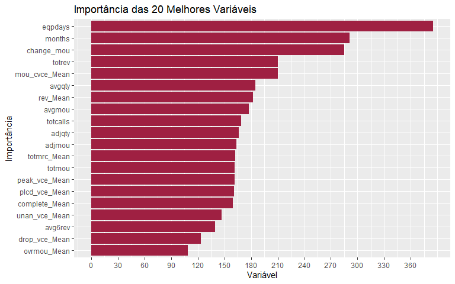<!-- -->


```r
# Gráfico da importância das variáveis
#Um gráfico para as duas medidas
varImpPlot(rf1, sort = T)
```

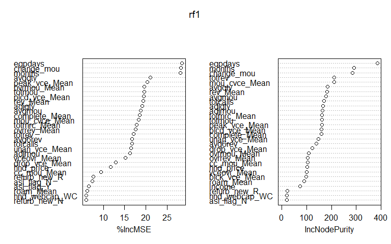<!-- -->

## Predição


```r
pred_rf1 <- predict(rf1, newdata = dados_treino1,  type = "response")
```

## Matriz de Confusão


```r
# Ponto de corte = 0.4
#Ponto de Corte: Transformar as probabilidades em rótulos de classe (0 ou 1) com base em um ponto de corte típico de 0.4
prob_rf1 <- ifelse(pred_rf1 >= 0.4, 1, 0)
prob_rf1 <- as.factor(prob_rf1)

#Criar uma tabela com todos os dados e o ponto de corte
df_rf1 <- cbind(dados_treino1, prob_rf1) #Unir ponto de corte e dados_treino1
#Mudar a posição do de prob_log3(ponto de corte) para que fique ao lado de churn
df_rf1 <- df_rf1 %>% select(1, 56, 2:55)  
#Para visualizar
df_rf1a <- df_rf1 %>% select(1:4) 
head(df_rf1a)
```

```
##   churn prob_rf1     months drop_vce_Mean
## 1     1        1 0.07547170   0.002004008
## 2     1        1 0.03773585   0.038076152
## 3     0        0 0.47169811   0.000000000
## 4     1        1 0.07547170   0.006012024
## 5     0        0 0.16981132   0.004008016
## 6     1        1 0.13207547   0.010020040
```

```r
verdadeiro <- factor(dados_treino1$churn)


# Criar a matriz de confusão
matrix_rf1 <- confusionMatrix(prob_rf1, verdadeiro, positive = "1")
matrix_rf1$table
```

```
##           Reference
## Prediction     0     1
##          0 15336   469
##          1  7777 20781
```

## Métricas


```r
# Calcular a precisão
precision_rf1 <- matrix_rf1$byClass["Pos Pred Value"]

# Calcular a revocação
recall_rf1 <- matrix_rf1$byClass["Sensitivity"]

# Calcular o F1-Score
f1_score_rf1 <- 2 * (precision_rf1 * recall_rf1) / (precision_rf1 + recall_rf1)

#Calcular Teste KS
ks_rf1 <- ks.test(pred_rf1, as.numeric(verdadeiro))
```

```
## Warning in ks.test.default(pred_rf1, as.numeric(verdadeiro)): p-value will be
## approximate in the presence of ties
```

```r
# Exibir as métricas
cat("Precision:", precision_rf1, "\n")
```

```
## Precision: 0.727677
```

```r
cat("Recall:", recall_rf1, "\n")
```

```
## Recall: 0.9779294
```

```r
cat("F1-Score:", f1_score_rf1, "\n")
```

```
## F1-Score: 0.8344443
```

```r
cat("Valor do KS:", ks_rf1$statistic, "\n")
```

```
## Valor do KS: 1
```

```r
# Calcule a curva ROC
roc_rf1 <- roc(dados_treino1$churn, pred_rf1)
```

```
## Setting levels: control = 0, case = 1
```

```
## Setting direction: controls < cases
```

```r
roc_rf1 
```

```
## 
## Call:
## roc.default(response = dados_treino1$churn, predictor = pred_rf1)
## 
## Data: pred_rf1 in 23113 controls (dados_treino1$churn 0) < 21250 cases (dados_treino1$churn 1).
## Area under the curve: 0.9684
```

```r
# Calcule o AUC
auc_rf1<- auc(roc_rf1)
auc_rf1
```

```
## Area under the curve: 0.9684
```

## Gráfico da curva ROC


```r
# Criar um gráfico da curva ROC 
par(mar = c(5, 5, 4, 2) + 0.1)  # Ajustar as margens
plot(roc_rf1, col = "blue", main = "Curva ROC", print.thres = T)
legend("bottomright", legend = c("Modelo 2"), col = c("blue"), lwd = 2)
```

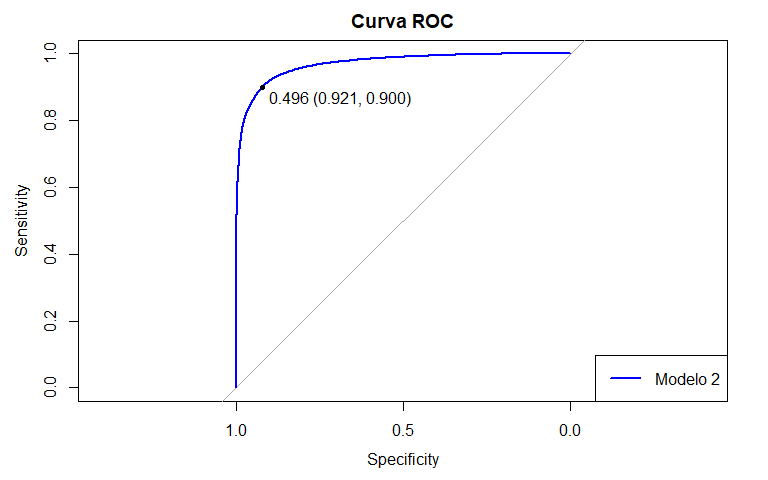<!-- -->

# Random Forest 2

Seleção das 10 variáveis mais importantes do Modelo 1 , de acordo com índice Gini.

## Treinar o modelo


```r
### 10 variaveis
set.seed(123)
rf2 <- randomForest(churn ~ eqpdays + months + change_mou + totrev +
                      mou_cvce_Mean + avgqty + rev_Mean + avgmou +
                      totcalls + adjqty, data= dados_treino1, importance= T, ntree = 100, mtry = 8, nodesize= 50, type = "classification")
```

```
## Warning in randomForest.default(m, y, ...): The response has five or fewer
## unique values.  Are you sure you want to do regression?
```

```r
#rf2

#summary(rf2)
```

#### Previsão do Modelo rf2


```r
pred_rf2 <- predict(rf2, newdata = dados_treino1)
```

#### Matriz de Confusão


```r
# Ponto de corte = 0.5
#Ponto de Corte: Transformar as probabilidades em rótulos de classe (0 ou 1) com base em um ponto de corte típico de 0.5
prob_rf2 <- ifelse(pred_rf2 >= 0.4, 1, 0)
prob_rf2 <- as.factor(prob_rf2)

#Criar uma tabela com todos os dados e o ponto de corte
df_rf2 <- cbind(dados_treino1, prob_rf2) #Unir ponto de corte e dados_treino1
#Mudar a posição do de prob_log3(ponto de corte) para que fique ao lado de churn
df_rf2 <- df_rf2 %>% select(1, 56, 2:55)
#Para visualizar
df_rf2a <- df_rf2 %>% select(1:4) 
head(df_rf2a)
```

```
##   churn prob_rf2     months drop_vce_Mean
## 1     1        1 0.07547170   0.002004008
## 2     1        0 0.03773585   0.038076152
## 3     0        0 0.47169811   0.000000000
## 4     1        1 0.07547170   0.006012024
## 5     0        0 0.16981132   0.004008016
## 6     1        1 0.13207547   0.010020040
```

```r
# Vetor com os valores verdadeiros de churn
verdadeiro <- factor(dados_treino1$churn)


# Criar a matriz de confusão
matrix_rf2 <- confusionMatrix(prob_rf2, verdadeiro, positive = "1")
matrix_rf2$table
```

```
##           Reference
## Prediction     0     1
##          0 15564   745
##          1  7549 20505
```

#### Métricas


```r
# Calcular a precisão
precision_rf2 <- matrix_rf2$byClass["Pos Pred Value"]

# Calcular a revocação
recall_rf2 <- matrix_rf2$byClass["Sensitivity"]

# Calcular o F1-Score
f1_score_rf2 <- 2 * (precision_rf2 * recall_rf2) / (precision_rf2 + recall_rf2)


#Calcular Teste KS
ks_rf2 <- ks.test(pred_rf2, as.numeric(verdadeiro))
```

```
## Warning in ks.test.default(pred_rf2, as.numeric(verdadeiro)): p-value will be
## approximate in the presence of ties
```

```r
# Exibir as métricas
cat("Precision:", precision_rf2, "\n")
```

```
## Precision: 0.7309118
```

```r
cat("Recall:", recall_rf2, "\n")
```

```
## Recall: 0.9649412
```

```r
cat("F1-Score:", f1_score_rf2, "\n")
```

```
## F1-Score: 0.8317784
```

```r
cat("Valor do KS:", ks_rf2$statistic, "\n")
```

```
## Valor do KS: 1
```

#### Curva ROC


```r
# Calcule a curva ROC
roc_rf2 <- roc(dados_treino1$churn, pred_rf2)
```

```
## Setting levels: control = 0, case = 1
```

```
## Setting direction: controls < cases
```

```r
roc_rf2 
```

```
## 
## Call:
## roc.default(response = dados_treino1$churn, predictor = pred_rf2)
## 
## Data: pred_rf2 in 23113 controls (dados_treino1$churn 0) < 21250 cases (dados_treino1$churn 1).
## Area under the curve: 0.9531
```

```r
# Calcule o AUC
auc_rf2<- auc(roc_rf2)
auc_rf2
```

```
## Area under the curve: 0.9531
```


```r
# Criar um gráfico da curva ROC 
par(mar = c(5, 5, 4, 2) + 0.1)  # Ajustar as margens
plot(roc_rf2, col = "#9F2042", main = "Curva ROC",  print.thres = T)
legend("bottomright", legend = c("Modelo 2"), col = c("#9F2042"), lwd = 2)
```

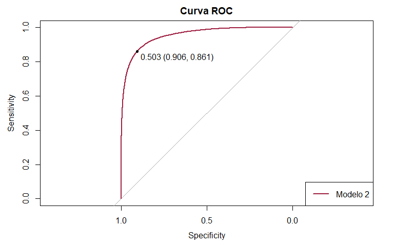<!-- -->

```r
# obs: print.thres = T :descobrimos o ponto de corte que fornece melhor soma de S e E
```

# Random Forest 3

Seleção das 15 variáveis mais importantes do Modelo 1 , de acordo com índice Gini.

## Treinar o modelo


```r
### 15 variaveis
set.seed(123)
rf3 <- randomForest(churn ~ eqpdays + months + change_mou + totrev +
                      mou_cvce_Mean + avgqty + rev_Mean + avgmou +
                      totcalls + adjqty + rev_Mean +  avgmou + totcalls +
                      adjqty + adjmou , data= dados_treino1, importance= T, ntree = 100, 
                    mtry = 8, nodesize= 50, type = "classification")
```

```
## Warning in randomForest.default(m, y, ...): The response has five or fewer
## unique values.  Are you sure you want to do regression?
```

```r
rf3
```

```
## 
## Call:
##  randomForest(formula = churn ~ eqpdays + months + change_mou +      totrev + mou_cvce_Mean + avgqty + rev_Mean + avgmou + totcalls +      adjqty + rev_Mean + avgmou + totcalls + adjqty + adjmou,      data = dados_treino1, importance = T, ntree = 100, mtry = 8,      nodesize = 50, type = "classification") 
##                Type of random forest: regression
##                      Number of trees: 100
## No. of variables tried at each split: 8
## 
##           Mean of squared residuals: 0.2345377
##                     % Var explained: 6.02
```

```r
summary(rf3)
```

```
##                 Length Class  Mode     
## call                8  -none- call     
## type                1  -none- character
## predicted       44363  -none- numeric  
## mse               100  -none- numeric  
## rsq               100  -none- numeric  
## oob.times       44363  -none- numeric  
## importance         22  -none- numeric  
## importanceSD       11  -none- numeric  
## localImportance     0  -none- NULL     
## proximity           0  -none- NULL     
## ntree               1  -none- numeric  
## mtry                1  -none- numeric  
## forest             11  -none- list     
## coefs               0  -none- NULL     
## y               44363  -none- numeric  
## test                0  -none- NULL     
## inbag               0  -none- NULL     
## terms               3  terms  call
```

## Gráfico da importância das variáveis


```r
# Gráfico da importância das variáveis
#Um gráfico para as duas medidas
varImpPlot(rf3, sort = T)
```

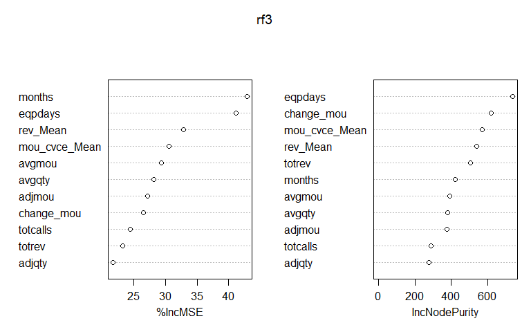<!-- -->

## Previsão


```r
pred_rf3 <- predict(rf3, newdata = dados_treino1,  type = "response")
```

## Matriz de Confusão


```r
# Ponto de corte = 0.4
#Ponto de Corte: Transformar as probabilidades em rótulos de classe (0 ou 1) com base em um ponto de corte típico de 0.4
prob_rf3 <- ifelse(pred_rf3 >= 0.4, 1, 0)
prob_rf3 <- as.factor(prob_rf3)

#Criar uma tabela com todos os dados e o ponto de corte
df_rf3 <- cbind(dados_treino1, prob_rf3) #Unir ponto de corte e dados_treino1
#Mudar a posição do de prob_log3(ponto de corte) para que fique ao lado de churn
df_rf3 <- df_rf3 %>% select(1, 56, 2:55)  
#Para visualizar
df_rf3a <- df_rf3 %>% select(1:4) 
head(df_rf3a)
```

```
##   churn prob_rf3     months drop_vce_Mean
## 1     1        1 0.07547170   0.002004008
## 2     1        0 0.03773585   0.038076152
## 3     0        0 0.47169811   0.000000000
## 4     1        1 0.07547170   0.006012024
## 5     0        1 0.16981132   0.004008016
## 6     1        1 0.13207547   0.010020040
```

```r
verdadeiro <- factor(dados_treino1$churn)


# Criar a matriz de confusão
matrix_rf3 <- confusionMatrix(prob_rf3, verdadeiro, positive = "1")
matrix_rf3$table
```

```
##           Reference
## Prediction     0     1
##          0 15567   700
##          1  7546 20550
```

## Métricas


```r
# Calcular a precisão
precision_rf3 <- matrix_rf3$byClass["Pos Pred Value"]

# Calcular a revocação
recall_rf3 <- matrix_rf3$byClass["Sensitivity"]

# Calcular o F1-Score
f1_score_rf3 <- 2 * (precision_rf3 * recall_rf3) / (precision_rf3 + recall_rf3)

#Calcular Teste KS
ks_rf3 <- ks.test(pred_rf3, as.numeric(verdadeiro))
```

```
## Warning in ks.test.default(pred_rf3, as.numeric(verdadeiro)): p-value will be
## approximate in the presence of ties
```

```r
# Exibir as métricas
cat("Precision:", precision_rf3, "\n")
```

```
## Precision: 0.7314208
```

```r
cat("Recall:", recall_rf3, "\n")
```

```
## Recall: 0.9670588
```

```r
cat("F1-Score:", f1_score_rf3, "\n")
```

```
## F1-Score: 0.8328943
```

```r
cat("Valor do KS:", ks_rf3$statistic, "\n")
```

```
## Valor do KS: 1
```

```r
# Calcule a curva ROC
roc_rf3 <- roc(dados_treino1$churn, pred_rf3)
```

```
## Setting levels: control = 0, case = 1
```

```
## Setting direction: controls < cases
```

```r
roc_rf3 
```

```
## 
## Call:
## roc.default(response = dados_treino1$churn, predictor = pred_rf3)
## 
## Data: pred_rf3 in 23113 controls (dados_treino1$churn 0) < 21250 cases (dados_treino1$churn 1).
## Area under the curve: 0.9557
```

```r
# Calcule o AUC
auc_rf3<- auc(roc_rf3)
auc_rf3
```

```
## Area under the curve: 0.9557
```

## Gráfico da curva ROC


```r
# Criar um gráfico da curva ROC 
par(mar = c(5, 5, 4, 2) + 0.1)  # Ajustar as margens
plot(roc_rf3, col = "blue", main = "Curva ROC", print.thres = T)
legend("bottomright", legend = c("Modelo 2"), col = c("blue"), lwd = 2)
```

<!-- -->

# Random Forest 4

## Treinar o modelo


```r
### 20 variaveis
set.seed(123)
rf4 <- randomForest(churn ~ eqpdays + months + change_mou + totrev +
                      mou_cvce_Mean + avgqty + rev_Mean + avgmou +
                      totcalls + adjqty+ adjmou + totmrc_Mean + totmou +
                      peak_vce_Mean + plcd_vce_Mean + complete_Mean + unan_vce_Mean +
                      avg6rev + drop_vce_Mean + ovrmou_Mean , data= dados_treino1, importance= T, ntree = 100, 
                    mtry = 8, nodesize= 50, type = "classification")
```

```
## Warning in randomForest.default(m, y, ...): The response has five or fewer
## unique values.  Are you sure you want to do regression?
```

## Gráfico da importância das variáveis


```r
# Gráfico da importância das variáveis
#Um gráfico para as duas medidas
varImpPlot(rf4, sort = T)
```

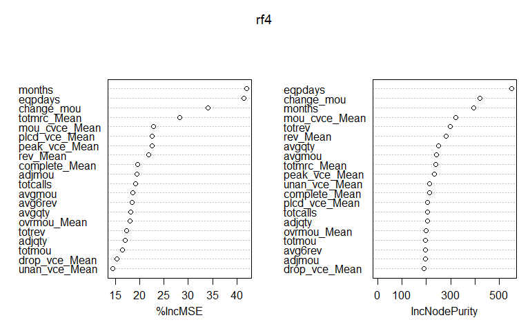<!-- -->

## Previsão


```r
pred_rf4 <- predict(rf4, newdata = dados_treino1,  type = "response")
```

## Matriz de Confusão


```r
# Ponto de corte = 0.4
#Ponto de Corte: Transformar as probabilidades em rótulos de classe (0 ou 1) com base em um ponto de corte típico de 0.4
prob_rf4 <- ifelse(pred_rf4 >= 0.4, 1, 0)
prob_rf4 <- as.factor(prob_rf4)

#Criar uma tabela com todos os dados e o ponto de corte
df_rf4 <- cbind(dados_treino1, prob_rf4) #Unir ponto de corte e dados_treino1
#Mudar a posição do de prob_log3(ponto de corte) para que fique ao lado de churn
df_rf4 <- df_rf4 %>% select(1, 56, 2:55)  
#Para visualizar
df_rf4a <- df_rf4 %>% select(1:4) 
head(df_rf4a)
```

```
##   churn prob_rf4     months drop_vce_Mean
## 1     1        1 0.07547170   0.002004008
## 2     1        1 0.03773585   0.038076152
## 3     0        0 0.47169811   0.000000000
## 4     1        1 0.07547170   0.006012024
## 5     0        1 0.16981132   0.004008016
## 6     1        1 0.13207547   0.010020040
```

```r
verdadeiro <- factor(dados_treino1$churn)


# Criar a matriz de confusão
matrix_rf4 <- confusionMatrix(prob_rf4, verdadeiro, positive = "1")
matrix_rf4$table
```

```
##           Reference
## Prediction     0     1
##          0 15957   539
##          1  7156 20711
```

## Métricas


```r
# Calcular a precisão
precision_rf4 <- matrix_rf4$byClass["Pos Pred Value"]

# Calcular a revocação
recall_rf4 <- matrix_rf4$byClass["Sensitivity"]

# Calcular o F1-Score
f1_score_rf4 <- 2 * (precision_rf4 * recall_rf4) / (precision_rf4 + recall_rf4)

#Calcular Teste KS
ks_rf4 <- ks.test(pred_rf4, as.numeric(verdadeiro))
```

```
## Warning in ks.test.default(pred_rf4, as.numeric(verdadeiro)): p-value will be
## approximate in the presence of ties
```

```r
# Exibir as métricas
cat("Precision:", precision_rf4, "\n")
```

```
## Precision: 0.7432088
```

```r
cat("Recall:", recall_rf4, "\n")
```

```
## Recall: 0.9746353
```

```r
cat("F1-Score:", f1_score_rf4, "\n")
```

```
## F1-Score: 0.8433333
```

```r
cat("Valor do KS:", ks_rf4$statistic, "\n")
```

```
## Valor do KS: 1
```

```r
# Calcular a curva ROC
roc_rf4 <- roc(dados_treino1$churn, pred_rf4)
```

```
## Setting levels: control = 0, case = 1
```

```
## Setting direction: controls < cases
```

```r
roc_rf4 
```

```
## 
## Call:
## roc.default(response = dados_treino1$churn, predictor = pred_rf4)
## 
## Data: pred_rf4 in 23113 controls (dados_treino1$churn 0) < 21250 cases (dados_treino1$churn 1).
## Area under the curve: 0.9676
```

```r
# Calcular o AUC
auc_rf4<- auc(roc_rf4)
auc_rf4
```

```
## Area under the curve: 0.9676
```

## Gráfico da curva ROC


```r
# Criar um gráfico da curva ROC 
par(mar = c(5, 5, 4, 2) + 0.1)  # Ajustar as margens
plot(roc_rf4, col = "blue", main = "Curva ROC", print.thres = T)
legend("bottomright", legend = c("Modelo 2"), col = c("blue"), lwd = 2)
```

<!-- -->

# Boruta

Boruta é um algoritmo wrapper de seleção de recursos totalmente relevante, capaz de funcionar com qualquer método de classificação que produza medida de importância variável (VIM); por padrão, **Boruta usa Random Forest**. O método realiza uma busca de cima para baixo por características relevantes, comparando a importância dos atributos originais com a importância alcançável aleatoriamente, estimada usando suas cópias permutadas, e eliminando progressivamente características irrelevantes para estabilizar esse teste.


```r
# Converter a variável resposta em um fator (necessário para o Boruta)
#dados_treino1$churn <- as.factor(dados_treino1$churn)

# Instanciar o objeto Boruta
#boruta_obj <- Boruta(churn ~ ., data = dados_treino1,  doTrace =  FALSE)

# Exibir as características selecionadas
#selected_features <- getSelectedAttributes(boruta_obj)
```

# Random Forest 5


```r
rf5 <- randomForest(churn ~ months + drop_vce_Mean + blck_vce_Mean + hnd_price+
                      avgqty+ rev_Mean+ totmrc_Mean + eqpdays + 
                      ovrmou_Mean + mou_cvce_Mean + totmou + avgmou +
                      vceovr_Mean + ovrrev_Mean + change_mou + roam_Mean +
                      cc_mou_Mean+ complete_Mean + peak_vce_Mean + unan_vce_Mean +
                      plcd_vce_Mean + totcalls + totrev + adjmou +
                      adjqty + avg6rev + asl_flag_N + asl_flag_Y + refurb_new_N+
                      refurb_new_R + hnd_webcap_WC + hnd_webcap_WCMB , 
                    data= dados_treino1,
                    ntree = 100, mtry = 5, nodesize= 50, type = "classification")
```

```
## Warning in randomForest.default(m, y, ...): The response has five or fewer
## unique values.  Are you sure you want to do regression?
```

```r
#summary(rf5)
```

## Previsão


```r
pred_rf5 <- predict(rf5, newdata = dados_treino1)
```

## Matriz de Confusão


```r
# Ponto de corte = 0.4
#Ponto de Corte: Transformar as probabilidades em rótulos de classe (0 ou 1) com base em um ponto de corte típico de 0.4
prob_rf5 <- ifelse(pred_rf5 >= 0.4, 1, 0)
prob_rf5 <- as.factor(prob_rf5)

#Criar uma tabela com todos os dados e o ponto de corte
df_rf5 <- cbind(dados_treino1, prob_rf5) #Unir ponto de corte e dados_treino1
#Mudar a posição do de prob_log3(ponto de corte) para que fique ao lado de churn
df_rf5 <- df_rf5 %>% select(1, 56, 2:55)  
#Para visualizar
df_rf5a <- df_rf5 %>% select(1:4) 
head(df_rf5a)
```

```
##   churn prob_rf5     months drop_vce_Mean
## 1     1        1 0.07547170   0.002004008
## 2     1        1 0.03773585   0.038076152
## 3     0        0 0.47169811   0.000000000
## 4     1        1 0.07547170   0.006012024
## 5     0        0 0.16981132   0.004008016
## 6     1        1 0.13207547   0.010020040
```

```r
verdadeiro <- factor(dados_treino1$churn)

# Criar a matriz de confusão
matrix_rf5 <- confusionMatrix(prob_rf5, verdadeiro, positive = "1")
matrix_rf5$table
```

```
##           Reference
## Prediction     0     1
##          0 15372   517
##          1  7741 20733
```

## Métricas


```r
# Calcular a precisão
precision_rf5 <- matrix_rf5$byClass["Pos Pred Value"]

# Calcular a revocação
recall_rf5 <- matrix_rf5$byClass["Sensitivity"]

# Calcular o F1-Score
f1_score_rf5 <- 2 * (precision_rf5 * recall_rf5) / (precision_rf5 + recall_rf5)

# Exibir as métricas
cat("Precision:", precision_rf5, "\n")
```

```
## Precision: 0.728138
```

```r
cat("Recall:", recall_rf5, "\n")
```

```
## Recall: 0.9756706
```

```r
cat("F1-Score:", f1_score_rf5, "\n")
```

```
## F1-Score: 0.8339233
```

```r
# Calcule a curva ROC
roc_rf5 <- roc(dados_treino1$churn, pred_rf5)
```

```
## Setting levels: control = 0, case = 1
```

```
## Setting direction: controls < cases
```

```r
roc_rf5 
```

```
## 
## Call:
## roc.default(response = dados_treino1$churn, predictor = pred_rf5)
## 
## Data: pred_rf5 in 23113 controls (dados_treino1$churn 0) < 21250 cases (dados_treino1$churn 1).
## Area under the curve: 0.965
```

```r
# Calcule o AUC
auc_rf5<- auc(roc_rf5)
auc_rf5
```

```
## Area under the curve: 0.965
```

## Gráfico da curva ROC


```r
# Criar um gráfico da curva ROC 
par(mar = c(5, 5, 4, 2) + 0.1)  # Ajustar as margens
plot(roc_rf5, col = "blue", main = "Curva ROC")
legend("bottomright", legend = c("Random Forest 5"), col = c("blue"), lwd = 2)
```

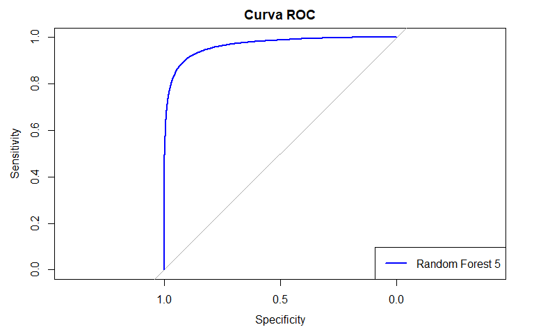<!-- -->

# Resultado Parcial 1

## Ponto de corte = 0,5


## Ponto de Corte = 0,4


## Gráfico da Curva ROC


```r
par(mar = c(5, 5, 4, 2) + 0.1)  # Ajustar as margens
plot(roc_log1, col = "#EAB200" , main = "Curva ROC comparando os  Modelos")
lines(roc_log2, col = "#37AA00")
lines(roc_log3, col = "#2C0E87")
lines(roc_log4, col = "#FF8E00")
lines(roc_log5, col = "#057D9F")
lines(roc_rf2, col = "#9F2042")
legend("bottomright", legend = c("Logistico 1", "Logistico 2", "Logistico 3", "Logistico 4", "Logistico 5", "Random Forest"), col = c("#EAB200", "#37AA00"  , "#2C0E87" , "#FF8E00", "#057D9F", "#9F2042"), lwd = 2)
```

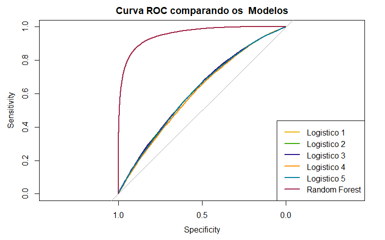<!-- -->

# Random Forest 4 - Dados de teste

## CrossValidation

### 1ª Forma


```r
### 20 variaveis
set.seed(123)
rf4_ta <- randomForest(churn ~ eqpdays + months + change_mou + totrev +
                      mou_cvce_Mean + avgqty + rev_Mean + avgmou +
                      totcalls + adjqty+ adjmou + totmrc_Mean + totmou +
                      peak_vce_Mean + plcd_vce_Mean + complete_Mean + unan_vce_Mean +
                      avg6rev + drop_vce_Mean + ovrmou_Mean , cv=10, data= dados_treino1, importance= T, ntree = 100, 
                    mtry = 8, nodesize= 50, type = "classification")
```

```
## Warning in randomForest.default(m, y, ...): The response has five or fewer
## unique values.  Are you sure you want to do regression?
```

### 2ª Forma


```r
# Transformar churn em fator
dados_treino2 <- dados_treino1
dados_treino2$churn <- as.factor(dados_treino2$churn)
```


```r
#controla como a validação cruzada será realizada
cross_rf4 <- trainControl(method= "cv", number=10) 
```


```r
# Defina um grid de hiperparâmetros para classificação binária com o método Random Forest
tuneGrid <- data.frame(mtry = c(7, 8, 9))
```


```r
# Execute a função train com o grid de hiperparâmetros
#rf4_tb <- train(
#  churn ~ eqpdays + months + change_mou + totrev +
#  mou_cvce_Mean + avgqty + rev_Mean + avgmou +
#  totcalls + adjqty + adjmou + totmrc_Mean + totmou +
#  peak_vce_Mean + plcd_vce_Mean + complete_Mean + unan_vce_Mean +
#  avg6rev + drop_vce_Mean + ovrmou_Mean, 
#  data = dados_treino2, 
#  trControl = cross_rf4, 
#  method = 'rf',
#  nodesize = 50,
#  tuneGrid = tuneGrid,
#  metric = "F1"  #  métrica de avaliação
#)
```


```r
#rf4_tb$finalModel$confusion
```

## Previsão


```r
pred_rf4_ta <- predict(rf4_ta, newdata = dados_teste1,  type = "response")
```


```r
#pred_rf4_tb <- predict(rf4_tb, newdata = dados_teste1,  type = "prob")
```

## Matriz de Confusão


```r
# Ponto de corte = 0.4
#Ponto de Corte: Transformar as probabilidades em rótulos de classe (0 ou 1) com base em um ponto de corte típico de 0.4
prob_rf4_ta <- ifelse(pred_rf4_ta >= 0.4, 1, 0)
prob_rf4_ta <- as.factor(prob_rf4_ta)

verdadeiro <- factor(dados_teste1$churn)
```


```r
#Criar uma tabela com todos os dados e o ponto de corte
df_rf4_ta <- cbind(dados_teste1, prob_rf4_ta) #Unir ponto de corte e dados_treino1
#Mudar a posição do de prob_log3(ponto de corte) para que fique ao lado de churn
df_rf4_ta <- df_rf4_ta %>% select(1, 56, 2:55)
#Para visualizar
df_rf4a_ta<- df_rf4_ta %>% select(1:4) 
head(df_rf4a_ta)
```

```
##   churn prob_rf4_ta     months drop_vce_Mean
## 1     1           1 0.09433962   0.120240481
## 2     0           0 0.22641509   0.000000000
## 3     0           0 0.00000000   0.008016032
## 4     1           1 0.07547170   0.000000000
## 5     0           0 0.39622642   0.024048096
## 6     1           1 0.07547170   0.000000000
```

```r
verdadeiro <- factor(dados_teste1$churn)


# Criar a matriz de confusão
matrix_rf4_ta <- confusionMatrix(prob_rf4_ta, verdadeiro, positive = "1")
matrix_rf4_ta$table
```

```
##           Reference
## Prediction    0    1
##          0 1877  831
##          1 3054 3744
```

## Métricas


```r
# Calcular a precisão
precision_rf4_ta <- matrix_rf4_ta$byClass["Pos Pred Value"]

# Calcular a revocação
recall_rf4_ta <- matrix_rf4_ta$byClass["Sensitivity"]

# Calcular o F1-Score
f1_score_rf4_ta <- 2 * (precision_rf4_ta * recall_rf4_ta) / (precision_rf4_ta + recall_rf4_ta)

#Calcular Teste KS
ks_rf4_ta <- ks.test(pred_rf4_ta, as.numeric(verdadeiro))
```

```
## Warning in ks.test.default(pred_rf4_ta, as.numeric(verdadeiro)): p-value will
## be approximate in the presence of ties
```

```r
# Exibir as métricas
cat("Precision:", precision_rf4_ta, "\n")
```

```
## Precision: 0.5507502
```

```r
cat("Recall:", recall_rf4_ta, "\n")
```

```
## Recall: 0.8183607
```

```r
cat("F1-Score:", f1_score_rf4_ta, "\n")
```

```
## F1-Score: 0.6584015
```

```r
cat("Valor do KS:", ks_rf4_ta$statistic, "\n")
```

```
## Valor do KS: 1
```

```r
# Calcular a curva ROC
roc_rf4_ta <- roc(dados_teste1$churn, pred_rf4_ta)
```

```
## Setting levels: control = 0, case = 1
```

```
## Setting direction: controls < cases
```

```r
roc_rf4_ta 
```

```
## 
## Call:
## roc.default(response = dados_teste1$churn, predictor = pred_rf4_ta)
## 
## Data: pred_rf4_ta in 4931 controls (dados_teste1$churn 0) < 4575 cases (dados_teste1$churn 1).
## Area under the curve: 0.6576
```

```r
# Calcular o AUC
auc_rf4_ta<- auc(roc_rf4_ta)
auc_rf4_ta
```

```
## Area under the curve: 0.6576
```

## Gráfico da curva ROC


```r
# Criar um gráfico da curva ROC 
par(mar = c(5, 5, 4, 2) + 0.1)  # Ajustar as margens
plot(roc_rf4_ta, col = "blue", main = "Curva ROC", print.thres = T)
legend("bottomright", legend = c("Random Forest 4 t"), col = c("blue"), lwd = 2)
```

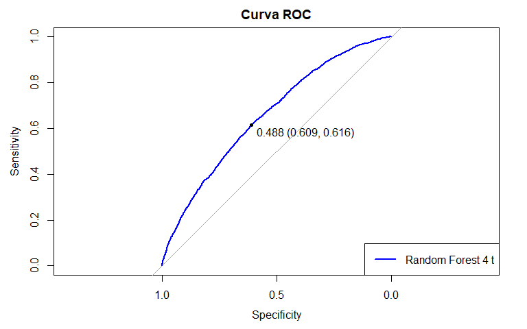<!-- -->

# Resultado Parcial 2

O ponto de corte utilizado foi de 0,4


As variáveis preditoras do modelo Random Forest 4 são:

-   **eqpdays:** Número de dias (idade) do equipamento atual;

-   **months:** Número total de meses de serviço;

-   **change_mou:** Alteração percentual nos minutos mensais de uso em relação à média dos três meses anteriores;

-   **totrev:** Rendimento total;

-   **mou_cvce_Mean:** Média de minutos não arredondados de uso de chamadas de voz concluídas;

-   **avgqty:** Número médio mensal de chamadas ao longo da vida do cliente;

-   **adjmou:** Faturamento ajustado do total de minutos de uso ao longo da vida do cliente;

-   **totmrc_Mean:** Média de cobrança recorrente mensal total;

-   **totmou:** Total de minutos de uso ao longo da vida do cliente;

-   **peak_vce_Mean:** Número médio de chamadas de voz de entrada e saída de pico;

-   **plcd_vce_Mean:** Número médio de tentativas de chamadas de voz realizadas;

-   **complete_Mean:** Número médio de chamadas concluídas;

-   **unan_vce_Mean:** Número médio de chamadas de voz não atendidas;

-   **avg6rev:** Receita média mensal nos seis meses anteriores;

-   **drop_vce_Mean:** Número médio de chamadas de voz perdidas (com falha);

-   **ovrmou_Mean:** Média de minutos excedentes de uso
